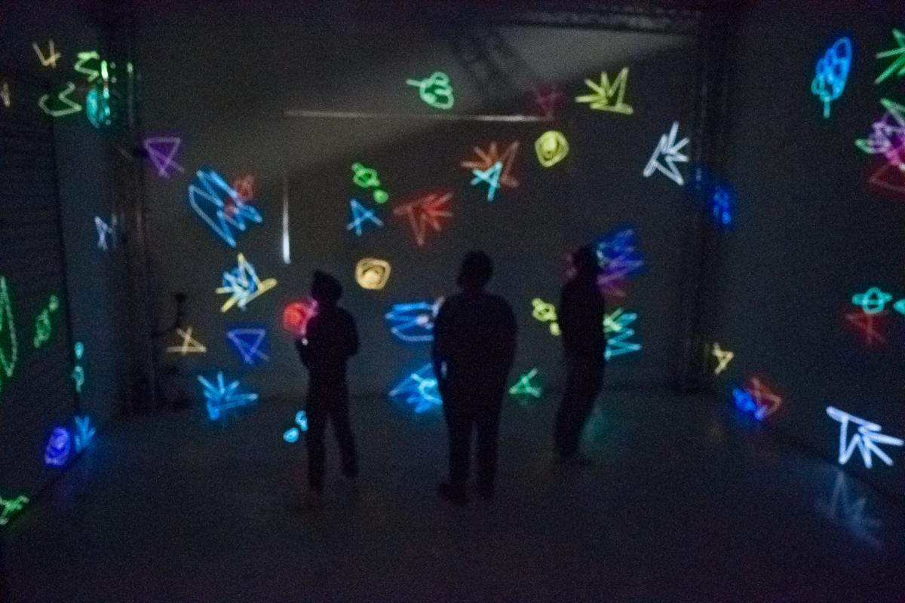
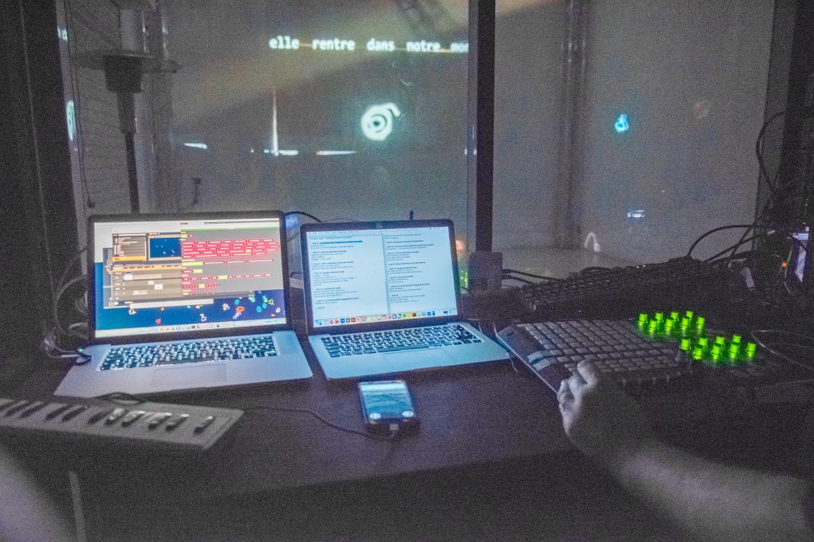
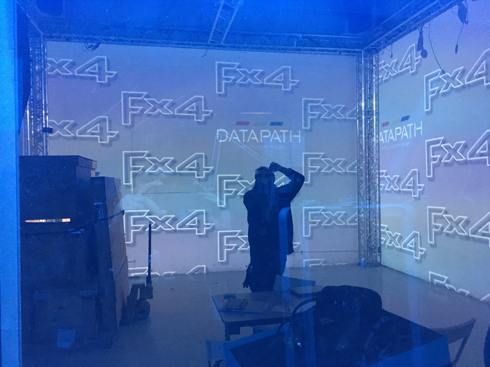
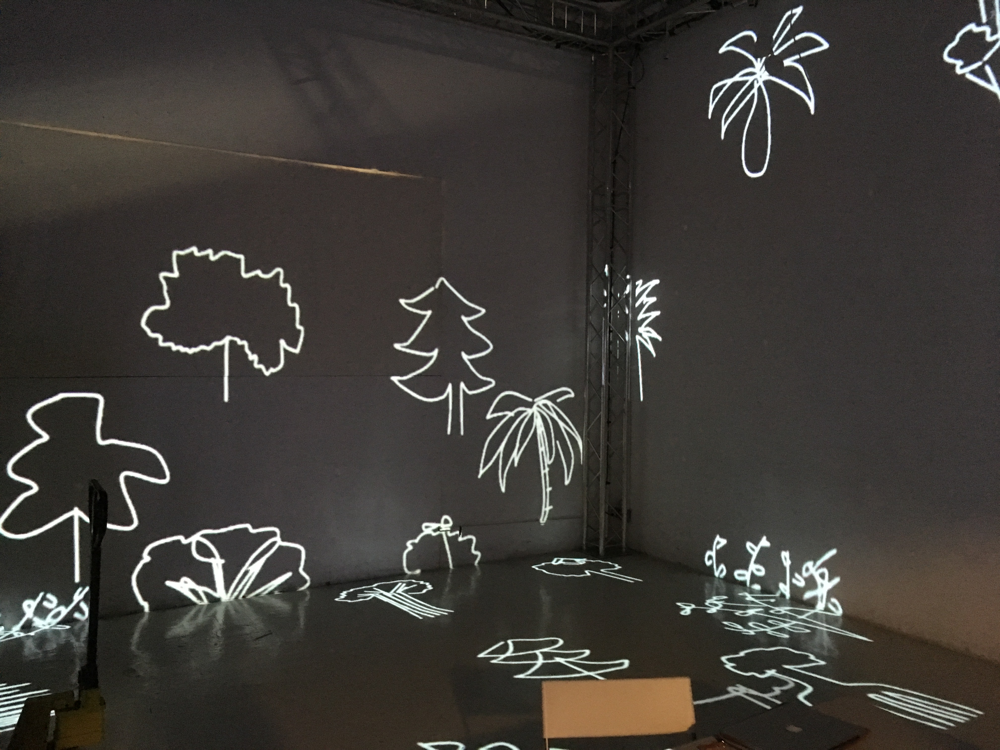
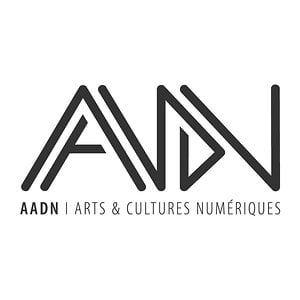

#### Description

En février, nous avons réalisé une résidence artistique au __LabLab__, un studio d'expérimentation en Art Numérique sur Lyon.  
Pendant trois jours, nous avons approfondi les possibilités offertes par notre outil de dessin collaboratif pour les performances live, et nous avons construit une narration.
Nous avons aussi exploré l'incorporation d'ambiances sonores et musicales à nos installations.  
  
  
La résidence s'est conclue par une restitution sous forme de spectacle accessible au public.

<photo-grid>

</photo-grid>

### Partenaires

[AADN](http://aadn.org/)  
  
[LabLab](https://www.facebook.com/atelierlablab/)  
  
[Lien officiel de l'événement](https://aadn.org/nos-residences/the-live-drawing-project-en-residence-au-lab-lab/)
