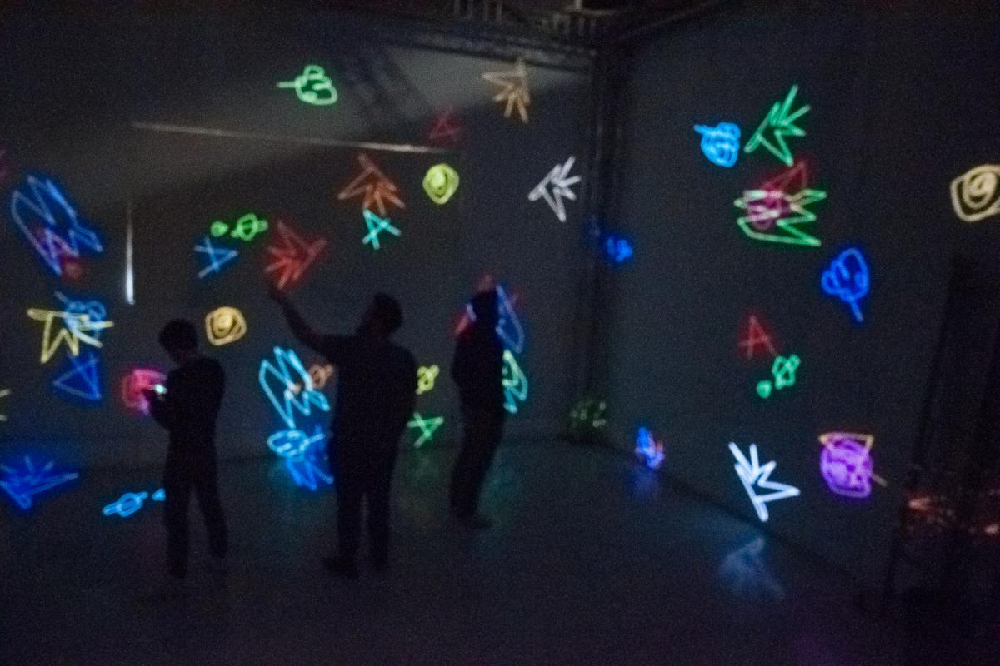
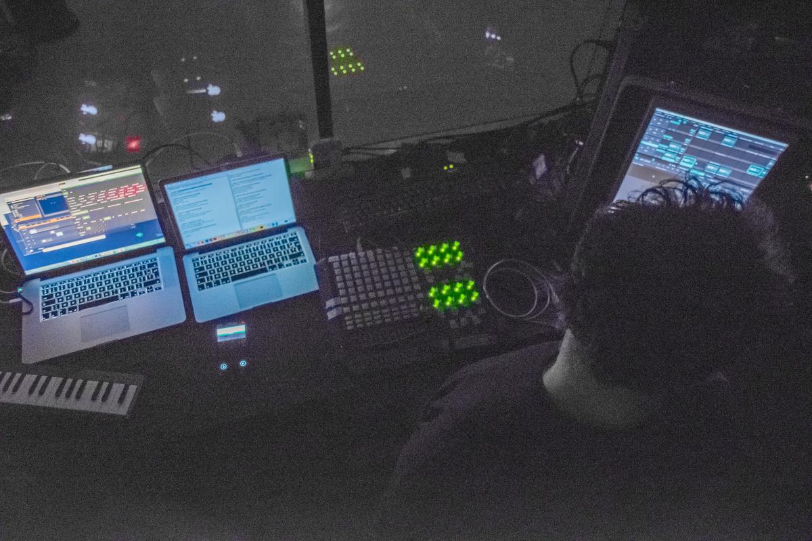

We did an Art residency at the LabLab, a well known studio for digital art experimentations in Lyon.
During three days, we further explored the possibilities of our collaborative drawing technologies for live performance and storytelling

<photo-grid>

</photo-grid>

### Partners
[AADN](http://aadn.org/)  
  
[LabLab](https://www.facebook.com/atelierlablab/)  
  
[Official event link](https://aadn.org/nos-residences/the-live-drawing-project-en-residence-au-lab-lab/)
