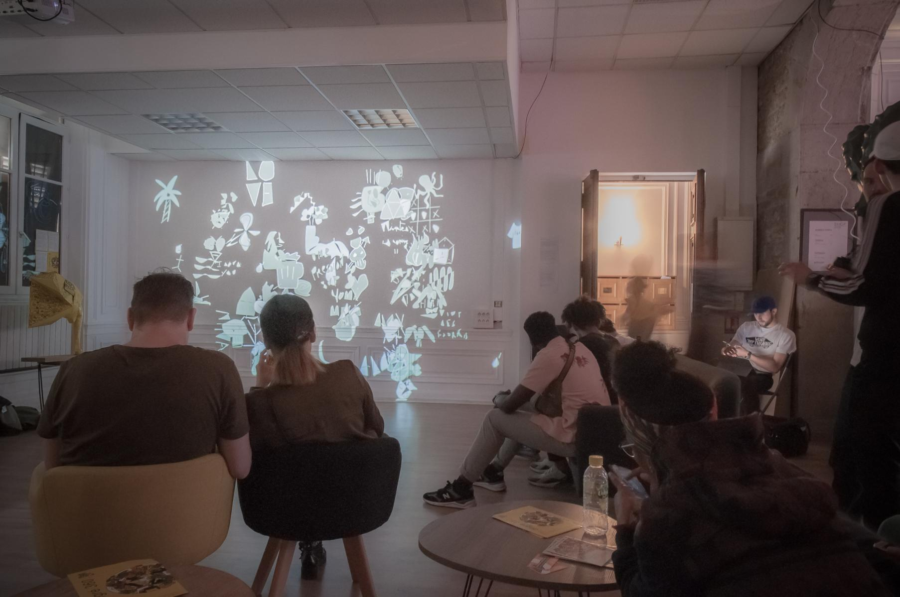
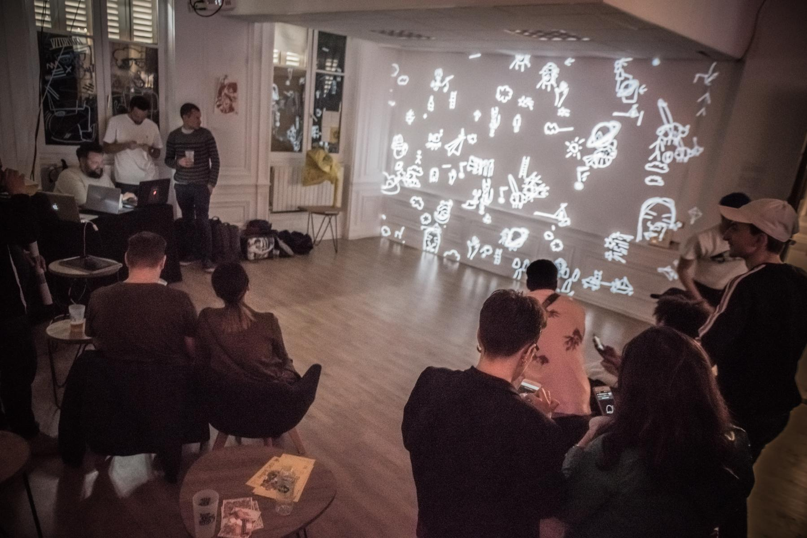
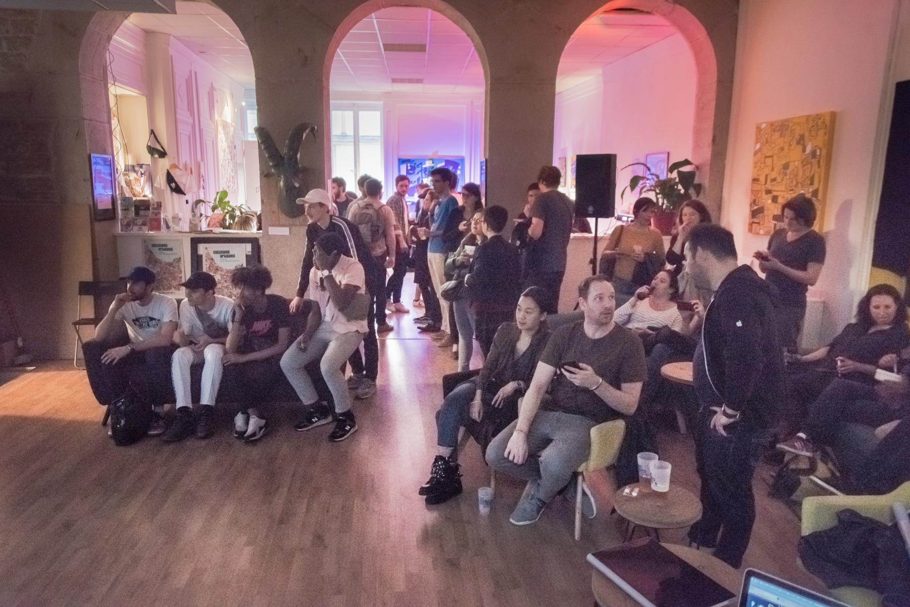
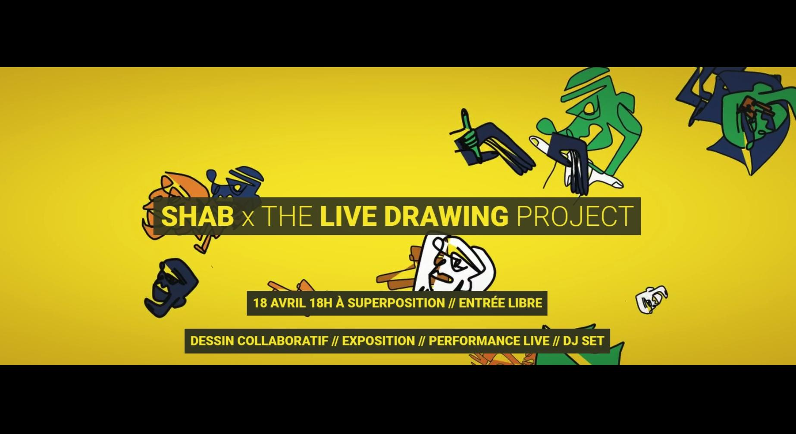

<iframe src="https://player.vimeo.com/video/335872657" frameborder="0" allowfullscreen width="1920" height="1080"></iframe>

[Lien Direct](//vimeo.com/335872657)

#### Description

En avril, nous avons collaboré avec le street artist __Shab__ pour sa dernière exposition à la __Galerie Superposition__.  

Nous avons présenté une installation de dessin collaboratif entièrement construite autour du style visuel de Shab. Shab a livré une performance en solo ainsi qu'en collaboration avec le public à l'aide de nos outils.

<photo-grid>

</photo-grid>

### Partenaires

[Shab](//www.shab-c.com/) 

[Superposition](//superposition-lyon.com)  

[Evenement Facebook](//www.facebook.com/events/592231084520436/)
