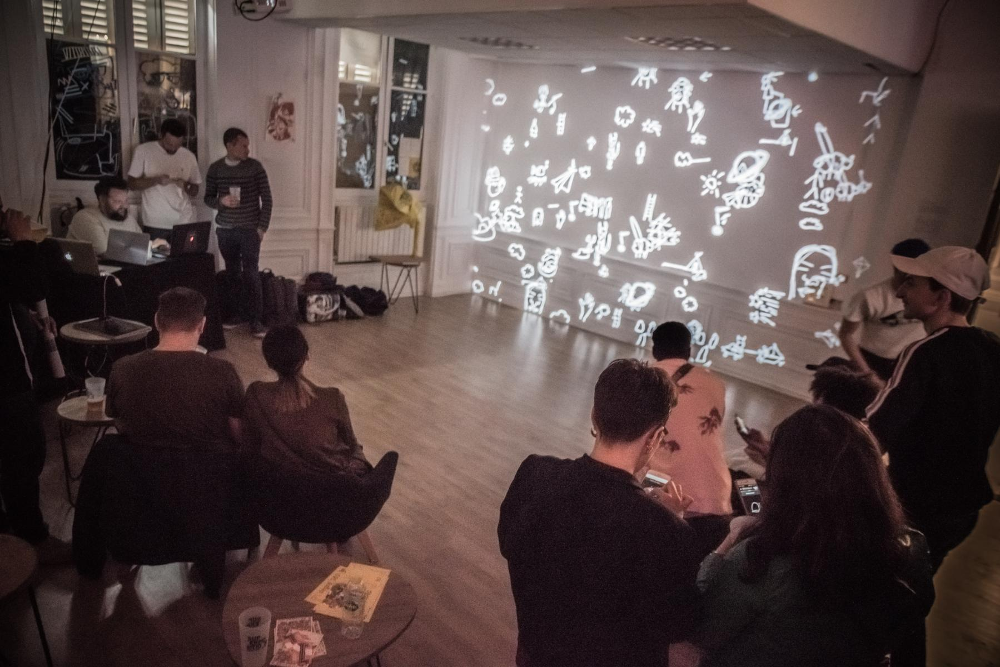

<iframe src="https://player.vimeo.com/video/335872657" frameborder="0" allowfullscreen width="1920" height="1080"></iframe>

[Direct Link](//vimeo.com/335872657)

#### Description

In April, we made an Art Collaboration with the French street artist **Shab** for his last exhibition at the **Superposition Gallery**.

We presented a collaborative drawing installation entirely based on Shab's visual style. Shab performed alone and in collaboration with the public using our collaborative tools.

<photo-grid>

</photo-grid>

### Partners

[Shab](//www.shab-c.com/)

[Superposition](//superposition-lyon.com)

[Facebook Event](//www.facebook.com/events/592231084520436/)
