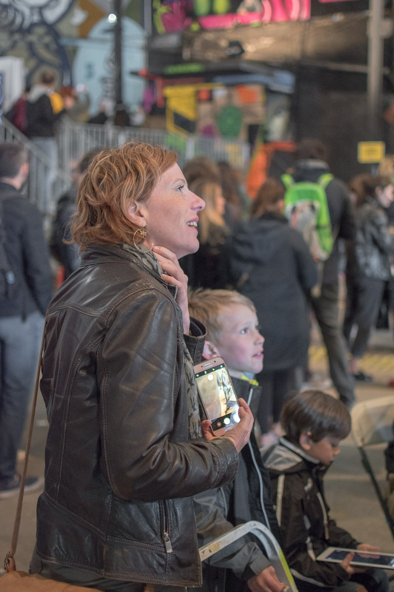
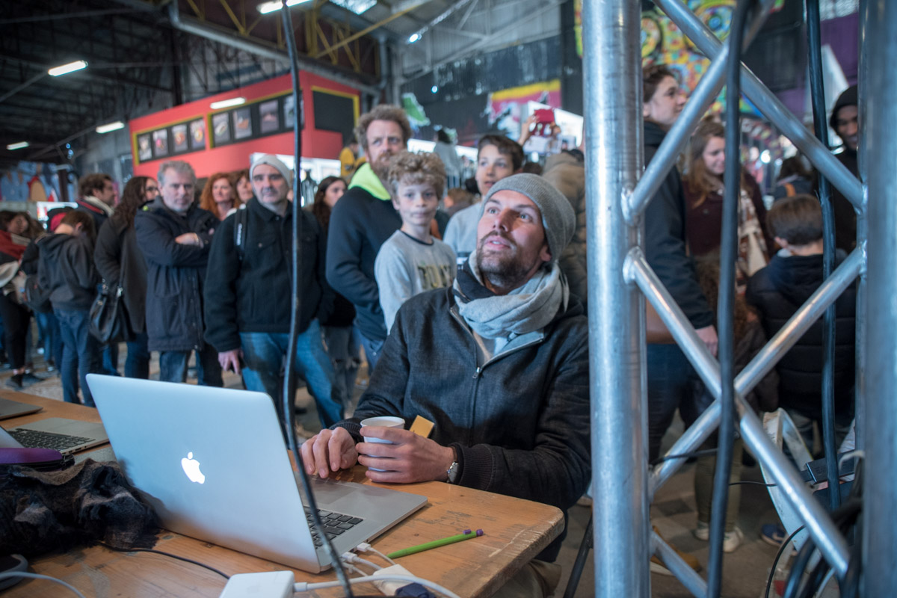
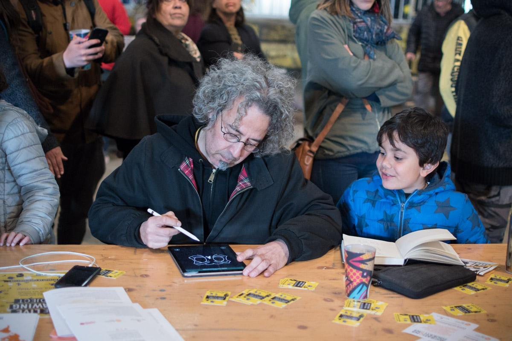
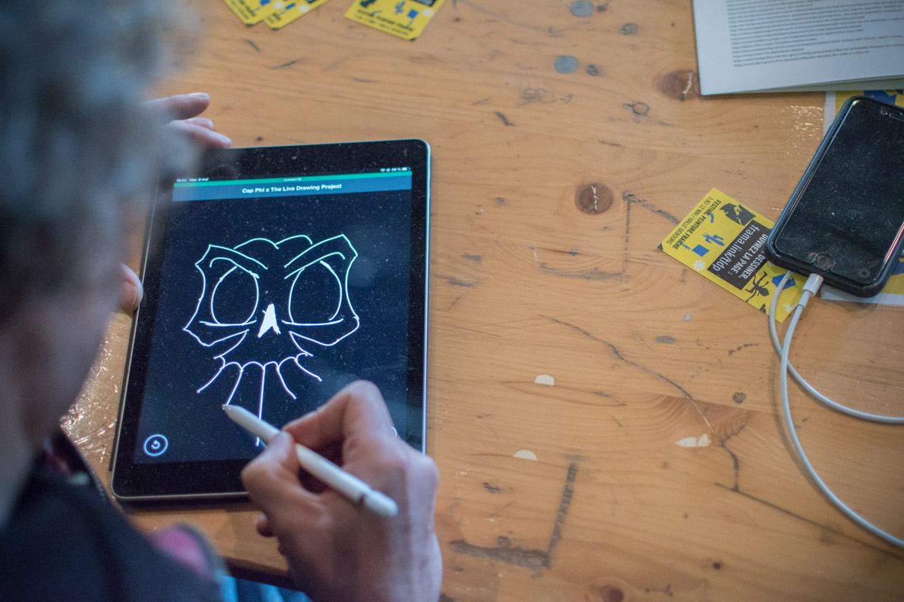
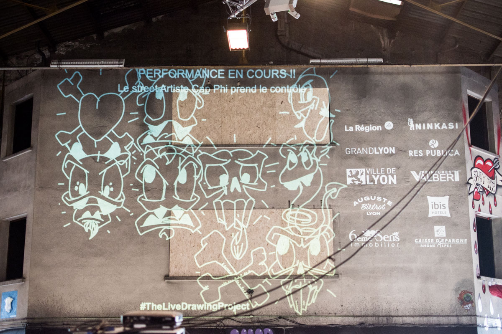
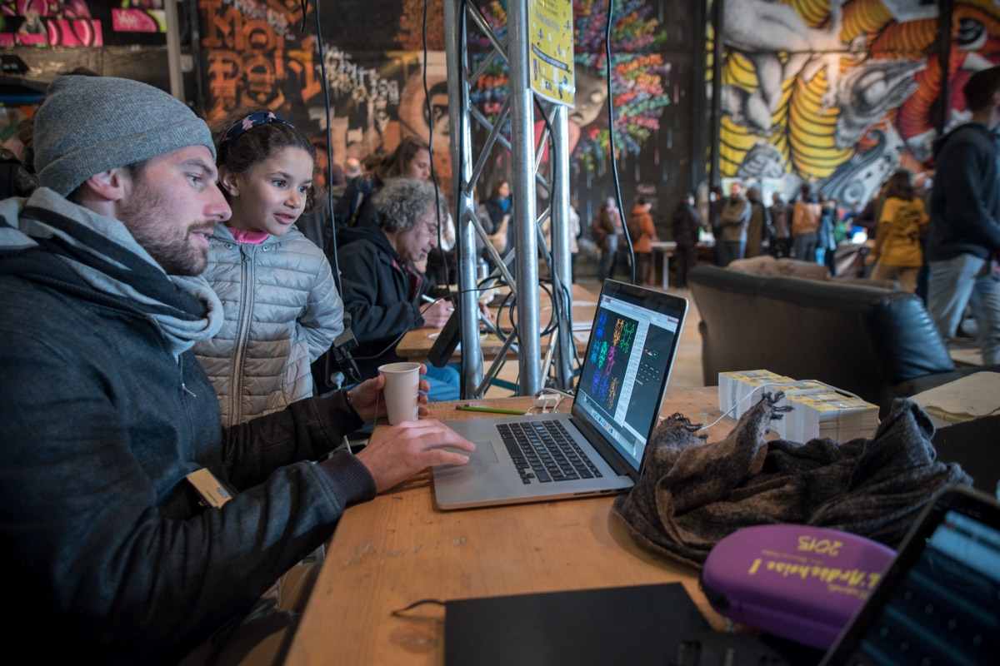
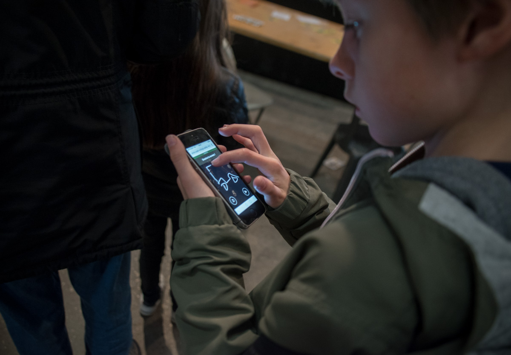
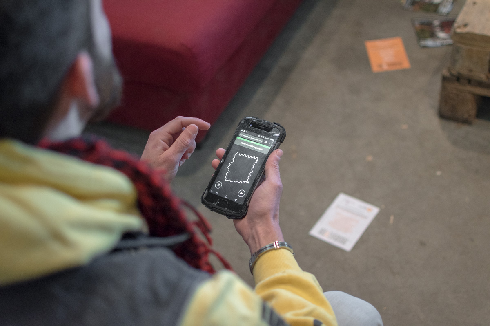
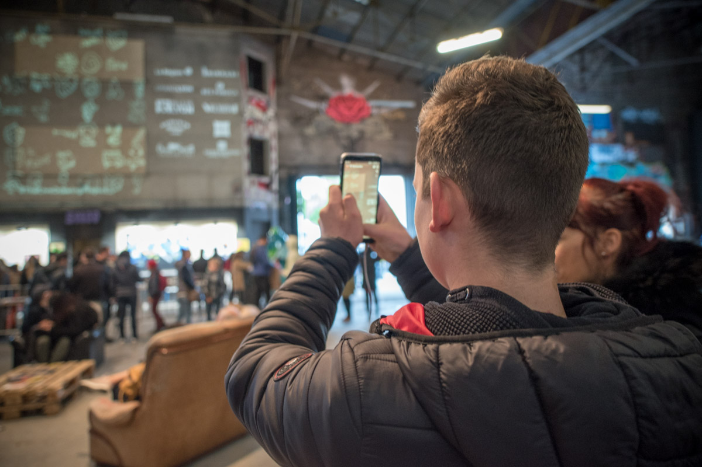

<iframe src="https://player.vimeo.com/video/344490536" frameborder="0" allowfullscreen width="1920" height="1080"></iframe>

[Direct Link](//vimeo.com/344490536)

#### Description

We exhibited our installation as part of the [Peinture Fraiche Festival](//peinturefraichefestival.fr), the Street Art Festival of Lyon, France.

During the 10 days of exhibition we received more than 40 thousand drawings from thousands of participants of all ages.
Street Artists from the festival also used our tool for live performances alongside the public.

<photo-grid>

</photo-grid>
