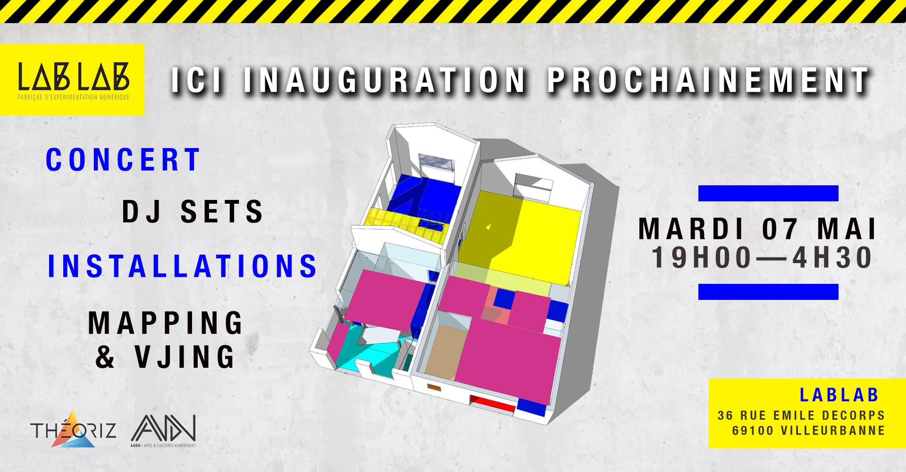

#### Description

We exhibited our collaborative drawing installation next to concerts, VJing performances, and other art installations as part the inauguration of the **Lablab 2.0** (a place dedicated to digital arts).
During this special evening The Live Drawing Project was being exhibited in two different venues in the city.
Audience from the two venues were able to communicate through drawings.

### Partners

[AADN](//aadn.org/)

[LabLab](//www.facebook.com/atelierlablab/)

[Facebook Event](//www.facebook.com/events/621144131696513/)
