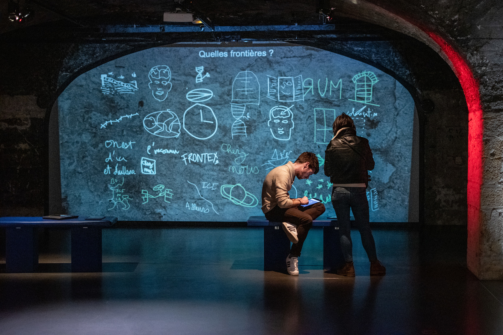
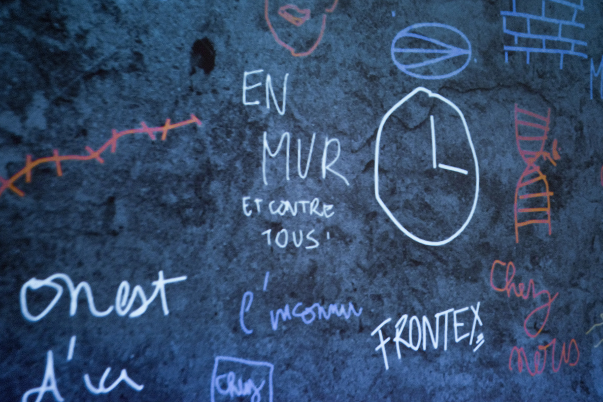
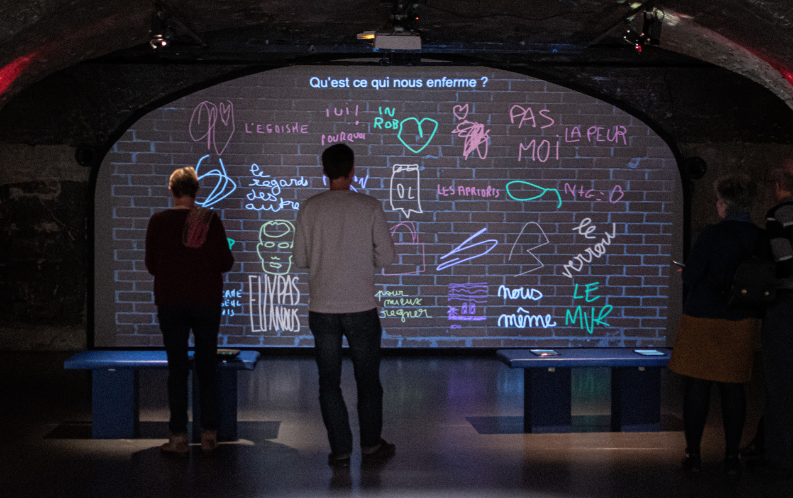
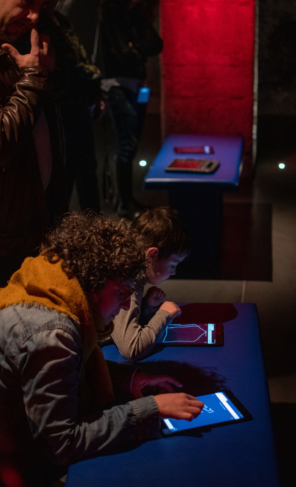
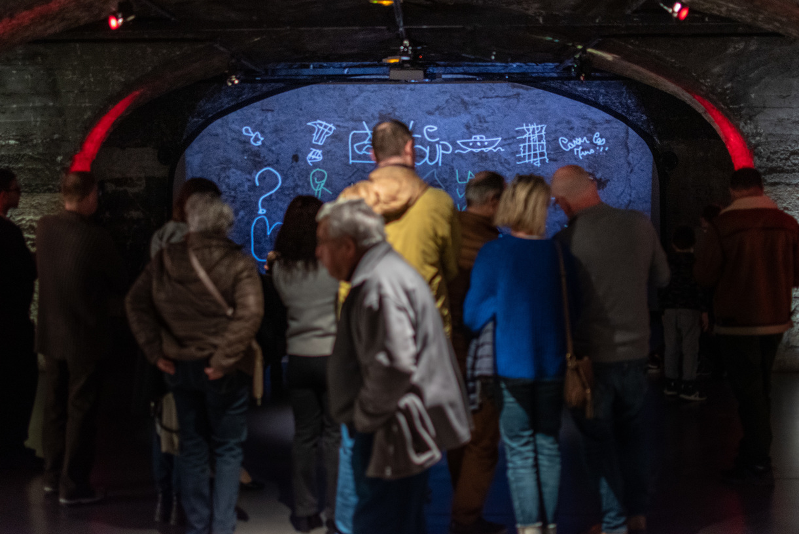
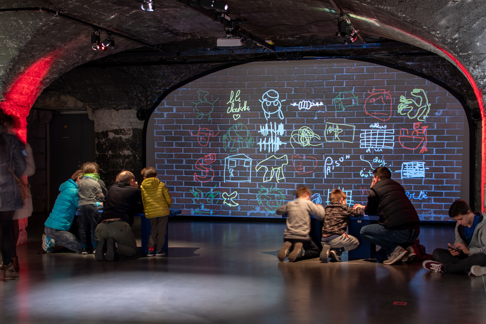

#### Description

Nous avons animé le 12 janvier 2020 un atelier sur le thème du dessin et de la seconde guerre mondiale pour échanger sur ces thématiques avec des publics de tous âges. En partenariat avec le Centre d'Histoire de la Résistance et de la Déportation de Lyon et l'évenement de Street Art [La Chute des Murs](//www.facebook.com/events/391944598374055/).

[Informations de programmation](https://www.lyon.fr/evenement/exposition/la-chute-des-murs)

<photo-grid>

</photo-grid>
