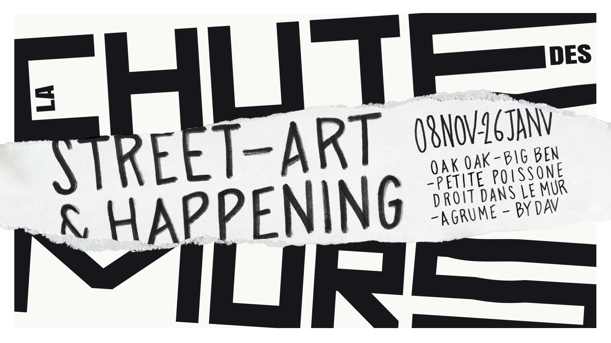

#### Description

Nous animerons le 12 janvier 2020 un atelier sur le thème du dessin et de la seconde guerre mondiale pour échanger sur ces thématiques avec des publics de tous âges. En partenariat avec le Musée de la Resistance de Lyon et l'évenement de Street Art [La Chute du Mur](//www.facebook.com/events/391944598374055/).  
  
[Informations de programmation](https://www.lyon.fr/evenement/exposition/la-chute-des-murs)
