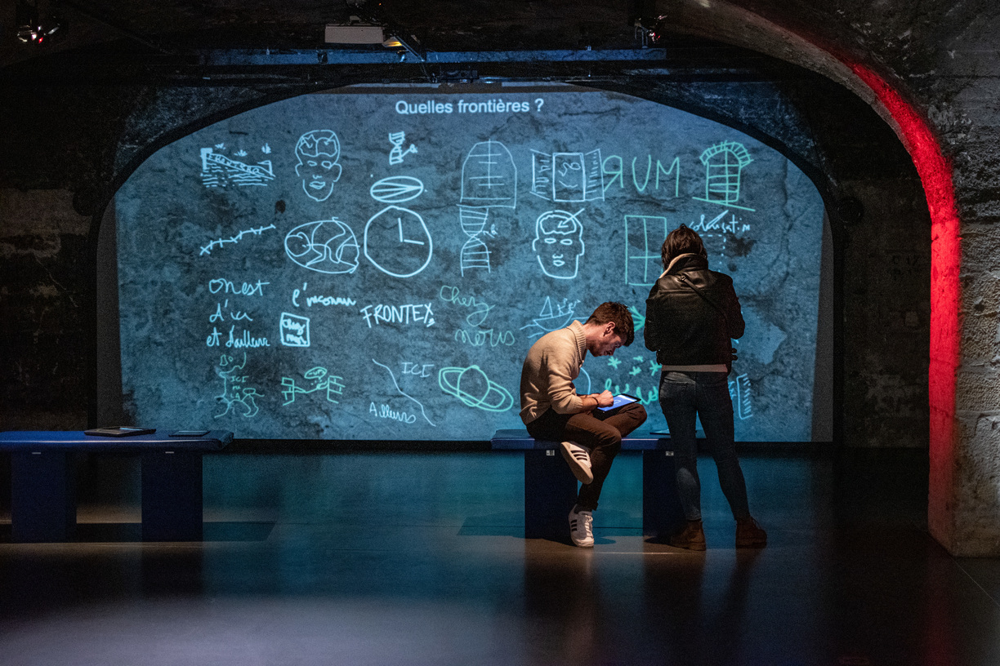
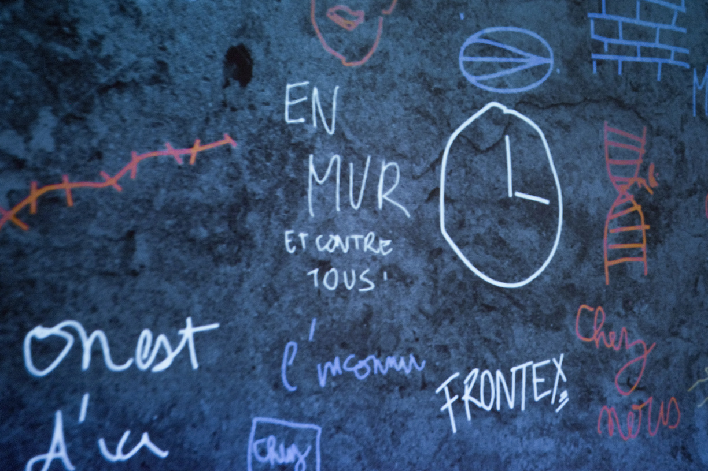
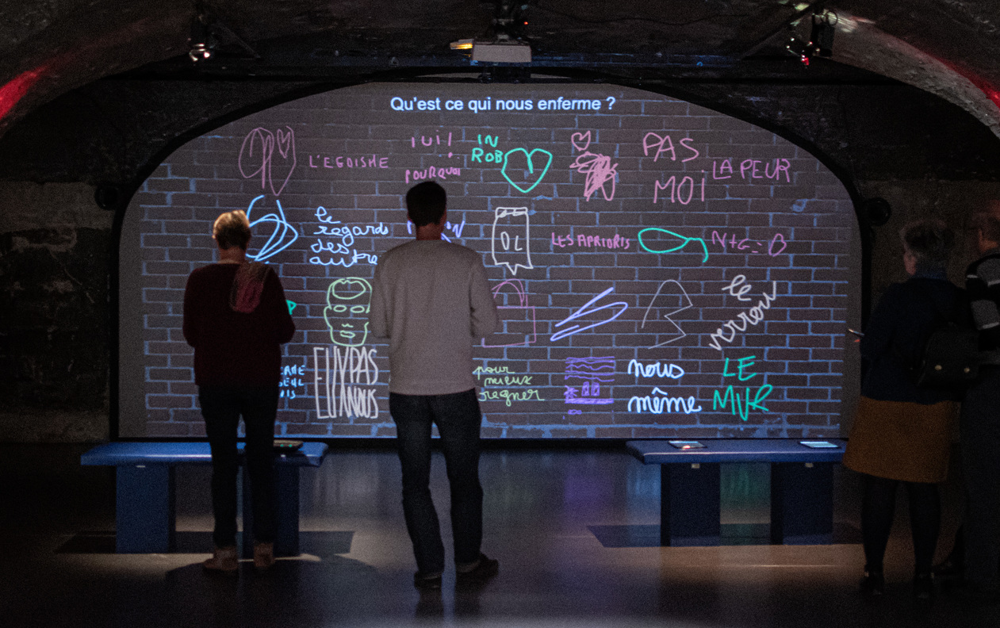
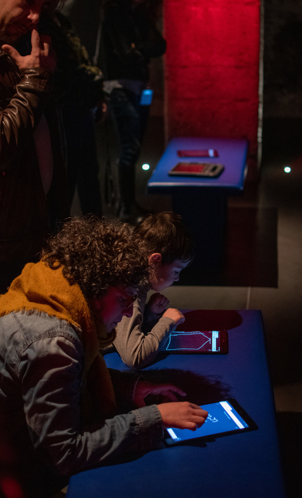
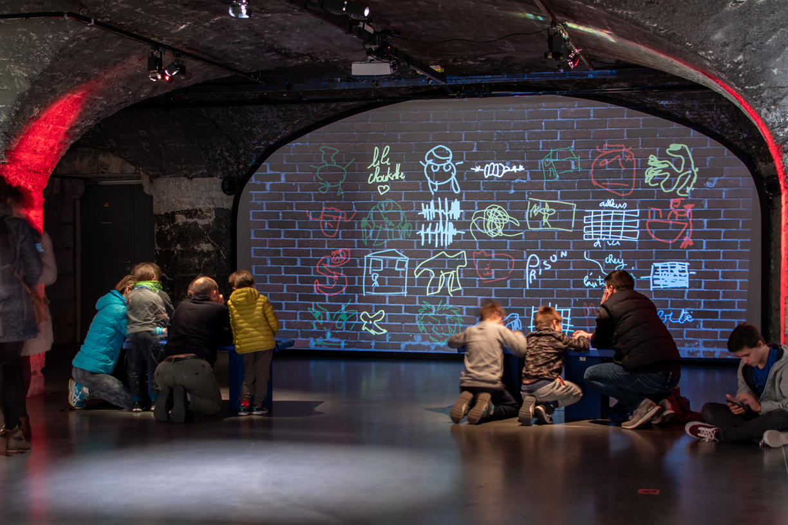

#### Description

The 12nd of January we conducted a drawing workshop on the thematics of World War II to discuss those important moments in history with a public of all ages. In partnership with the Centre d'Histoire de la Résistance et de la Déportation of Lyon and the Sreet Art event [La Chute des Murs](//www.facebook.com/events/391944598374055/).

[Event Page](https://www.lyon.fr/evenement/exposition/la-chute-des-murs)

<photo-grid>

</photo-grid>
