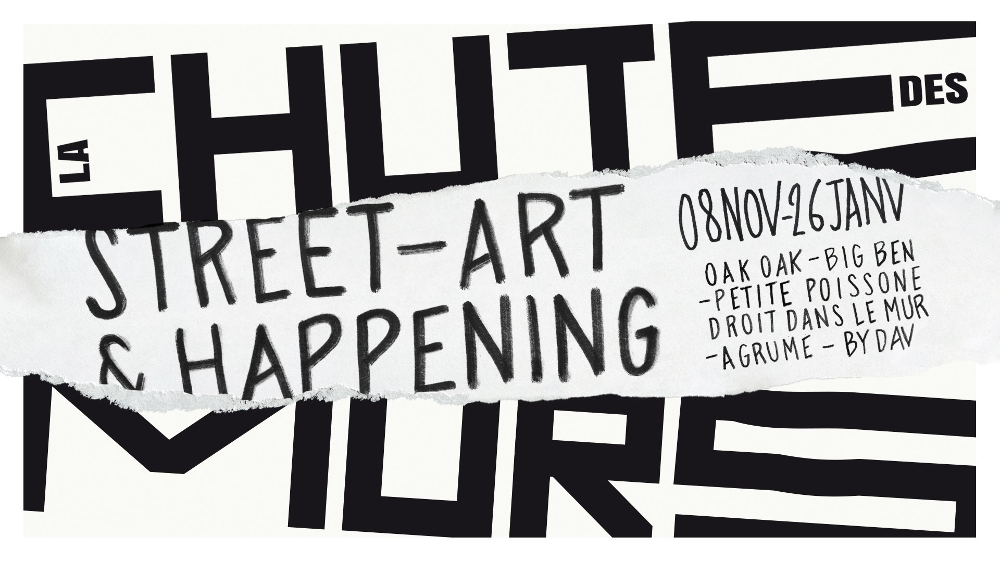

#### Description

We will conduct in January a drawing workshop on the thematics of World War II to discuss those important moments in history with a public of all ages. In partnership with the Resistance Museum of Lyon and the Sreet Art event [La Chute du Mur](//www.facebook.com/events/391944598374055/).
