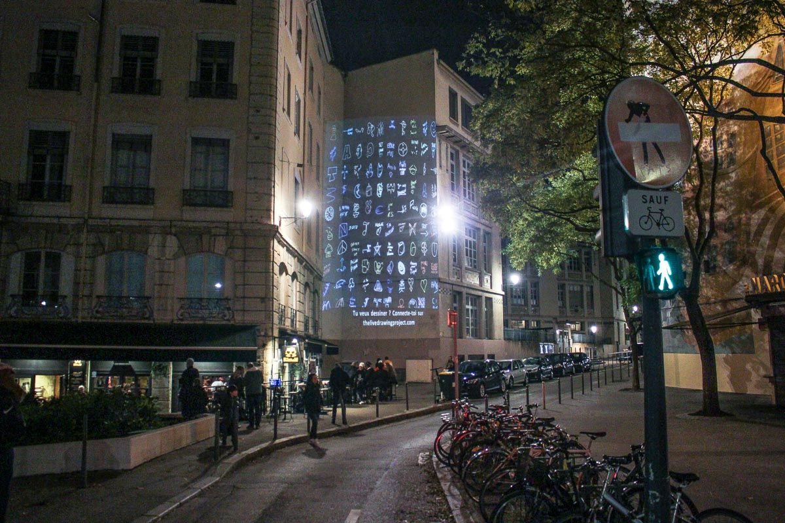
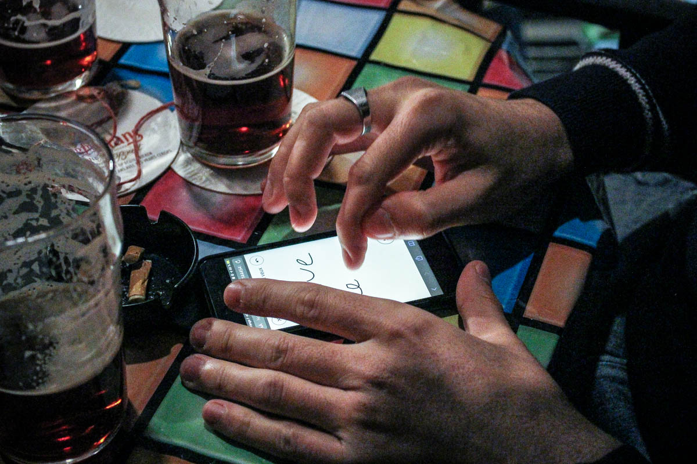
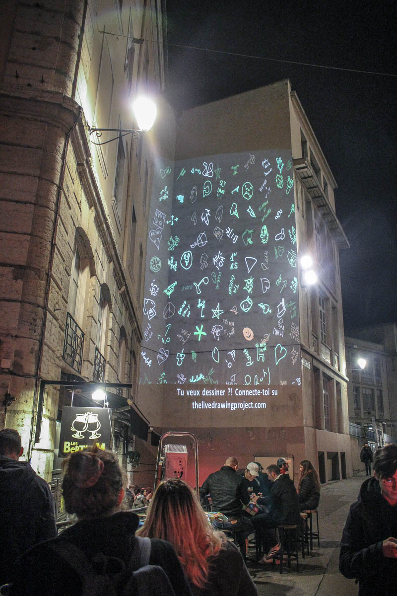
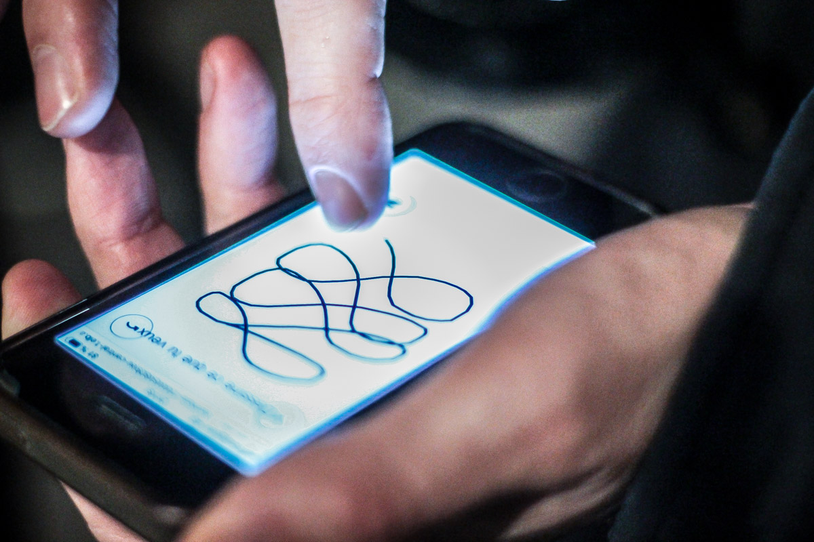
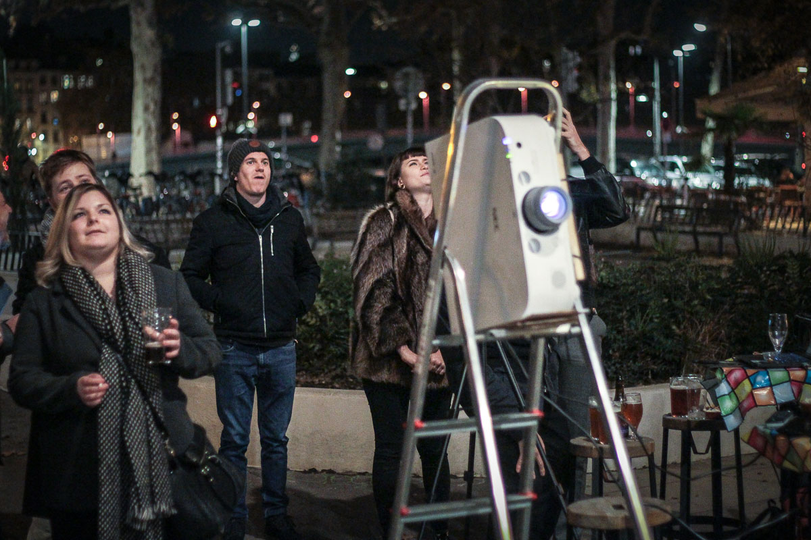
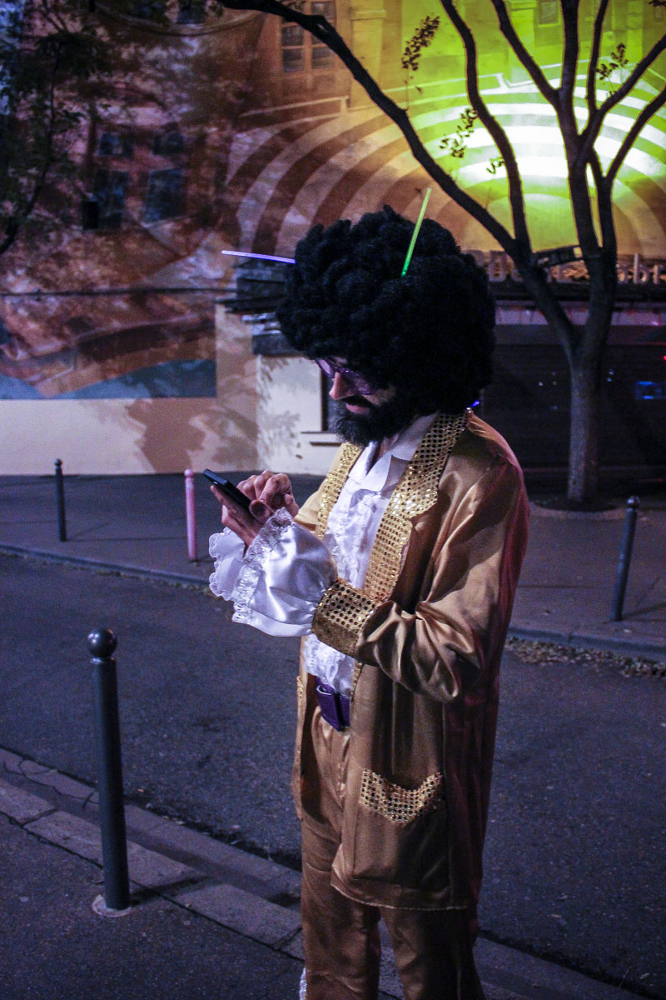
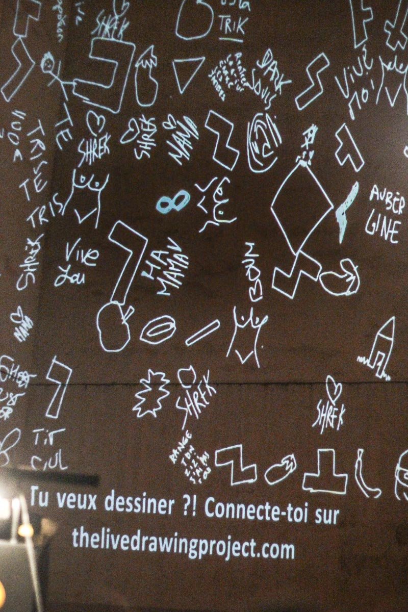
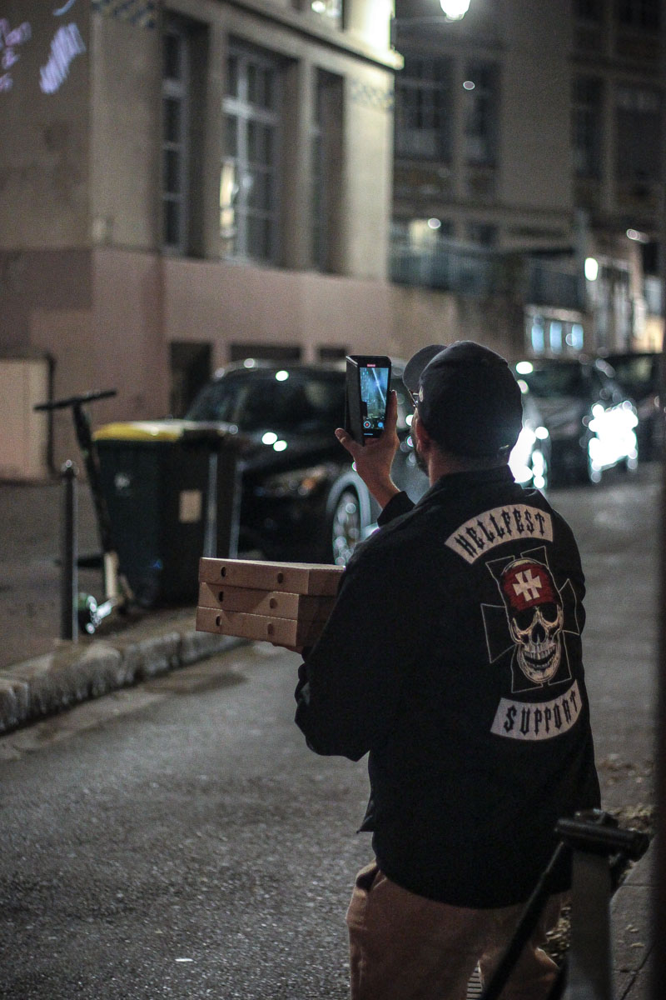
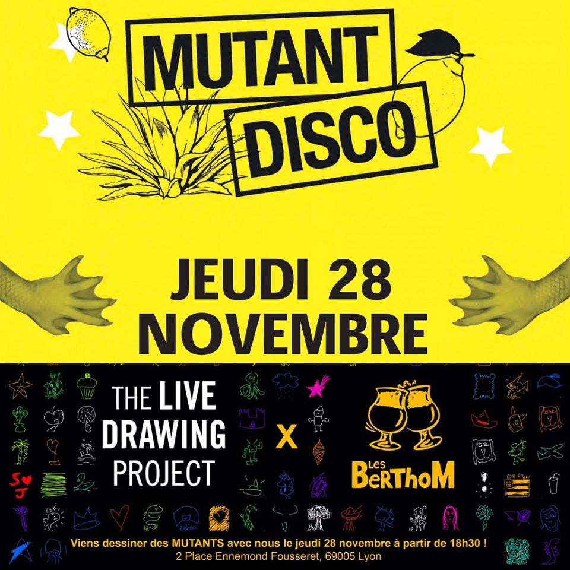

#### Description

We exhibited our installation of collaborative drawing for the Afterwork organised by one of the [BertThoM Bars](https://www.lesberthom.com/) of Lyon (Old Town). We projected on a wall right next to the bar to mix aperitif and drawing with the audience and attracted many passers-by.

<photo-grid>

</photo-grid>
