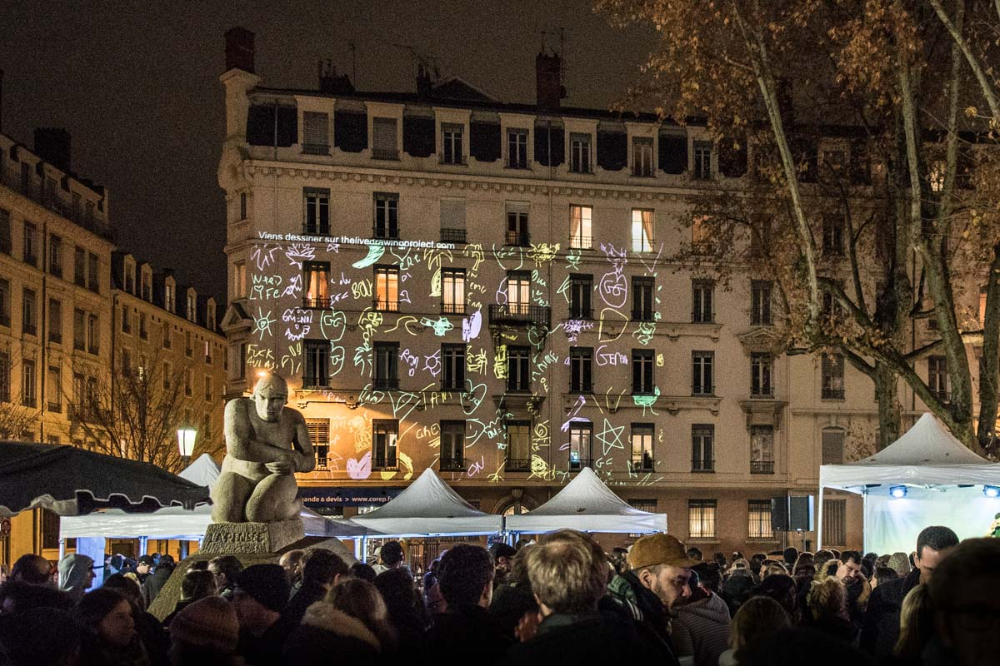
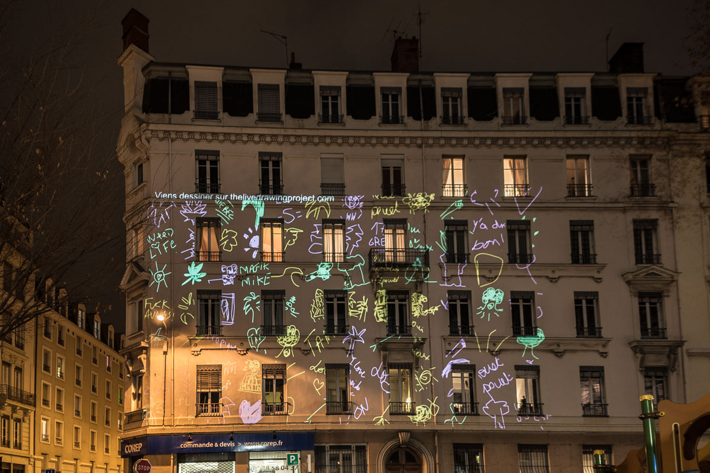
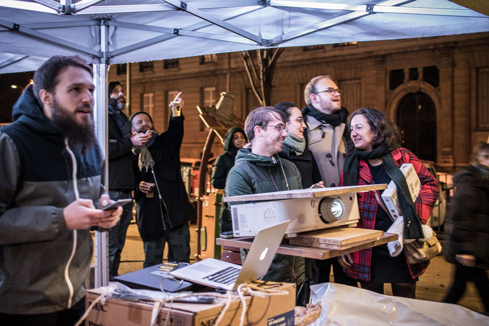
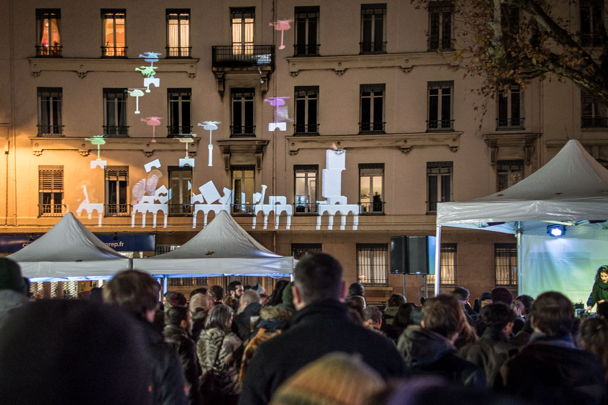
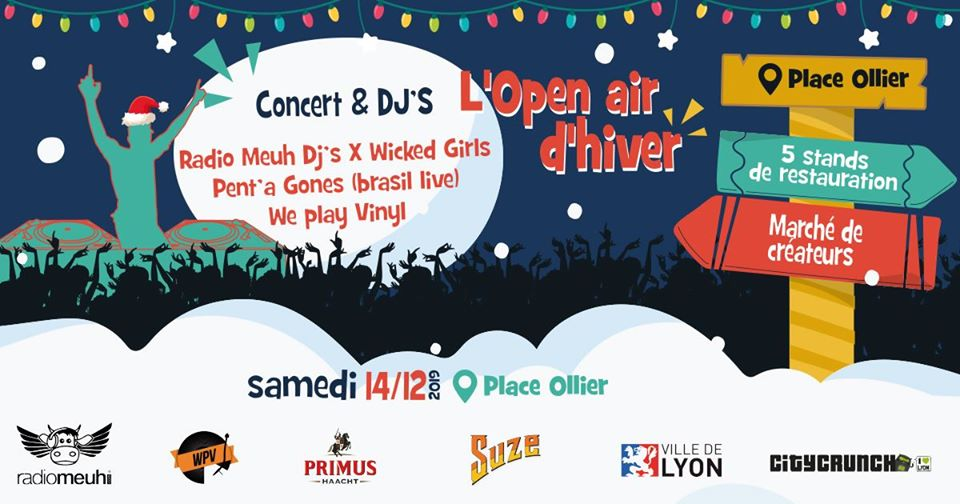

#### Description

We exhibited our installation of collaborative drawing for the Open Air organised by [SoliBARités](https://www.facebook.com/solibarites/).
The audience was able to mix dance moments and drawing moments for the whole evening. We also exhibited __Babel__, our collaborative building game.
  
<photo-grid>

</photo-grid>
