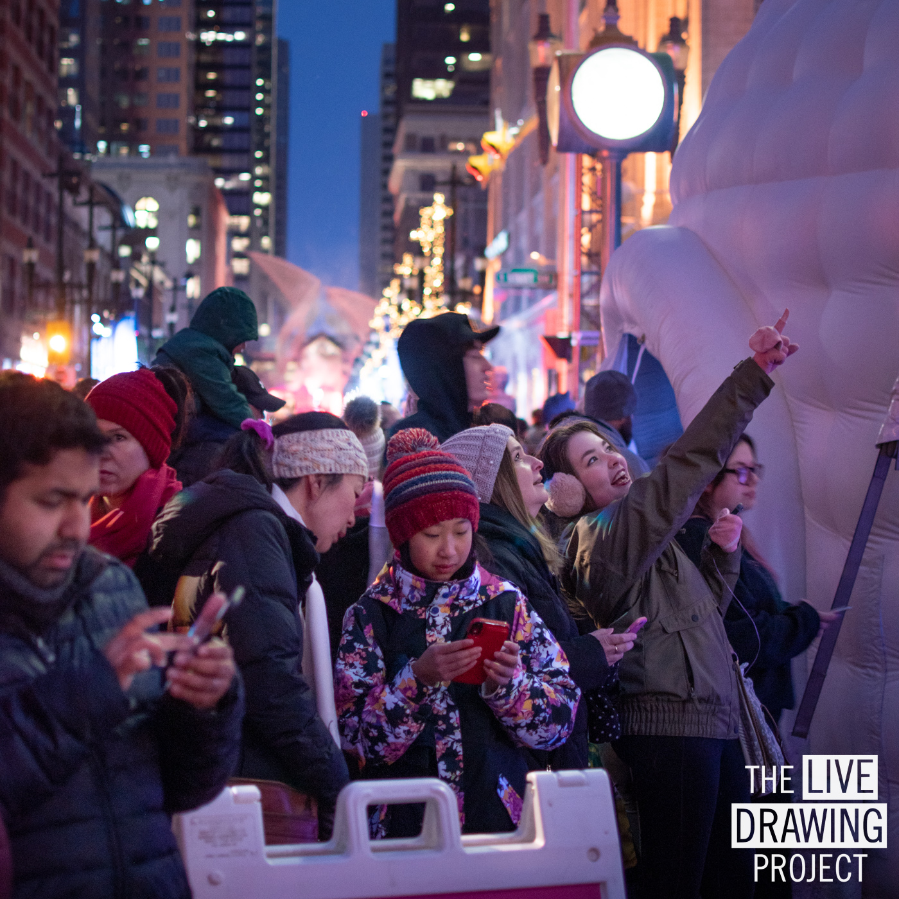

#### Description

We exhibited our installation the GLOW Winter Festival of Calgary in Stephen Avenue. First international date for the project and we received more than 12,000 drawings in 3 nights!

[Event website](https://glowyyc.com/)

<photo-grid>

</photo-grid>
