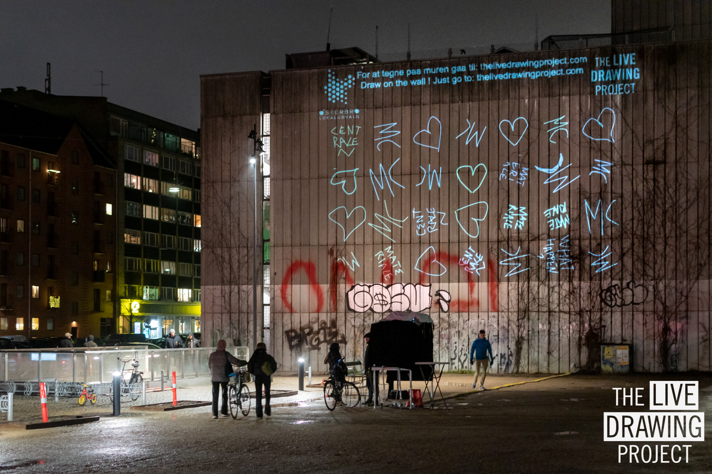
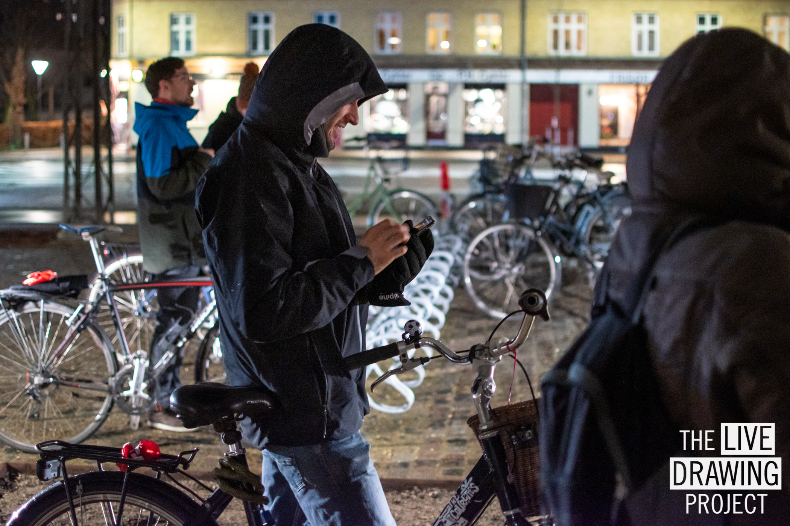
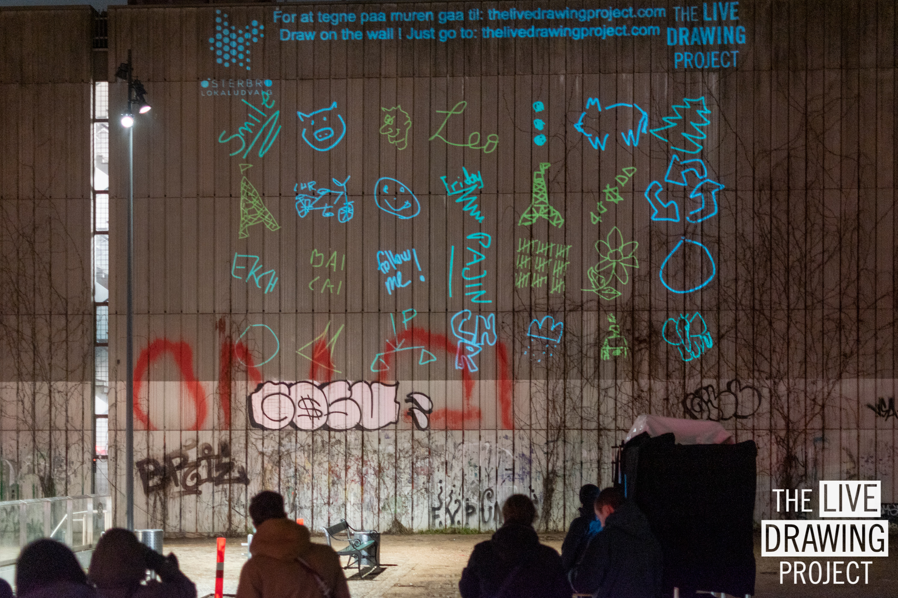
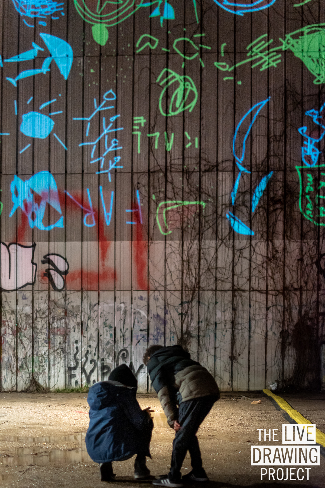
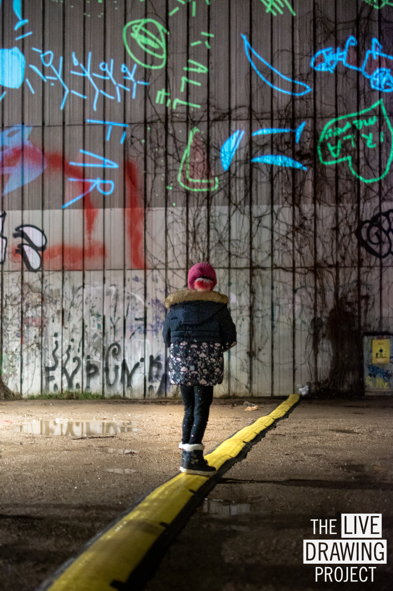
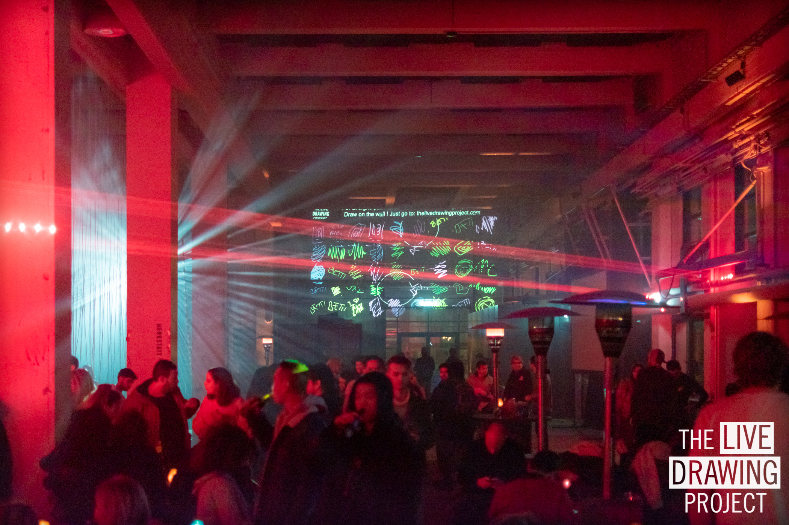
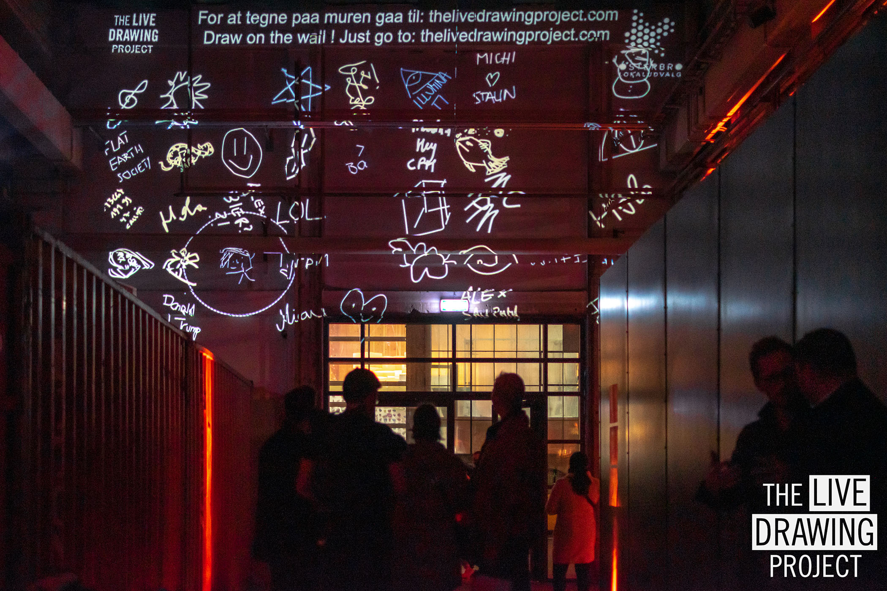
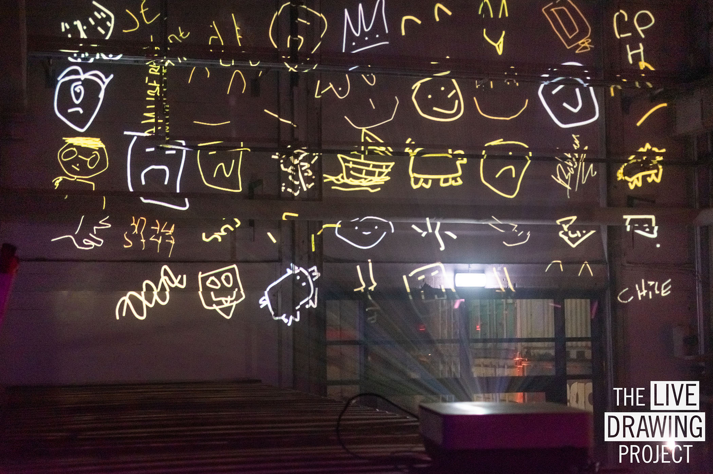

#### Description

We exhibited our installation the Copenhagen Light Festival in the Oesterbro neighborhood. We also exhibited our multi-wall format for the closing party of the festival: at the closing party and at Oesterbro at the same time.

#### Partners

[Copenhagen light Festival](https://copenhagenlightfestival.org/)  
[Oesterbro Commune](https://kk.dk/)

<photo-grid>

</photo-grid>
