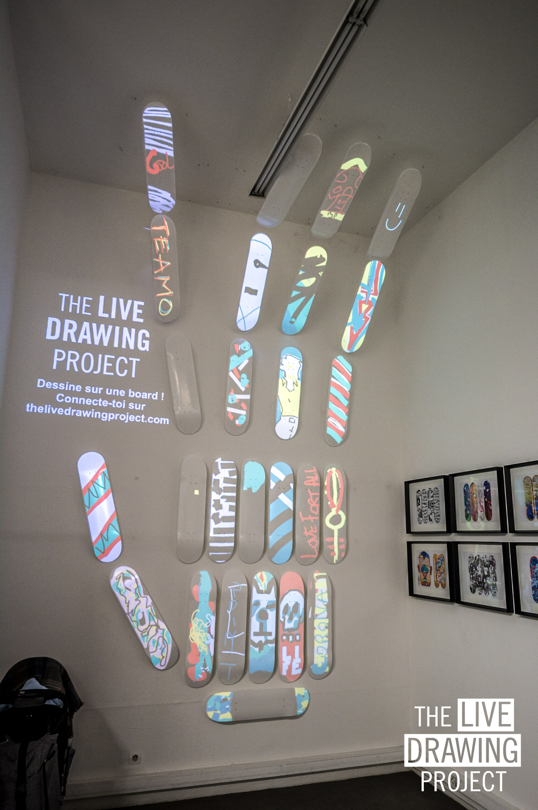
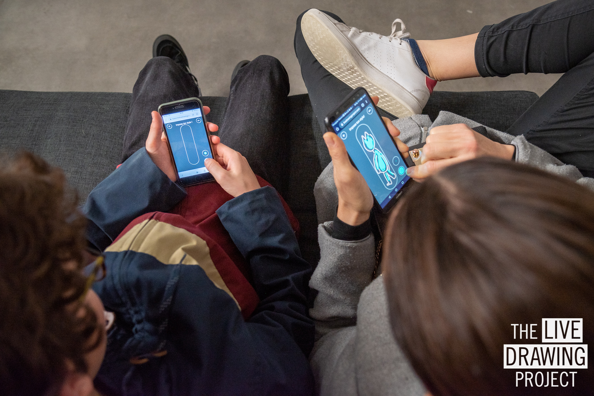
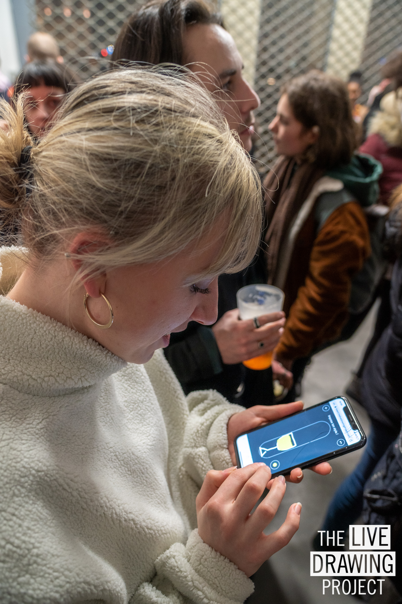
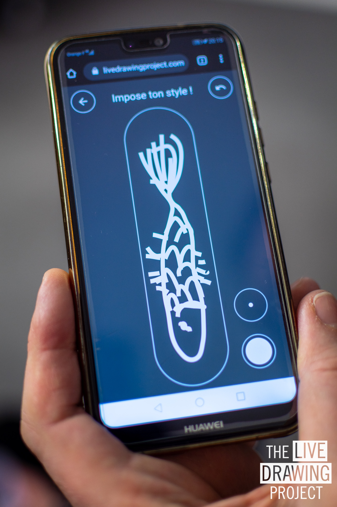
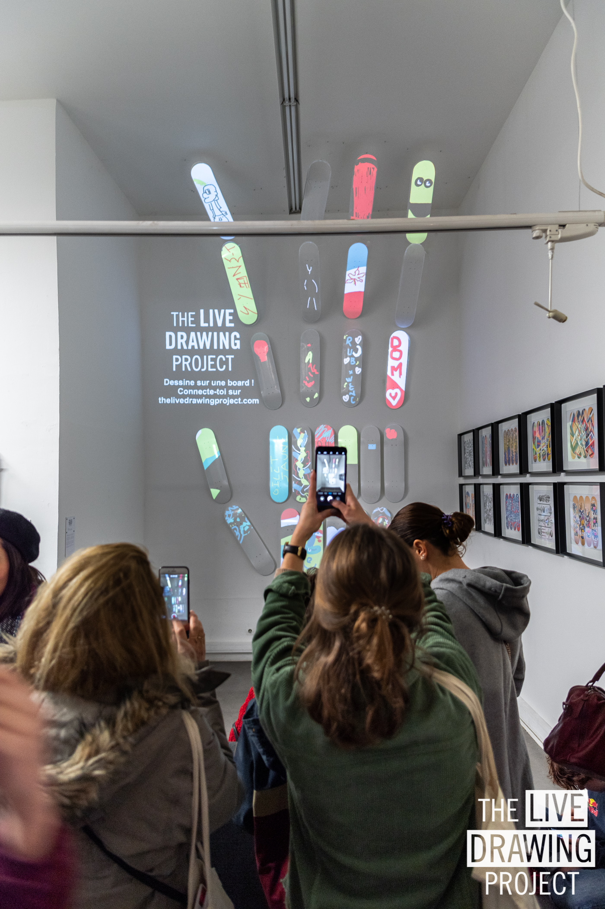
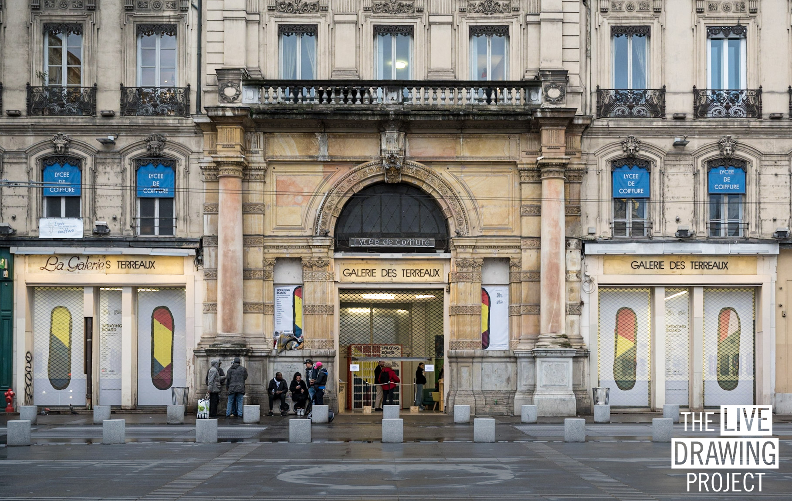
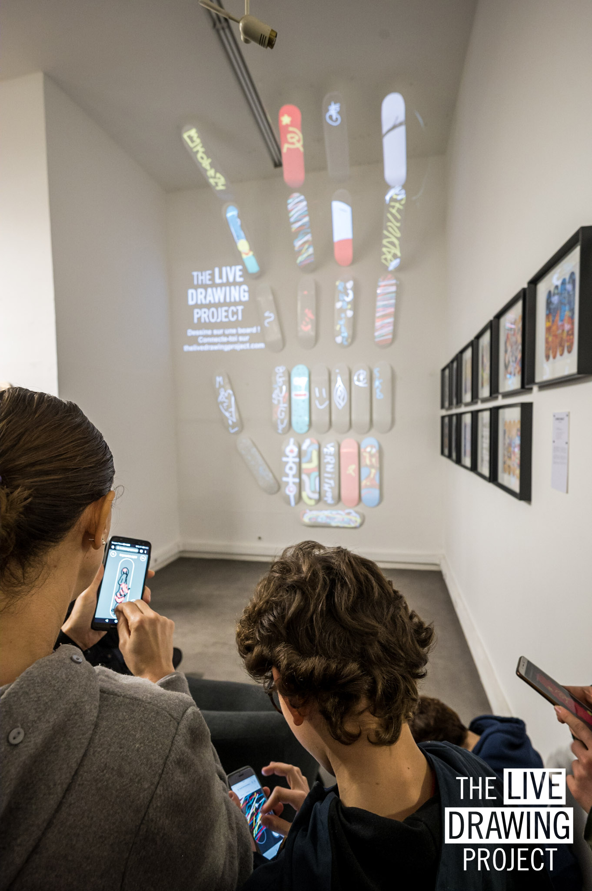
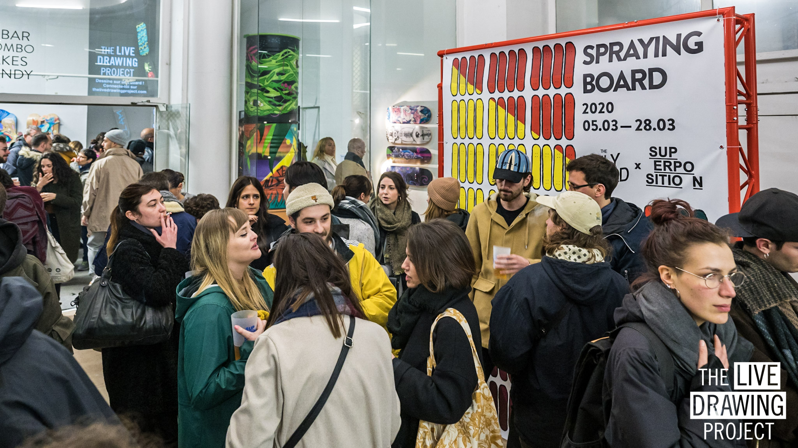

#### Description

We have been invited to display at the Spraying Board exhibition in March 2020 at the Galerie des Terreaux in Lyon. It’s a collective exhibition of 44 skateboards transformed into original artworks by 12 artists coming from graffiti, Street-Art or neo-muralism.

For this exhibition dedicated to skate art we composed a gigantic hand made from 27 white skate decks. Each visitor is invited to use his phone to draw freely on one of the sculpture's skateboards. Every stroke he makes on his phone appears in real time on the board.

<photo-grid>

</photo-grid>

[Event website](https://sprayingboard.thedailyboard.co/)  
Pictures by: [Lionel Rault](https://lionelrault.smugmug.com/) and [Maxime Touroute](https://maximetouroute.github.io)
