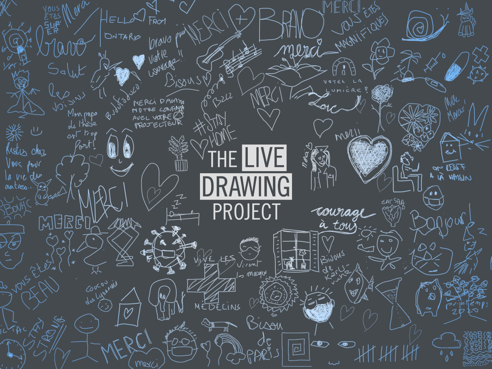

#### La créativité et le partage doivent continuer !

Nous avons décidé d'adapter notre installation pour continuer à exposer pendant le confinement. **Rejoignez le mouvement** et lancez The Live Drawing Project depuis votre fenêtre pour divertir vos voisins et lutter contre la morosité !

Nous exposons tous les dimanches soirs à 21h partout en France.

Vous souhaitez vous joindre à nous dimanche prochain ? Sortez votre vidéoprojecteur et répondez à ce formulaire:

## [Formulaire de participation](https://framaforms.org/stayhome-and-staycreative-1585829622)

#### Contenus

<photo-grid>

</photo-grid>

Retrouvez plus d'images sur nos réseaux sociaux: [Instagram](https://instagram.com/livedrawingproject) [Facebook](https://facebook.com/TheLiveDrawingProject)

[Telecharger le communiqué de presse](comPresse6avril2020.pdf)
