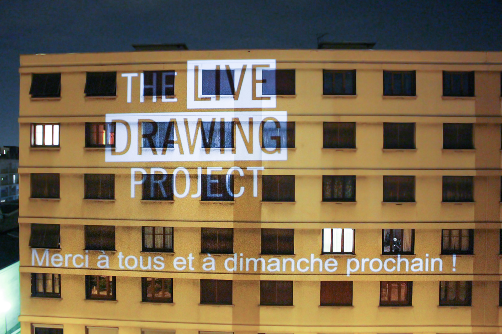

#### Dessinons ensemble et projetons nos dessins sur les murs de la ville !

Nous avons décidé d'adapter notre installation pour exposer pendant le confinement. **Rejoignez le mouvement** et lancez _The Live Drawing Project_ depuis votre fenêtre pour créer avec vos voisins et lutter contre la morosité !

**Nous exposons tous les dimanches soirs à 21h partout en France.**

#### COMMENT ÇA MARCHE ?

Chaque personne dessine avec son téléphone, les dessins apparaissent instantanément sur les murs ! Les dessins transitent entre les lieux créant une **oeuvre collective unique qui évolue à chaque nouveau dessin reçu**. Pour vidéoprojeter depuis chez vous c'est très simple, remplissez le formulaire et nous vous contacterons:

# [Formulaire de participation](https://framaforms.org/stayhome-and-staycreative-1585829622)

#### AGENDA

- Lundi 30 mars: _premier test, 2 lieux simultanés_
- Dimanche 5 avril: _5 lieux simultanés, 550 dessins, 80 participants_
- Dimanche 12 avril: _12 lieux simultanés, 1800 dessins, 150 participants_
- Dimanche 19 avril: _20 lieux simultanés, 2500 dessins, 160 participants_
- **Dimanche 26 avril: Rejoignez le mouvement dans toute la France !**

#### PHOTOS

<photo-grid>

</photo-grid>

Retrouvez plus d'images de cet événement sur nos réseaux sociaux: [Instagram](https://instagram.com/livedrawingproject) [Facebook](https://facebook.com/TheLiveDrawingProject)

[Photos de nos autres événements](/fr/gallery)

#### PRESSE

[Telecharger le communiqué de presse du 20 avril 2020](CP_TLDP_2004.pdf)

[Télécharger la brochure de présentation](TheLiveDrawingProject_Brochure_FR.pdf)

#### L’ÉQUIPE

### MAXIME TOUROUTE est ingénieur en Arts Visuels.

Diplômé de l’école Polytechnique Universitaire de Nice, il se spécialise dans le domaine de l’audiovisuel et de l’art numérique. Au fil des rencontres, il développe des projets mêlant interactivité et technologie avec une attention particulière sur la relation à l’intime. Son projet Humanlapse, où il explore la création de timelapses de portrait, lui offre une nouvelle visibilité avec le #humanlapse réapproprié par de nombreux photographes sur les réseaux sociaux. Son bagage d’ingénieur façonne son processus créatif avec Space Dances, reconstitutions de parcours chorégraphique en Réalité Augmentée et The Live Drawing Project, installation de dessin collaborative.

### LOUIS CLÉMENT est scénographe et régisseur général.

Il est diplômé d’architecture de l’ENSA Paris Val de Seine. Il s’intéresse à la vidéoprojection et au mapping depuis 2013 et crée « For L » avec le compositeur Dominique Clément, une scénographie vidéo audio réactive qui fera le tour d’Europe. Il réalise depuis 2015 des parcours dans la ville guidé par smartphone où les spectateurs découvrent des œuvres plastiques et vidéos. Il déploie aussi des interventions musicales dans des lieux originaux et inattendus.

En parallèle il est régisseur général pour l’Ensemble ALEPH, le festival « D’Aujourd’hui à Demain », et Nomos ensemble de violoncelles. Il intervient aussi comme régisseur vidéo pour des œuvres muséales au MAC au MBA de Lyon ainsi que pour la biennale d’art contemporain de Lyon.

### MAXIME HURDEQUINT est architecte et illustrateur.

Après avoir complété sa formation par différentes pratiques au Danemark, Mexique puis Japon à l’agence Sou Fujimoto, il a exercé comme architecte chef de projet à Paris. Il est aussi illustrateur et depuis plusieurs années il demande à des proches ou des inconnus de
dessiner un arbre sur chaque page de son carnet : “J’aime faire dessiner les gens pour partager un moment avec eux, j’adore leur montrer ensuite la diversité des dessins que j’ai accumulé”.
