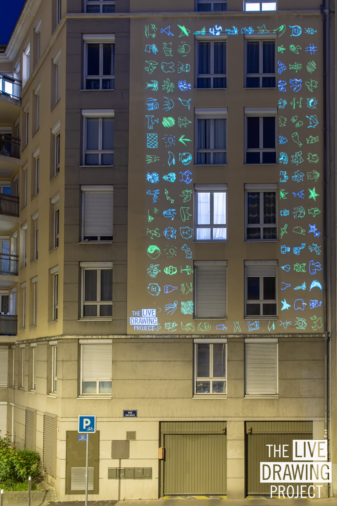
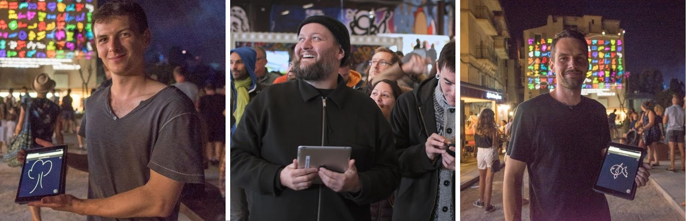

#### La créativité et le partage doivent continuer !

Nous avons décidé d'adapter notre installation pour continuer à exposer pendant le confinement. **Rejoignez le mouvement** et lancez The Live Drawing Project depuis votre fenêtre pour divertir vos voisins et lutter contre la morosité !

Nous exposons tous les dimanches soirs à 21h partout en France.

Vous souhaitez vous joindre à nous dimanche prochain ? Sortez votre vidéoprojecteur et répondez à ce formulaire:

## [Formulaire de participation](https://framaforms.org/stayhome-and-staycreative-1585829622)

#### Précedentes expositions

- Lundi 30 mars: premier test, **2 lieux simultanés**
- Dimanche 4 avril: **3 lieux simultanés, 550 dessins, 80 participants**
- Dimanche 11 avril: **12 lieux simultanés, 1800 dessins, 150 participants**
- Dimanche 18 avril: Rejoignez le mouvement pour battre le record !

#### Contenus

<photo-grid>

</photo-grid>

Retrouvez plus d'images sur nos réseaux sociaux: [Instagram](https://instagram.com/livedrawingproject) [Facebook](https://facebook.com/TheLiveDrawingProject)

#### PRESSE

[Telecharger le communiqué de presse du 06 avril](comPresse6avril2020.pdf)

#### L’ÉQUIPE

### MAXIME TOUROUTE est ingénieur en Arts Visuels.

Il est diplômé de l’école Polytechnique Universitaire de Nice. Autodidacte, il se spécialise après sa formation dans le domaine de l’audiovisuel et de l’art numérique. Il est réalisateur ou technicien sur les plateaux de tournage. Il s’investit aussi sur des projets comme le projet Humanlapse, où il explore la création de timelapses de portrait; Space Dances, projet de parcours chorégraphique en Réalité Augmentée et The Live Drawing Project. Au quotidien, Maxime s’investit sur des projets à finalité artistique où il peut mêler ses compétences techniques et sa passion créative.

### LOUIS CLÉMENT est régisseur général et scénographe.

Il est diplômé d’architecture de l’ENSA Paris Val de Seine.Depuis 2014, il est régisseur général pour l’Ensemble ALEPH et réalise des parcours avec intervention musicales en espace public à Paris 13, Cluny, Beaune. Il assure également la direction technique du festival de musique contemporaine « D’Aujourd’hui à Demain » à Cluny depuis 2017 avec 10 jours de concerts dans 5 lieux différents. Il travaille également comme régisseur vidéo pour Le MAC de Lyon, le MBA de Lyon, la biennale d’art contemporain 2020 et le Musée d’Art de Valence.

### MAXIME HURDEQUINT est architecte et illustrateur.

Après avoir complété sa formation par différentes pratiques au Danemark, Mexique puis Japon à l’agence Sou Fujimoto, il a exercé comme architecte chef de projet à Paris. Il est aussi illustrateur et depuis plusieurs années il demande à des proches ou des inconnus de
dessiner un arbre sur chaque page de son carnet : “J’aime faire dessiner les gens pour partager un moment avec eux, j’adore leur montrer ensuite la diversité des dessins que j’ai accumulé”.
