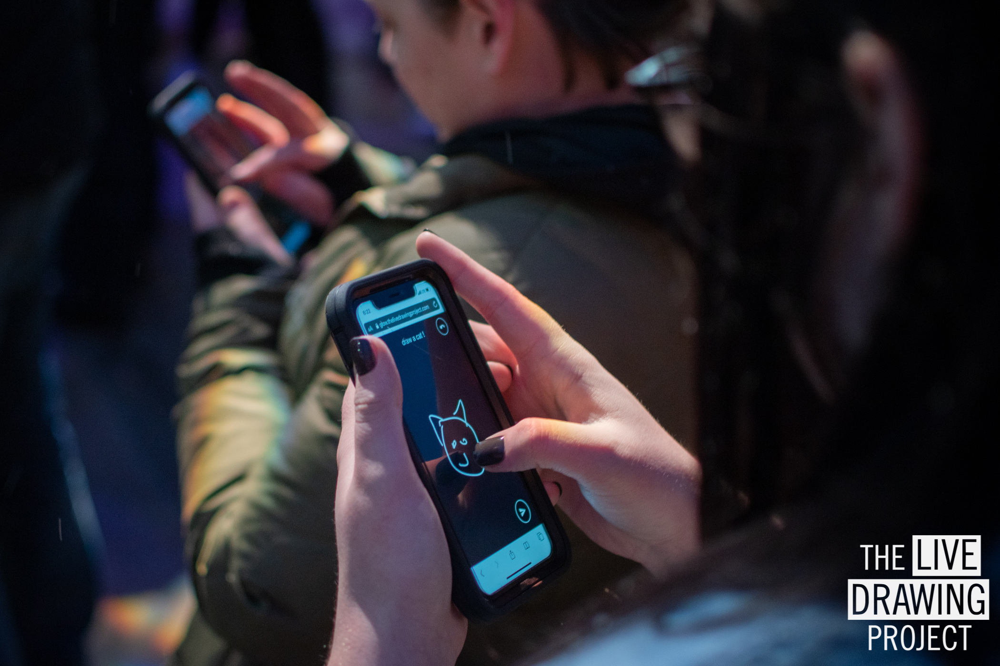

## Cet événement est désormais terminé. Merci à tous les participants !

 
 
 
 

## Article original de l'événement ci-dessous:

#### Dessinons ensemble et projetons nos dessins sur les murs des villes !

Les mesures de confinement ont entraîné l’annulation de l’ensemble des événements culturels. Pour parer à cela nous proposons de partager un moment de dessin ensemble tous les dimanches soirs. **Rejoignez le mouvement** et vidéoprojetez sur un mur extérieur les dessins qui seront faits par vous et vos voisins sur leurs téléphones. Vous pouvez dessiner avec les autres participants dans toute la France et passer vos messages de soutien.

  Nous avons exposé tous les dimanches soirs à 21h partout en France.

#### Comment ça marche ?

Les participants sont invités à dessiner librement sur leurs téléphones sans rien télécharger :

1. Ils vont sur la page d’accueil de notre site pour accéder à l’interface de dessin
2. Ils dessinent avec leurs doigts directement sur l’écran du téléphone
3. Ils envoient leur dessin qui rejoint alors la projection

Les dessins transitent entre les villes connectant les participants et créant une **oeuvre collective unique qui évolue à chaque nouveau dessin reçu**.

#### Comment participer ?

Si vous avez un vidéoprojecteur, vous pouvez vous aussi projeter depuis votre fenêtre. Nous sommes plus de 30 volontaires à projeter à travers la France. Pour nous rejoindre, remplissez le formulaire et nous vous contacterons :

- Le formulaire n'est plus disponible désormais.

 
 

#### 6 week-ends de projection en avril et mai

Depuis le début du confinement nous avons fait ensemble plus de **9500 dessins** avec **560 participants cumulés** dans **30 lieux différents** à travers **10 villes**.

 
 

<ImageGrid props={props} />

_Photos libre de droit_

Retrouvez plus d'images de cet événement sur nos réseaux sociaux: [Instagram](https://instagram.com/livedrawingproject) [Facebook](https://facebook.com/TheLiveDrawingProject)

[Photos de nos autres événements](/fr/gallery)

#### Merci à tous les volontaires

Merci à Gilles, David, Alain, Yannick, Livia, Josselin, Aurélie, Romain, Aurélien, Marion, Harold, Yann, Anne, Théo, Julien, Vincent, Nicolas, Monsieur Nuage, Colin, Georges, Victor, Charles, Dorian, Corentin, Lilian, Francis, Emeric, Maxime, Maxime et Louis pour votre participation à cette aventure !

#### Merci à nos partenaires et relais de communication

- [L'AADN](https://aadn.org/) pour leur précieux soutien
- [Fun Station](https://funstation.fr/) pour leur interview
- Jean-Baptiste Wallers-Bulot, rédacteur web et influenceur Lumières. Retrouvez son travail sur [Scoop It](https://www.scoop.it/topic/lumieres-by-jbbulot) et [Light Zoom Lumiere](https://www.lightzoomlumiere.fr/auteur/jeanbaptiste497/)
- [Pix314](http://pix314.com/)
- [La Ville de Lyon](https://www.lyon.fr/actualite/culture/dessineaveclesvoisins-le-live-drawing-participatif)
- [The Mayor](https://www.themayor.eu/en/lyon-citizens-create-giant-paintings-together-in-real-time)
- [City Crunch Lyon](https://lyon.citycrunch.fr/the-live-drawing-project-jouez-a-dessiner-sur-les-murs-avec-vos-voisins/2020/04/19/)
- [Le Cube](https://www.facebook.com/lecube.digitalart/?ref=br_rs)
- [La Brouette Saint Etienne](https://www.facebook.com/la.brouette.de.ouf/)
- [Eclairage Public](http://eclairagepublic.eu/site/confinement-the-live-drawing-project-pour-dessiner-en-lumiere-avec-ses-voisins/)
- [Lyon Capitale](https://www.lyoncapitale.fr/actualite/confinement-participez-a-une-oeuvre-lumineuse-et-dessinee-depuis-chez-vous/)
- [Reporters D'espoir](http://www.reportersdespoirs.org/)
- [Copenhagen Light Festival](https://www.facebook.com/cphlightfest/)
- [Østerbro Lokaludvalg](https://www.facebook.com/oesterbro.lokaludvalg/)
- Tous les participants qui partagent notre initiative sur les réseaux sociaux

#### PRESSE

Toutes les photos de cette page sont libres de droit.
