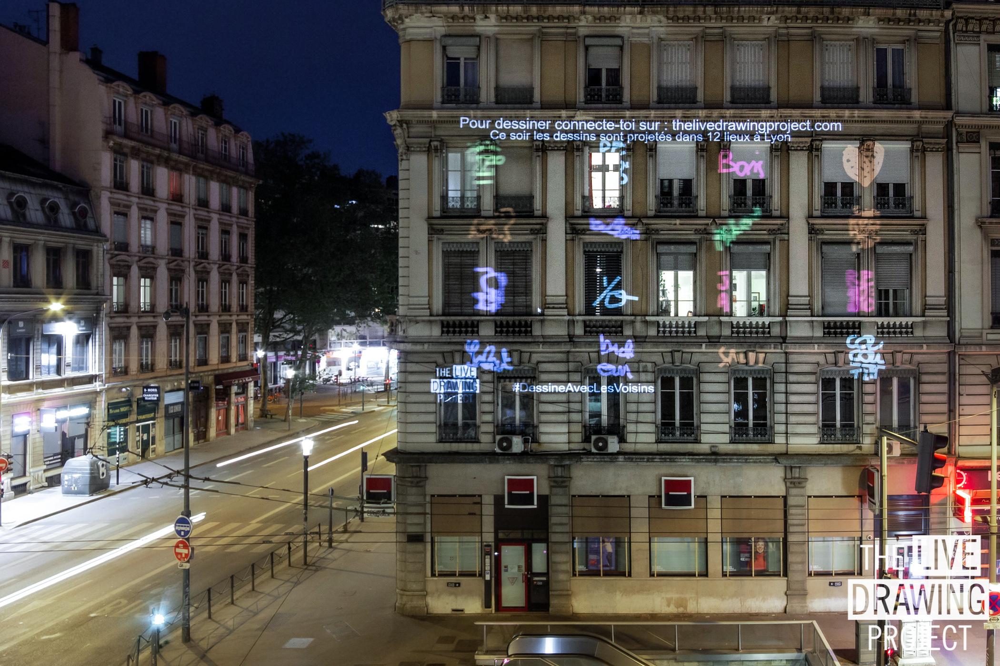
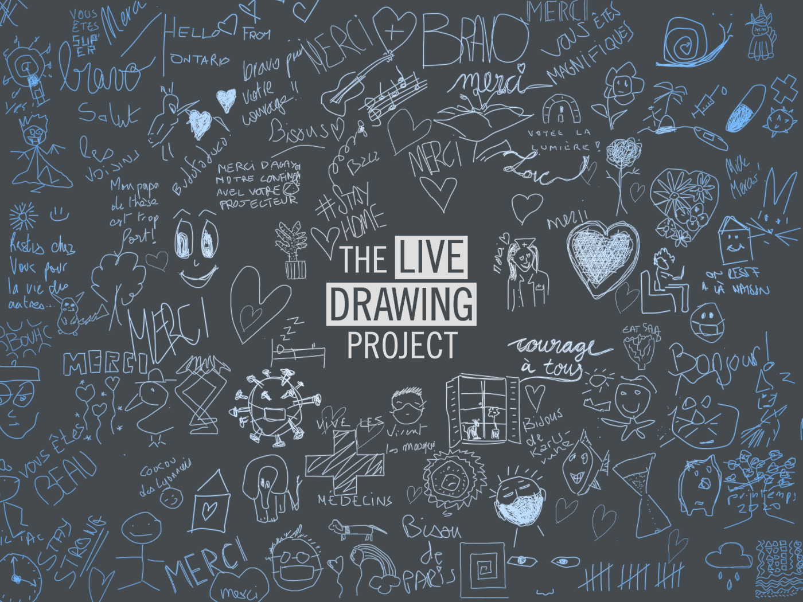

#### Let's draw together on city walls all over the world!

We decided to adapt our installation so we can exhibit with you during lockdown. **Join the movement** and run _The Live Drawing Project_ from your window with your neigboors to tackle monotony!

**We exhibit every Sunday evening at 9PM. The installation works all over the world.**

#### HOW DOES IT WORK?

Everyone can draw on its phone. The drawings appear instantaneously on the walls! Drawings travel between locations connecting people and creating a **collective artwork**. Would you like to join us next Sunday? To videoproject from your home it's very simple: fill the form and we will contact you:

## [Participation Form](https://framaforms.org/stayhome-and-staycreative-1585829622)

#### AGENDA

- Monday 30th March: _first test, 2 locations_
- Sunday 5th April: _5 locations, 550 drawings, 80 participants_
- Sunday 12nd April: _12 locations, 1800 drawings, 150 participants_
- Sunday 19th April: _20 locations, 2500 drawings, 160 participants_
- **Sunday 26th April: Join us for the 4th live drawing session at 9pm (French Time).**

#### PHOTOS

<photo-grid>

</photo-grid>

Find more pictures of this event on social networks: [Instagram](https://instagram.com/livedrawingproject) [Facebook](https://facebook.com/TheLiveDrawingProject)

[Pictures of other events](/gallery)

#### PRESS

[Download the Press Release (20th April 2020)](PR_TLDP_2004.pdf)

[Download the brochure (in French)](TheLiveDrawingProject_Brochure_FR.pdf)

#### THE TEAM

_From left to right:_

- **MAXIME TOUROUTE is a Visual Arts engineer**

Graduate from the School Polytechnique Universitaire de Nice (France), he specializes in the fields of audiovisual and digital art.
He develops projects combining interactivity and technology with a special focus on our relationship to intimacy. His _Humanlapse_ project exploring the timelapse technique for human portraits gives him visibility with the #humanlapse reused by many photographers on social medias around the globe. His engineering education shapes his creative process with Space Dances, choregraphic explorations in Augmented Reality and The Live Drawing Project, collective drawing installation.

- **LOUIS CLÉMENT is a Scenographer**

- **MAXIME HURDEQUINT is an Architect and Illustrator**
