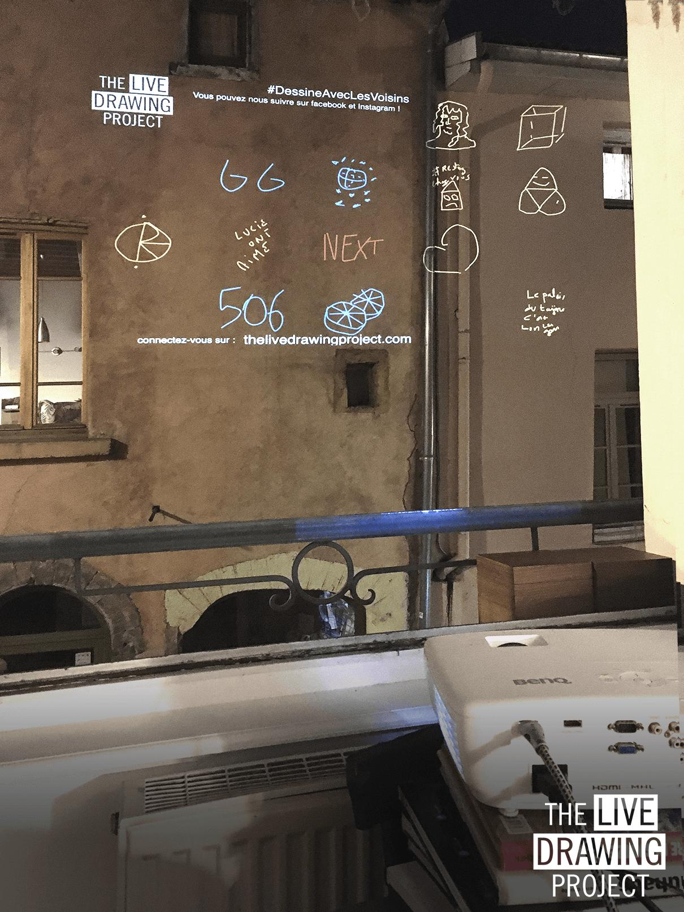

#### Creativity and collective spirit must go on!

We decided to adapt our installation so we can keep exhibiting during lockdown. **Join the movement** and run The Live Drawing Project from your window!

We exhibit every Sunday evening at 9pm. The installation works all over the world.

Would you like to join us next Sunday? Take out your video projector and fill this form:

## [Participation Form](https://framaforms.org/stayhome-and-staycreative-1585829622)

#### AGENDA

- Monday 30th March: _first test, 2 locations_
- Sunday 5th April: _5 locations, 550 drawings, 80 participants_
- Sunday 12nd April: _12 locations, 1800 drawings, 180 participants_
- **Sunday 19th avril: Join the movement all over the world!**

#### PHOTOS

<photo-grid>

</photo-grid>

Find more pictures of this event on social networks: [Instagram](https://instagram.com/livedrawingproject) [Facebook](https://facebook.com/TheLiveDrawingProject)

[Pictures of other events](/gallery)

#### PRESS

[Download the Press Release (14th April 2020) (in French)](TheLiveDrawingProject_comPresse14avril2020.pdf)

[Download the brochure (in French)](TheLiveDrawingProject_Brochure_FR.pdf)

#### THE TEAM

From left to right:

- MAXIME TOUROUTE is a Visual Arts engineer
- LOUIS CLÉMENT is a Scenographer
- MAXIME HURDEQUINT is an Architect and Illustrator
