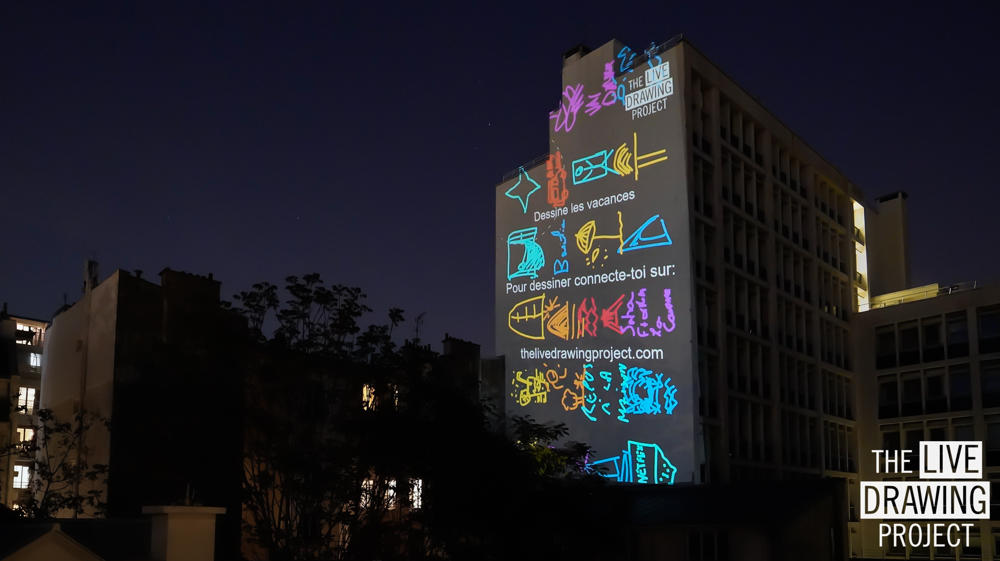

#### Let's draw together on city walls all over the world!

Lockdown measures brought all social and cultural activities to a halt. To tackle this we offer to share together a drawing session every Sunday evening. **Join the movement** and videoproject on a wall drawings made by you and your neigbors on their phones. You can draw with all other participants around the world and send your supportive messages.

We exhibit every Sunday at 9PM. You can participate all over the world!

#### How does it work?

Participants are invited to draw freely on their phone without downloading an app:

1. They go on this website and access the drawing interface
2. They finger draw directly on their phone screen
3. They send their drawings. Drawings join the videoprojection instantly

Drawings travel between locations connecting people and creating a **collective artwork evolving with upcoming drawings**.

#### How to participate ?

If you have a videoprojector you can join the movement. We are currently more than 25 volunteers across multiple cities. To join us, fill the form and we will reach you:

## [Participation Form](https://framaforms.org/dessineaveclesvoisins-drawfromthewindow-1585829622)

 
 

#### Join us Sunday 10th of May at 9PM

Since the lockdown started we made more than **8500 drawings** with **560 participants** in **30 locations** across **10 cities**. Join us next Sunday for a new drawing session together!

 
 

<photo-grid>

</photo-grid>

_Royalty free pictures_

Find more pictures of this event on social networks: [Instagram](https://instagram.com/livedrawingproject) [Facebook](https://facebook.com/TheLiveDrawingProject)

[Pictures of other events](/gallery)

#### Thank you to all the volunteers

Thank you Gilles, David, Alain, Yannick, Livia, Josselin, Aurélie, Romain, Aurélien, Marion, Harold, Yann, Anne, Théo, Julien, Vincent, Nicolas, Monsieur Nuage, Colin, Georges, Victor, Charles, Dorian, Corentin, Lilian, Francis, Emeric, Maxime, Maxime et Louis for joining this adventure!

#### Thank you to our partners and communication channels

- [Ville de Lyon](https://www.lyon.fr/actualite/culture/dessineaveclesvoisins-le-live-drawing-participatif)
- [Fun Station](https://funstation.fr/)
- [The Mayor](https://www.themayor.eu/en/lyon-citizens-create-giant-paintings-together-in-real-time)
- [City Crunch Lyon](https://lyon.citycrunch.fr/the-live-drawing-project-jouez-a-dessiner-sur-les-murs-avec-vos-voisins/2020/04/19/)
- [Le Cube](https://www.facebook.com/lecube.digitalart/?ref=br_rs)
- [La Brouette Saint Etienne](https://www.facebook.com/la.brouette.de.ouf/)
- Jean-Baptiste Wallers-Bulot, journalist and light expert. Discover his work on [Scoop It](https://www.scoop.it/topic/lumieres-by-jbbulot) and [Light Zoom Lumiere](https://www.lightzoomlumiere.fr/auteur/jeanbaptiste497/)
- [Eclairage Public](http://eclairagepublic.eu/site/confinement-the-live-drawing-project-pour-dessiner-en-lumiere-avec-ses-voisins/)
- [Lyon Capitale](https://www.lyoncapitale.fr/actualite/confinement-participez-a-une-oeuvre-lumineuse-et-dessinee-depuis-chez-vous/)
- [L'AADN](aadn.org/) for their precious support
- [Reporters D'espoir](http://www.reportersdespoirs.org/)
- [Copenhagen Light Festival](https://www.facebook.com/cphlightfest/)
- [Østerbro Lokaludvalg](https://www.facebook.com/oesterbro.lokaludvalg/)
- All of you sharing this initiative across social medias

#### PRESS

All pictures on this website are royalty free.

[Press Kit](https://drive.google.com/drive/folders/1OAtVA8CTudPPjQpv13f1FJJ6o-Of4Mwa)
