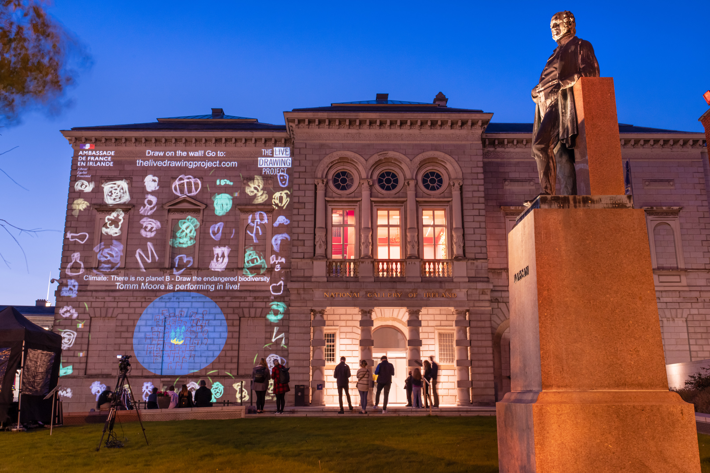
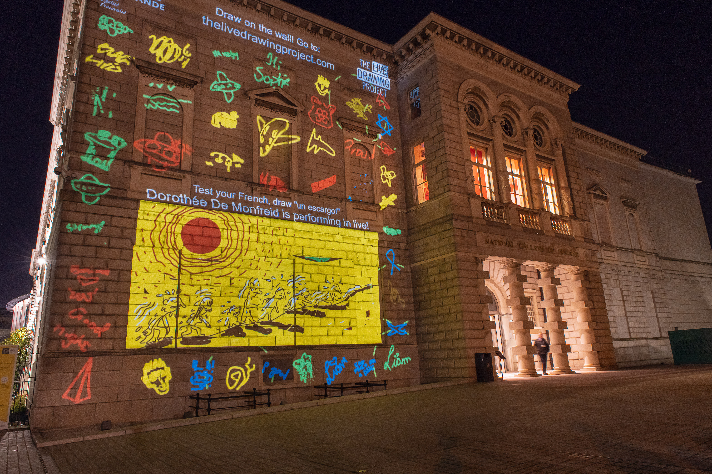
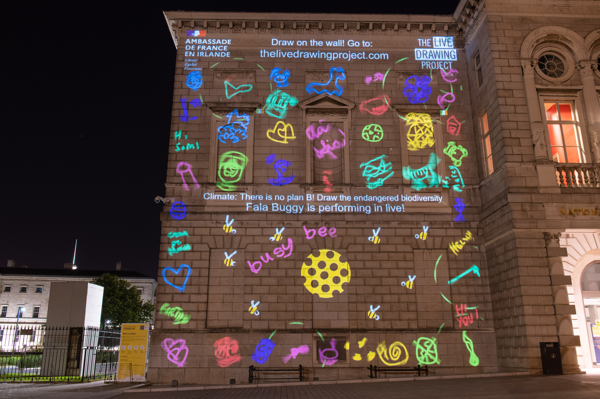
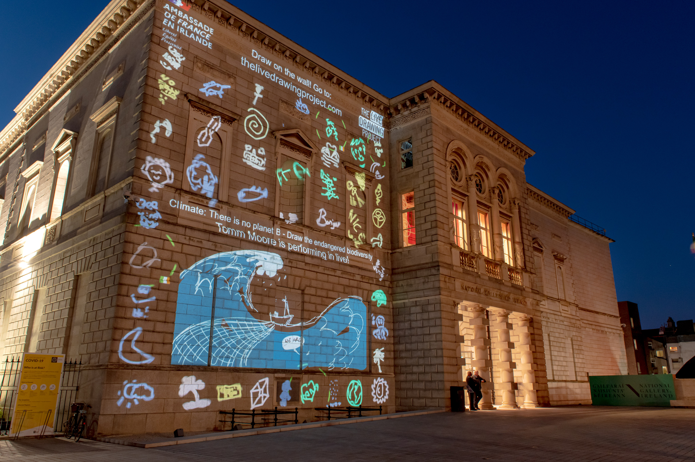
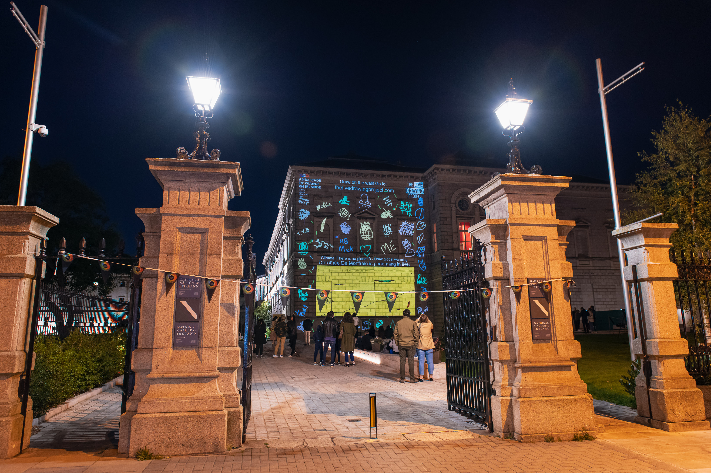

#### Description

Pour Culture Night, un événement irlandais annuel, nous avons vidéoprojeté sur la facade de la National Gallery de Dublin et au Centre Culturel Irlandais à Paris simultanément. Les participants ont pu voir leur dessins apparaitre dans chaque pays, créant des échanges entre l'Irlande et la France. L'origine des dessins apparaissait sur la vidéoprojection.

Pendant l'événement, 8 dessinateurs professionnels ont utilisé notre plateforme de performance pour dessiner sur les murs depuis chez eux. Leurs dessins sont apparus en temps réel, trait par trait, à Dublin et à Paris.

Tout l'événement a été diffusé en direct sur les réseaux sociaux pour permettre une participation à distance.

_Nous avons géré la partie irlandaise de cet événement entièrement à distance._

#### Partenaires

[Ambassade de France en Irlande](https://ie.ambafrance.org/)  
[Culture Night](https://culturenight.ie/)  
[Centre Culturel Irlandais](https://www.centreculturelirlandais.com/)

#### Dessinateurs

[John Beattie](https://www.johnbeattie.ie/)  
[Stephen Brandes](http://www.stephenbrandes.com/)  
[Vaida Varnagiene](https://vaidavarnagiene.weebly.com/)  
[Tomm Moore](https://www.cartoonsaloon.ie/)  
[Dorothée de Monfreid](https://www.dorotheedemonfreid.fr/)  
[Fala Buggy](https://falabuggy.com/)  
[Claire Prouvost](https://claireprouvost.com/)  
[Sarah Ward](http://www.gingerbred.co.uk/)

<photo-grid>

</photo-grid>

Photos: Courtesy of French Embassy in Ireland – [Dora Kazmierak](https://www.dorakazmierak.com/)
