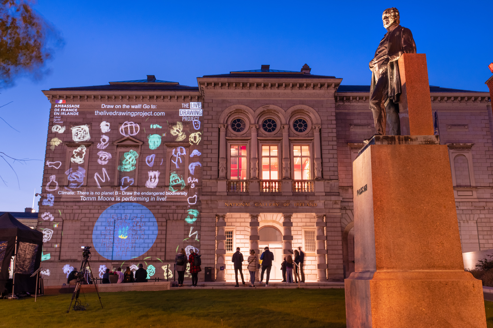
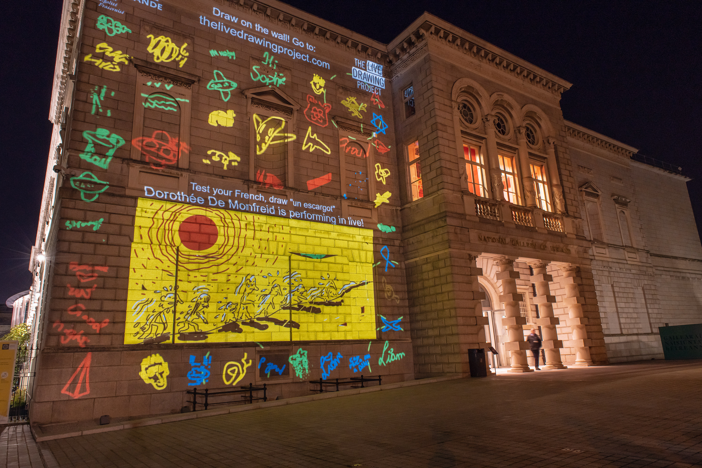
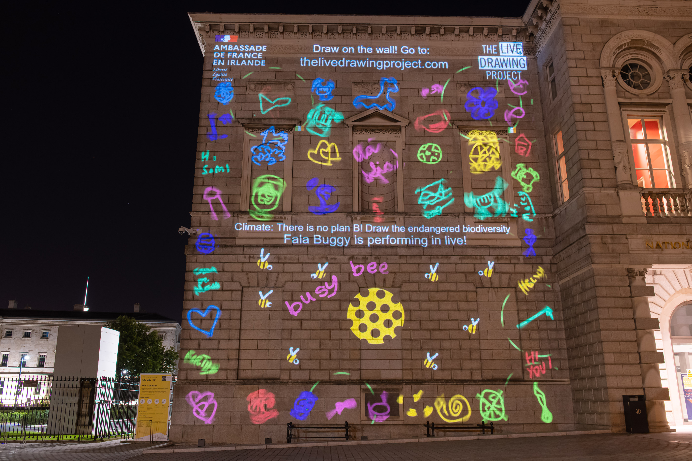
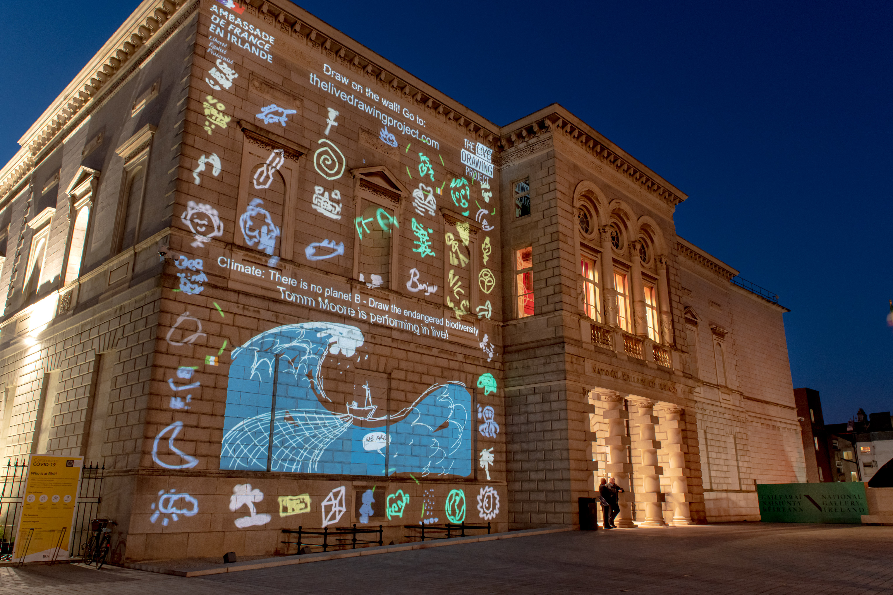
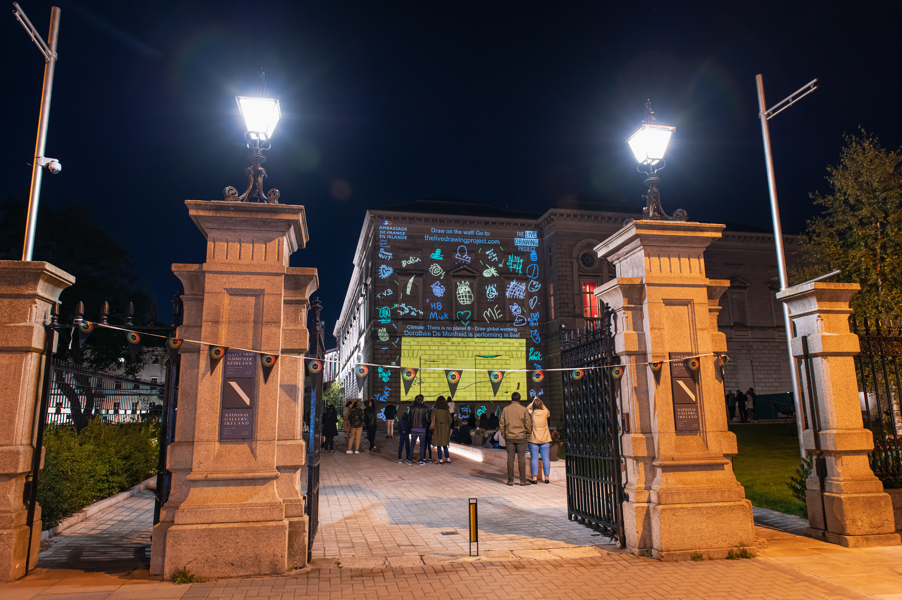

#### Description

For Culture Night, an annual Irish event, we videoprojected on the National Gallery of Dublin and at the Irish Cultural Center in Paris simultaneously. Participants were able to see their drawings on both sides, creating exchanges between France and Ireland. The drawings origin countries were displayed on the projection.

During the event, 8 illustrators used our performance platform to draw on the walls from their home. Their drawings appeared in real time, stroke by stroke, in Dublin and in Paris.

The whole event was livestreamed on social medias to let people participate from home.

_We operated the Dublin part of this event remotely from France._

#### Partners

[French Embassy in Ireland](https://ie.ambafrance.org/)  
[Culture Night](https://culturenight.ie/)  
[Irish Cultural Center](https://www.centreculturelirlandais.com/)

#### Performers

[John Beattie](https://www.johnbeattie.ie/)  
[Stephen Brandes](http://www.stephenbrandes.com/)  
[Vaida Varnagiene](https://vaidavarnagiene.weebly.com/)  
[Tomm Moore](https://www.cartoonsaloon.ie/)  
[Dorothée de Monfreid](https://www.dorotheedemonfreid.fr/en/)  
[Fala Buggy](https://falabuggy.com/)  
[Claire Prouvost](https://claireprouvost.com/)  
[Sarah Ward](http://www.gingerbred.co.uk/)

<photo-grid>

</photo-grid>

Photos: Courtesy of French Embassy in Ireland – [Dora Kazmierak](https://www.dorakazmierak.com/)
