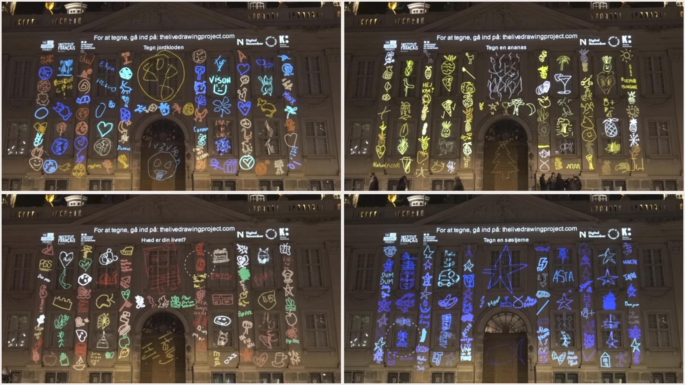

From our offices in France, we remotely controlled a monumental projection on the French Embassy of Danemark monumental facade. Participants were asked to draw on various thematics like climate Change, biodiversity and denmark culture.

### Partners

[French Institute](https://www.institutfrancais.com/)  
[French Embassy of Denmark](https://dk.ambafrance.org/)  
[Danish Arts Foundation](https://www.kunst.dk/)
