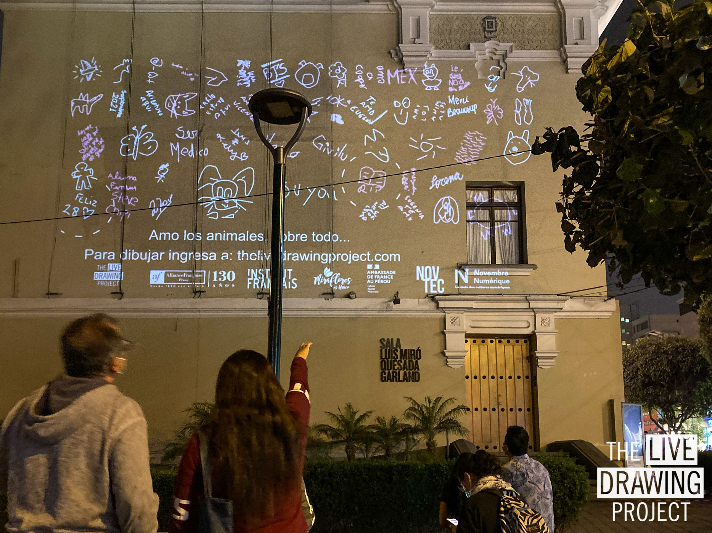

 

Depuis nos bureaux lyonnais, nous avons géré à distance une vidéoprojection monumentale sur le mur de la _Sala Luis Miro Quesada Garland_, à Lima, Pérou. Pendant une soirée, les péruviens étaient invités créer ensemble un mur de l'espoir numérique, nous confiant leurs envies et desirs pour l'avenir.

 
 

<ImageGrid props={props}/>

_Credits photo : Alianza Francesa de Lima_

### Partenaires

[Alliance Francaise de Lima](https://www.alianzafrancesa.org.pe/)
[Institut Français](https://www.institutfrancais.com/)  
[Ambassade de France au Pérou](https://pe.ambafrance.org/)  
[Miraflores TV](https://miraflorestv.pe/)
