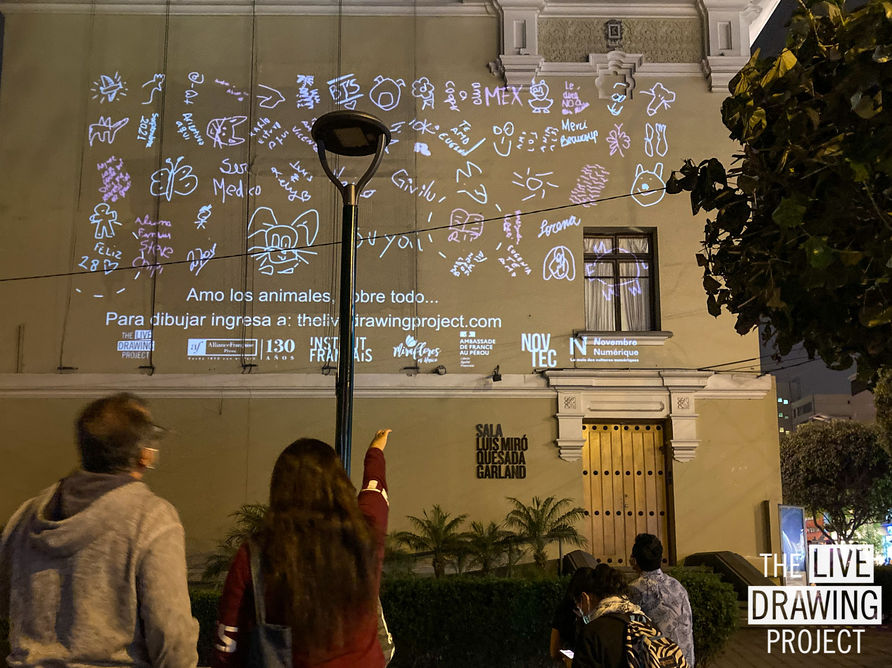

 

From our offices in France, we remotely controlled a monumental projection on the wall of the _Sala Luis Miro Quesada Garland_, in Lima, Peru.
During one evening, peruvians were invited to express their desires for the future on a digital wall of hope.

 
 

 <ImageGrid props={props}/>

_Photo credits: Alianza Francesa de Lima_

### Partners

[French Alliance of Lima](https://www.alianzafrancesa.org.pe/)
[French Institute](https://www.institutfrancais.com/)  
[French Embassy of Peru](https://peru.ambafrance.org/)  
[Miraflores TV](https://miraflorestv.pe/)
