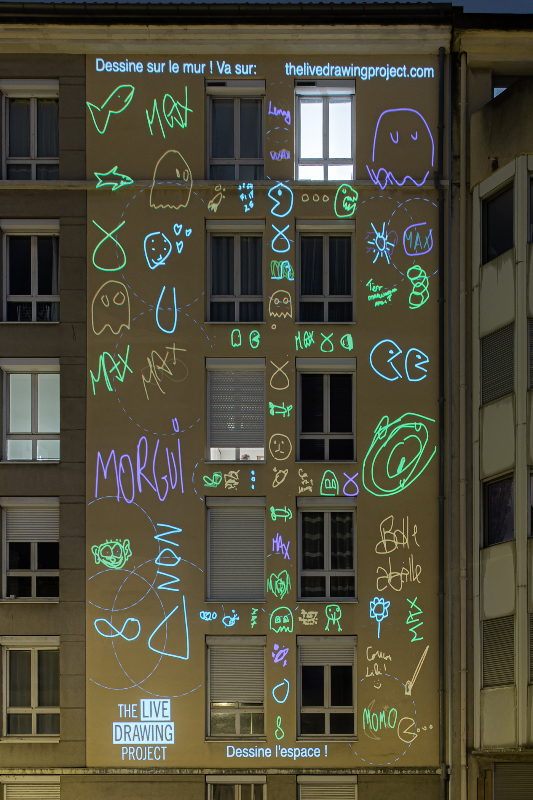
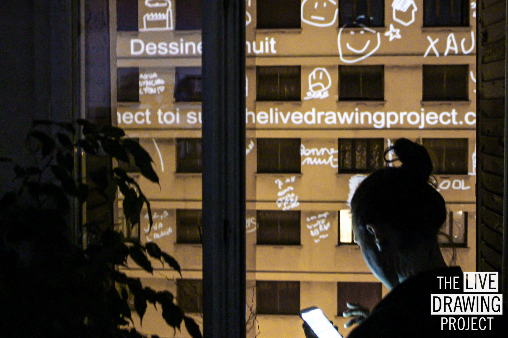

## Faisons la Fête des Lumières à la Fenêtre, depuis chez nous, tous ensemble !

Les mesures de confinement ont entraîné une fois de plus l’annulation de l’ensemble des événements culturels dont la célèbre **Fête des Lumières de Lyon 2020**.

En alternative, nous lançons avec les **habitants** de la métropole et les **artistes locaux** un **grand mouvement de vidéoprojection depuis chez soi**. Un spectacle vidéoprojeté sera diffusé simultanément dans toute la métropole, créant une grande soirée de partage entre voisins : La Fête des Lumières à la Fenêtre.

Rendez-vous à votre fenêtre, au coucher du soleil, le 5 décembre 2020.

## [Evenement Facebook](https://www.facebook.com/events/372296650736821/)

 
 
 

## Programmation

Les détails de la programmation seront annoncés prochainement !

## Comment participer ?

Vous habitez à Lyon ou dans la région Auvergne Rhône Alpes et disposez d'un vidéoprojecteur? **Rejoignez le mouvement** et vidéoprojetez depuis votre fenêtre ! Il vous suffit de remplir le court formulaire de participation :

#### [Formulaire de participation](https://forms.gle/KfCrRYCfP6rSkJPA9)

 
 
 

## Comment installer son vidéoprojecteur ?

C'est très facile :

1. Vous placez votre vidéoprojecteur à la fenêtre (posé sur une table ou un meuble juste derrière la fenêtre). Vous pouvez viser une façade ou le sol.
2. Nous vous envoyons une page web à afficher en plein écran sur le vidéoprojecteur. tout ce qu'il vous faut c'est un navigateur internet.
3. Nous effectuons quelques réglages ensemble depuis la page web : calage de l'image, caches pour ne pas vidéoprojeter dans les fenêtres et ne pas importuner les voisins d'en face. C'est très facile !
4. C'est prêt ! Au cours de la soirée, nous contrôlons votre vidéoprojecteur à distance pour diffuser le spectacle vidéoprojeté.

 
 

#### Je suis artiste, je souhaite proposer mes oeuvres

Photographes, Peintres, vidéastes, street artistes, artistes numériques, proposez vos oeuvres et nous les diffuserons sur les façades de la ville.

Le contenu doit répondre aux caractéristiques suivantes :

- Image, vidéo, ou bien contenu accessible depuis une page web (shadertoy, p5js, ...)
- Le contenu sera diffusé dans tous les lieux de vidéoprojection simultanément. Le parc de vidéoprojecteurs est varié, et le contenu sera projeté parfois en paysage parfois en portrait. Les surfaces de vidéoprojection peuvent comporter des fenêtres (parties du contenu masqué), votre contenu doit prendre ces aspects en compte
- Nous ne pourrons pas diffuser de son

Toutes les oeuvres seront crédités sur les supports de communication, les réseaux sociaux, ainsi que directement sur la vidéoprojection.
Vous pouvez proposer vos oeuvres via ce formulaire :

### [Formulaire de Participation Artistique](https://forms.gle/3gAxqWfKNVQT9Sfq7)

Pour toutes questions, vous pouvez envoyer un mail à [livedrawingproject@pm.me](mailto:livedrawingproject@pm.me)  
 
 

  
 
 

## Lors du premier confinement

Lors du premier confinement en avril, nous avons déjà réuni 500 participants à travers toute la France avec notre installation de dessin collaboratif.
[Plus d'informations sur l'événement d'avril](/stayhome)  
 
 

<photo-grid>

</photo-grid>

#### PRESSE

[Communiqué de Presse](frama.link/fdl-fenetre-cp)

[Photos de nos autres événements](/fr/gallery)

Toutes les photos de cette page sont libres de droit.

Retrouvez nous sur les réseaux sociaux: [Instagram](https://instagram.com/livedrawingproject) [Facebook](https://facebook.com/TheLiveDrawingProject)
