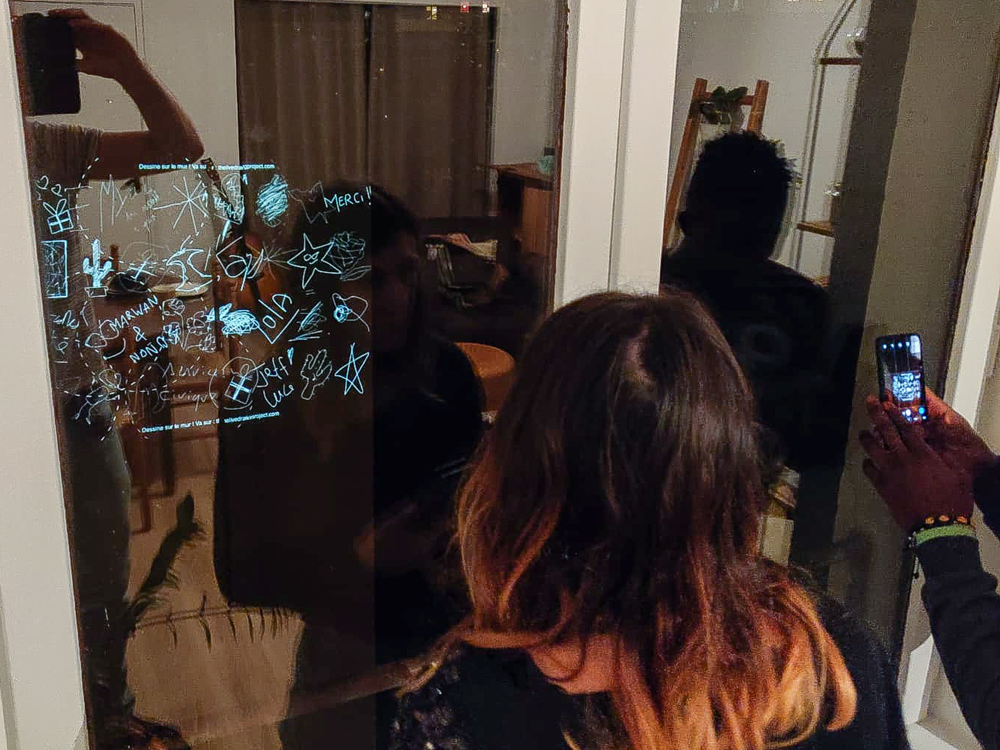
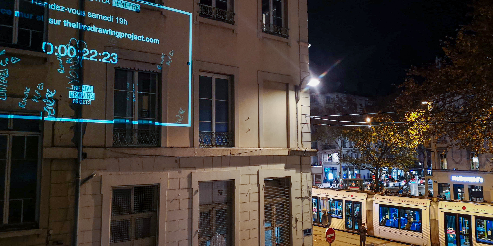

## A light festival at the window, from home, together

The lockdown measures in France brought the famous Light Festival of Lyon 2020 to an halt.

As an alternative, we launched with the **city's inhabitants** and **local artists** a **large movement of neighborhood videoprojections**. A videomapping show has been videoprojected simultaneously in a 100 locations all around the city. We videoprojected our collective drawing installation and the visuals of 18 local artists.

 

<photo-grid>

</photo-grid>

## Our technology

This event was made possible thanks to our **decentralised videomapping technology**. From home, we took control of a 100 videoprojectors simultaneously, showing our drawing installation, images and videos. Our tool let the inhabitants to videoproject from their window even without prior knowledge in videomapping. Interested in our technology ? [Reach us](/contact)

#### Thank you to the local artists

Déambulations - Janine Martin Prades  
Intérieur Nuit - [Trouble Collectif](https://www.instagram.com/TroubleCollectif/)  
Joyeuses Fêtes - Robin  
Loopings - [Francis Malapris](http://malapris.com)  
Shuffle Dance - [4cutprod](https://www.instagram.com/4cutprod/)  
Lumen - [Julien Menzel](http://mrzl.fr/)  
Burning Love - [Clémentine Breed](http://www.clementine-breed.fr/)  
Montgolfières - [Eugénie Lichet](http://instagram.com/eugenie_jl)  
Dessins au trait - [Esthelle Froid](https://www.instagram.com/est_h_elle/)  
Créatures - [Marta Daeuble](http://www.martadaeuble.com/)  
Aurora - [Gain Scenography](https://www.instagram.com/gain.scenography/)  
The Mouth - [Emilien](https://www.instagram.com/emilien.neilime/)  
Bouquets - [Clarisse Garcia](https://www.instagram.com/clarisse_clg/)  
Dessins de confinement - [Lucas Servoz](https://www.instagram.com/servoz.lucas/)  
Peintures - [Maëlle Valantin](https://maellevalantin.wixsite.com/monsite)  
Illustrations - [EC Concept Design](https://www.instagram.com/ecdesign_studio_/)
Planets - [VJ Paulicorne](https://www.instagram.com/paul_icorne/)
Humanlapse - [Maxime Touroute](https://maximetouroute.github.io)

#### Thank you to our communication channels

- [L'AADN](https://aadn.org/)
- [Le Progrès - Lyon Plus](https://www.lyonplus.com/actualite/2020/12/08/une-fete-des-lumieres-chez-soi-citoyenne-et-artistique)
- [BFM TV Lyon](https://www.bfmtv.com/lyon/fete-des-lumieres-les-lyonnais-invites-illuminer-les-facades-grace-a-des-videoprojecteurs_AV-202012030181.html)
- [Radio Espace](http://www.radioespace.com/news/locales/188872/une-fete-des-lumieres-aux-fenetres-cette-annee-a-lyon)
- [Le Bonbon](https://www.lebonbon.fr/lyon/news/fete-des-lumieres-dessins-murs-projection/)
- [Lyon Capitale](https://www.lyoncapitale.fr/actualite/confinement-participez-a-une-oeuvre-lumineuse-et-dessinee-depuis-chez-vous/)
- [Lyon Mag](https://www.lyonmag.com/article/111665/lyon-un-projet-de-fete-des-lumieres-aux-fenetres-cette-annee)
- [Lyon City Crunch](https://lyon.citycrunch.fr/une-fete-des-lumieres-aux-fenetres-le-5-decembre/2020/11/25/)

#### Thank you to all the volunteers

Thank you Sandrine, Marion Delous, David Pauzon, Pauline, Elsa et Pierre, Roxane, Amélie, Léa, Jerome, Enzo, Thomas, Justine, Marieke, Léa, gaspard, Juliette, Ludovic, Marie, Lucas, olivier, Jacques, Clémence & Pierre-Nicolas, Lucie, Pierre et Anne-Charlène, Jean, Florent, Julien, Philippe, Jean-Philippe, Benjamin, Florent, Maria, Florian, Pierre, Mélanie, Eric, yann, Marion, Jérôme, Marion, Margot, Mat, Coralyne, Blanche, Esthelle, Sandrine, Marie-Alix, Olivier, Nadege, Arnaud, Cindy, Mélanie, Marie laure, Margot, Kim, Diane, lambert, Camille, Marion, Jean-Francois, Guillaume, Eddy, Fanny, Maëlle, Thomas, Irène, Audrey, Charlène, Andrew, Yên, Marielle, Anne-Sophie, Evy, Agathe, Colin, Fabienne, Sylvie, Mathias, Sébastien, Laurence, florent, Océane, Nabila, Laura, Faustine, Sébastien, Guillaume, Anouk, Elodie, Victoire, Damien, Antoine, Ariane, Raffaella, Jerome, Philippe, Maxime, Louis, Maxime.
