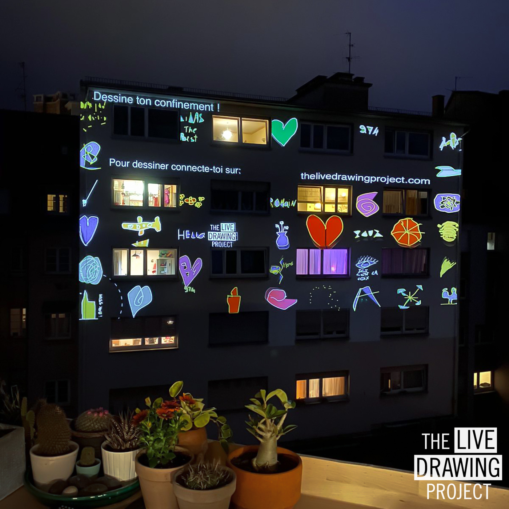
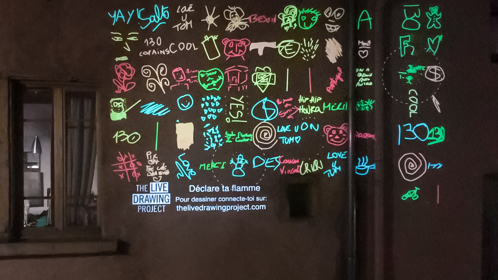

#### Chers Nantais, dessinons ensemble et projetons nos dessins sur les murs de la ville !

A l'occasion des Fêtes de fin d'année, la mairie de Nantes vous propose un **grand mouvement de vidéoprojection de quartier**. Vous êtes invités à dessiner sur votre téléphone et vos dessins apparaitront vidéoprojetés dans plusieurs lieux sur les murs de la ville.

Cette animation entièrement gratuite aura lieu **le mardi 22 décembre et le mercerdi 23 décembre de 18h à 20h**. Pendant l'événement, vous pourrez dessiner en vous connectant à notre site internet [https://thelivedrawingproject.com](https://thelivedrawingproject.com)

Vos dessins apparaitront vidéorojetés en temps-réel dans les quartiers suivents :

- Breil
- Malakoff
- Dervaillères
- Clos Toreau

Vous ne pouvez pas vous déplacer ? Rendez-vous sur notre page facebook pour voir vos dessins sur le _livestream_ :

## [Notre page Facebook](https://www.facebook.com/TheLiveDrawingProject)

 
 
 

#### Comment ça marche ?

Les soirs de l'événement, vous êtes tous invités à dessiner librement sur votre téléphone sans rien télécharger :

1. Vous allez sur [notre site](https://thelivedrawingproject.com) pour accéder à l’interface de dessin
2. Vous dessinez avec vos doigts directement sur l’écran du téléphone
3. Vous cliquez sur envoyer, et votre dessin apparait sur toutes les vidéoprojections !

Les dessins transitent entre les différents lieux connectant les participants et créant une **oeuvre collective unique qui évolue à chaque nouveau dessin reçu**.

<photo-grid>

</photo-grid>

 
 

#### Vous avez un vidéoprojecteur ? Vidéoprojetez avec nous !

Vous êtes tous invités à vidéoprojeter depuis chez vous sur un mur extérieur les dessins de tous les Nantais. **Rejoignez le mouvement** pour illuminer les murs de la ville ! Il vous suffit de remplir le court formulaire de participation et nous vous contacterons :

### [Formulaire pour vidéoprojeter](https://frama.link/videoprojer-depuis-chez-moi)

 
 

### Comment installer son vidéoprojecteur ?

C'est très facile :

1. Vous placez votre vidéoprojecteur à la fenêtre (posé sur une table ou un meuble juste derrière la fenêtre) pour vidéoprojeter sur une façade ou le sol.
2. Nous vous envoyons une page web à afficher en plein écran sur le vidéoprojecteur. tout ce qu'il vous faut c'est un navigateur internet.
3. C'est prêt ! Au cours de la soirée, nous contrôlons votre vidéoprojecteur à distance pour diffuser les dessins des Nantais.

 
 
