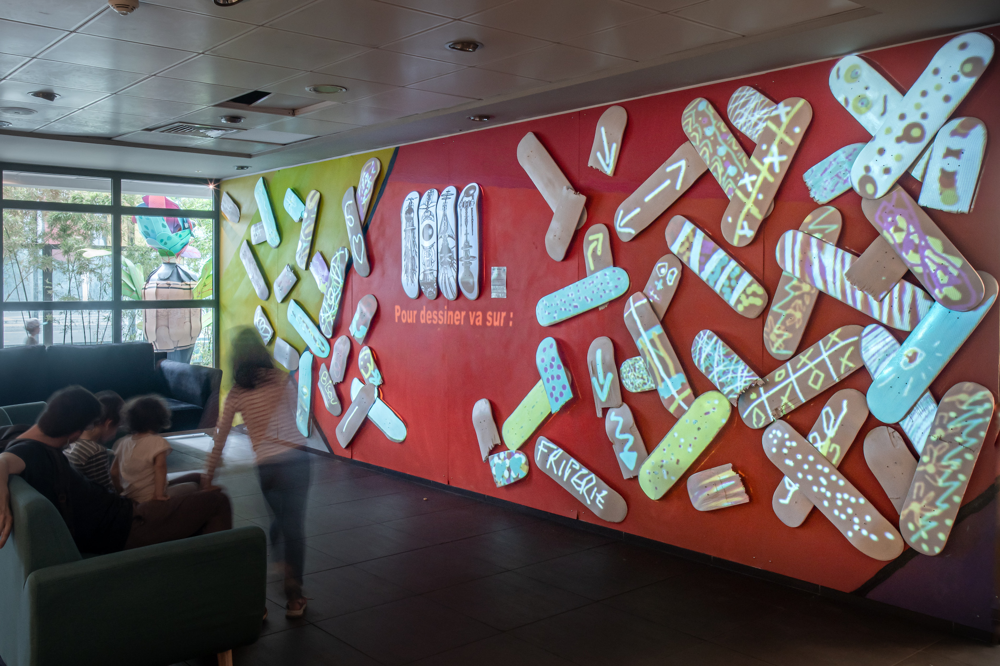

#### Description

This large mural is an hommage to [Spraying Board](/sprayingboard) first edition in March 2020.

At the center, 4 white boards on which we project artworks of the 2020 exhibition. Around it, 59 broken boards we collected from skaters and painted in white. The audience is invited to take its phone and draw freely from our website. Each person gets assigned a unique board. Each stroke made on the phone appears in real time on the board. Participants can express themselves freely using their own imagination, or by getting inspired of the ever changing artwork at the center.

 <ImageGrid props={props}/>

[Event website](https://sprayingboard.thedailyboard.co/)  
Pictures by: [Maxime Touroute](https://maximetouroute.github.io)

#### Partners

[Superposition](//superposition-lyon.com)  
[The Daily Board](//www.thedailyboard.co)  
[Spraying Board](//www.sprayingboard.com)
