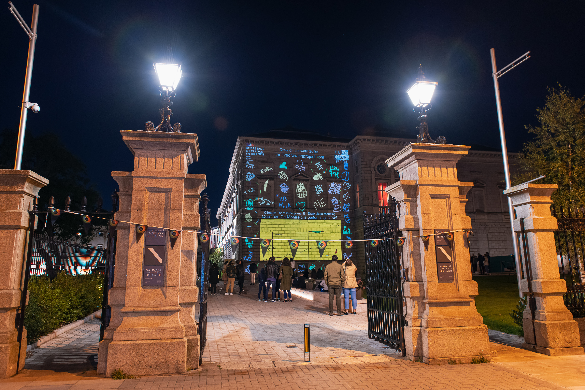

#### Infos événement

17th of September 2021, in Dublin and in Paris.

[Culture Night Event](https://culturenight.ie/event/french-embassy-at-the-national-gallery-of-ireland-the-live-drawing-project-ireland-and-france/)  
[Evenement Facebook](https://www.facebook.com/events/250631850276287/)  

-> Revenez sur notre site le 17 à 5h00 pour dessiner !

#### Description

Nous revenons pour une deuxième année pour Culture Night ! Nous allons projeter sur la National Gallery de Dublin et au Centre Culturel irlandais à Paris simultanément.
Vous pourrez voir vos dessins des deux côtés, créant des échanges entre la France et l'Irlande. L'origine des dessins apparaitra sur la projection.

Pendant l'événement, 7 dessinatrices et dessinateurs feront des dessins en live sur les murs, sur site ou depuis chez eux. 

#### Artistes

[Fuchsia MacAree](https://macaree.ie/)
[Manyoly](https://macaree.ie/)
[Cecilia Danell](http://www.ceciliadanell.com/)
[Holly Pereira](https://www.hollypereira.com/)
[Eamon O’Kane](https://eamonokane.com/)
[Tomm Moore](https://www.cartoonsaloon.ie/)  
[Pierre Coffin](https://www.illuminationmacguff.com/)

#### Partenaires

[Ambassade de France en Irlande](https://ie.ambafrance.org/)  
[Culture Night](https://culturenight.ie/)  
[Centre Culturel Irlandais](https://www.centreculturelirlandais.com/)

Photos: Courtesy of French Embassy in Ireland – [Dora Kazmierak](https://www.dorakazmierak.com/)
