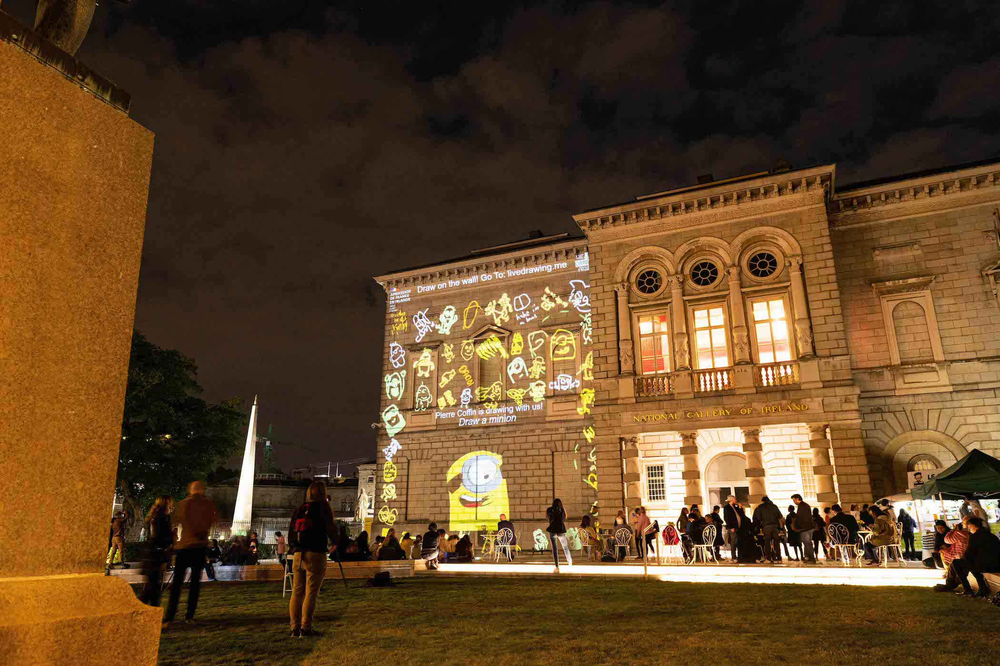

Après une [première édition en 2020](/culturenight), nous sommes revenus pour une deuxième année pour Culture Night. Cette fois ci, nous avons invité irlandais et français à dessiner sur le thème de l'Europe, et de la mer. 
Pendant l'événement, 7 dessinatrices et dessinateurs professionnels ont dessiné en direct sur les façades pour accompagner le public. Les dessins étaient projetés dans deux lieux simultanément : sur la National Gallery de Dublin, et au Centre Culturel Irlandais à Paris.
Tout l'événement a été diffusé en direct sur les réseaux sociaux pour permettre une participation à distance.

_Nous avons géré la partie irlandaise de cet événement à distance._

#### Artistes

[Fuchsia MacAree](https://macaree.ie/)  
[Manyoly](https://www.manyoly.com/)  
[Cecilia Danell](http://www.ceciliadanell.com/)  
[Holly Pereira](https://www.hollypereira.com/)  
[Eamon O’Kane](https://eamonokane.com/)  
[Tomm Moore](https://www.cartoonsaloon.ie/)  
[Pierre Coffin](https://www.illuminationmacguff.com/)  

#### Partenaires

[Ambassade de France en Irlande](https://ie.ambafrance.org/)  
[National Gallery de Dublin](https://www.nationalgallery.ie/)  
[Centre Culturel Irlandais](https://www.centreculturelirlandais.com/)  
[Culture Night](https://culturenight.ie/)  

Photos: Courtesy of French Embassy in Ireland – [Dora Kazmierak](https://www.dorakazmierak.com/), Damien from Centre Culturel Irlandais, Live Drawing Team

<ImageGrid props={props} />