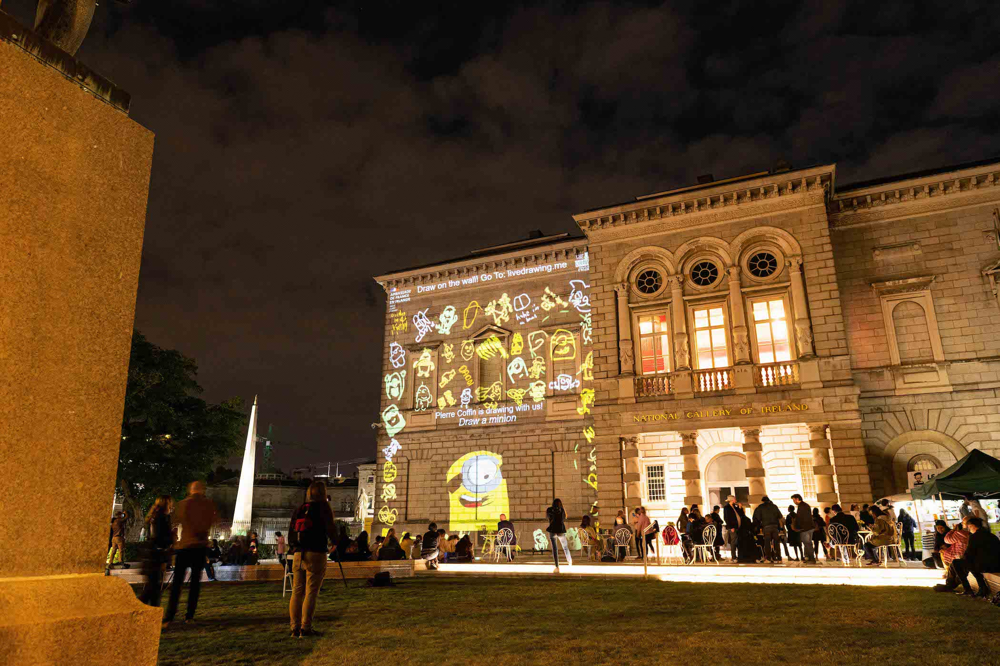

After a successful [first edition in 2020](/culturenight), we came back for a second year to celebrate Culture Night. This time we invited Irish and French people to draw on thematics around Europe and the sea.
During the event, 7 illustrators used our performance platform to draw on the walls. Drawing were projected in two locations simultaneously : On the National Gallery of Dublin, and at the Irish Cultural Center in Paris.

The whole event was livestreamed on social medias to let people participate from home.

_We operated the Dublin part of this event remotely from France.

#### Performers

[Fuchsia MacAree](https://macaree.ie/)  
[Manyoly](https://www.manyoly.com/)  
[Cecilia Danell](http://www.ceciliadanell.com/)  
[Holly Pereira](https://www.hollypereira.com/)  
[Eamon O’Kane](https://eamonokane.com/)  
[Tomm Moore](https://www.cartoonsaloon.ie/)   
[Pierre Coffin](https://www.illuminationmacguff.com/)  

#### Partners

[French Embassy in Ireland](https://ie.ambafrance.org/)  
[National Gallery of Dublin](https://www.nationalgallery.ie/)  
[Irish Cultural Center](https://www.centreculturelirlandais.com/)  
[Culture Night](https://culturenight.ie/)  

Photos: Courtesy of French Embassy in Ireland – [Dora Kazmierak](https://www.dorakazmierak.com/), Damien from Centre Culturel Irlandais, Live Drawing Team

