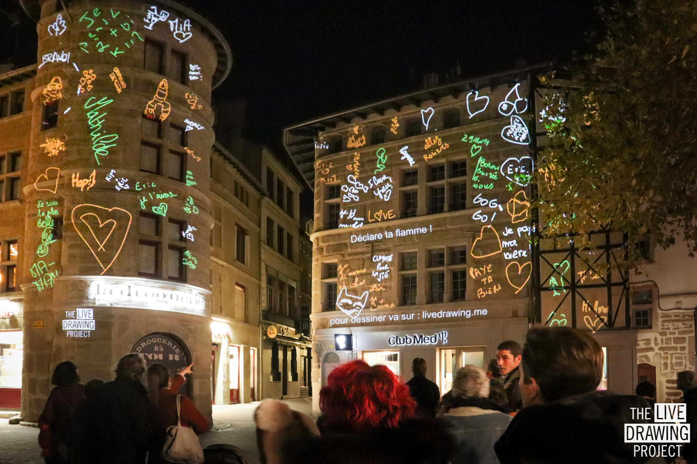

 

We projected during the Pléiades digital art festival of Saint Etienne, France. We lit up two facades including the iconic Droguerie tower. 
Families and friends joined us despite the cold weather to make thousands of drawings.

 

<ImageGrid props={props} />

#### Partners

[Saint Etienne City](https://www.saint-etienne.fr/)  
[Tetro](https://www.tetro.fr/)