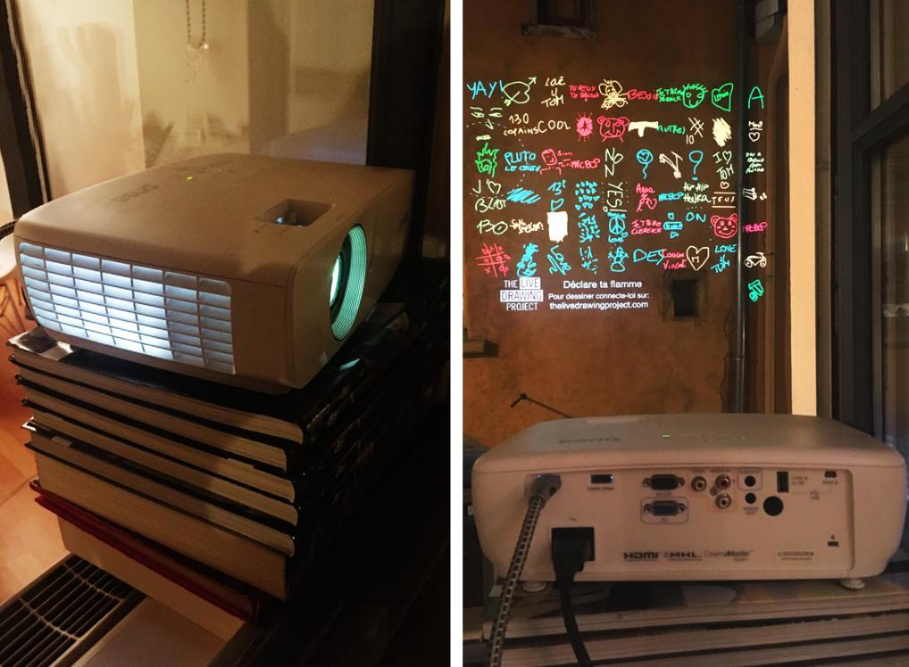

#### Chers Nantais, dessinons ensemble et projetons nos dessins sur les murs de la ville !

A l'occasion du festival **1,2,3 Couleurs !** la mairie de Nantes vous propose un **grand mouvement de vidéoprojection de quartier**. Vous êtes invités à dessiner sur votre téléphone et vos dessins apparaitront vidéoprojetés sur la Place Rosa Parks, et dans plusieurs lieux sur les murs de la ville.

### [Rendez-vous sur l'événement Facebook pour plus d'infos](https://fb.me/e/1IXMnviyP)

 

#### Vous avez un vidéoprojecteur ? Vidéoprojetez avec nous !

Vous êtes tous invités à vidéoprojeter depuis chez vous sur un mur extérieur les dessins de tous les Nantais. **Rejoignez le mouvement** pour illuminer les murs de la ville ! Il vous suffit de remplir le court formulaire de participation et nous vous contacterons :

### [Formulaire pour vidéoprojeter](https://framaforms.org/appel-a-participation-dessine-en-lumiere-malakoff-nantes-25022022-1644321529)

 
 

### Comment installer son vidéoprojecteur ?

C'est très facile :

1. Vous placez votre vidéoprojecteur à la fenêtre (posé sur une table ou un meuble juste derrière la fenêtre) pour vidéoprojeter sur une façade ou le sol.
2. Nous vous envoyons une page web à afficher en plein écran sur le vidéoprojecteur. tout ce qu'il vous faut c'est un navigateur internet.
3. C'est prêt ! Au cours de la soirée, nous contrôlons votre vidéoprojecteur à distance pour diffuser les dessins des Nantais.

 
 
