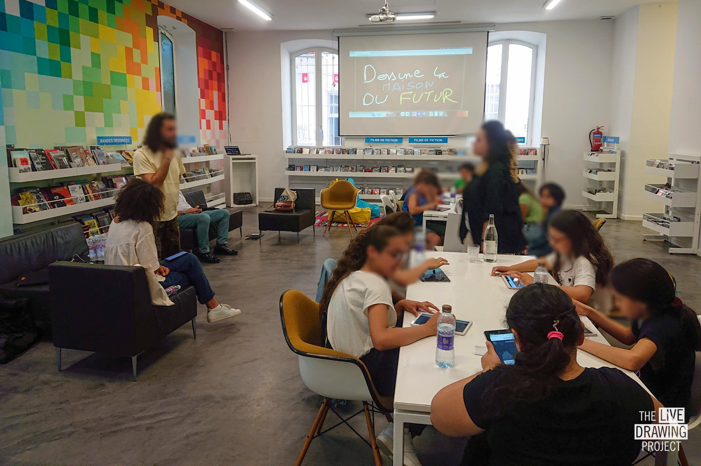

 
 
 

We organised a workshop for children and a projection mapping for the "Nuit des Idées" festival with the [French Institute of Tunis](https://www.institutfrancais-tunisie.com/). Children's drawings were recorded the day before and projected on the façade for the festival (exhibitions, concerts, workshops). The public was invited to draw around the children's creations on a common theme : "rebuild together".

 
 
 

<ImageGrid props={props} />

## Partners

[French Institute of Tunis](https://www.institutfrancais-tunisie.com/)