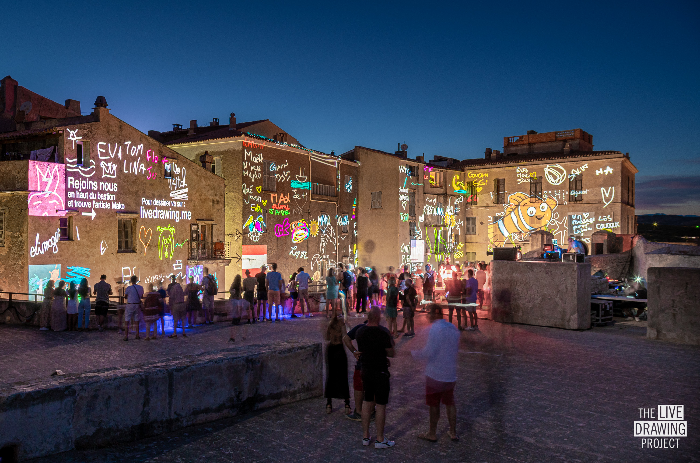

 
 
 

Nous avons participé pour la deuxième fois à Festi Lumi, grande fête des Lumières de Bonifacio. Cette fois-ci, nous nous sommes emparés de l'immense site du Bastion et ses 4 façades. Nous avons invité le public à créer un grand cadavre exquis tous ensemble. L'artiste [Mako Deuza](https://www.makodeuza.com/) nous a rejoint pour dessiner avec le public sur plusieurs thématiques choisies en amont : la mer, les falaises (de Bonifacio), le ciel étoilé...

 
 
 

<ImageGrid props={props} />

## Partenaires
[Mairie de Bonifacio](https://www.bonifacio-mairie.fr/)  
[L'Agence Lumière](https://www.agence-lumiere.fr/)  
[L'artiste Mako](https://www.makodeuza.com/)  
[VLS](https://www.vls.fr/en/)  