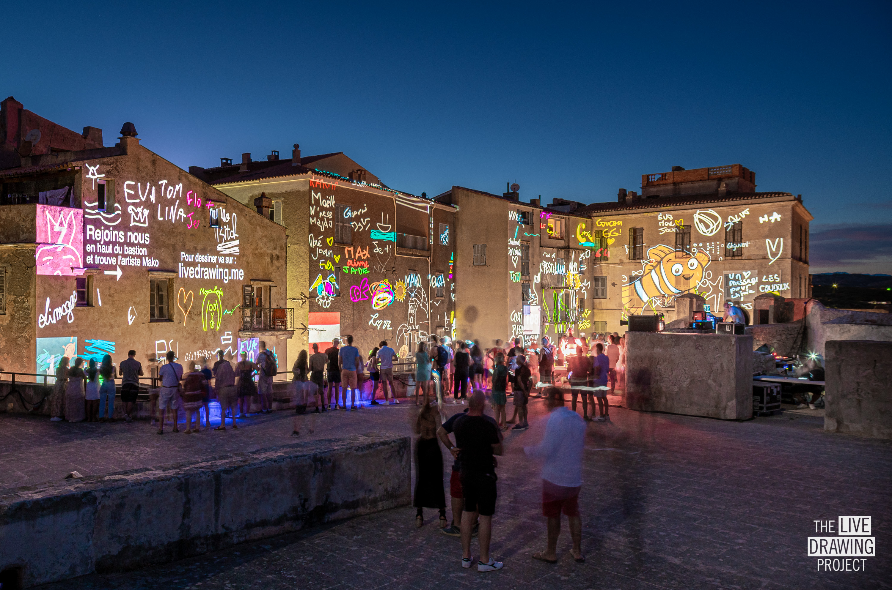

 
 
 

We projected for the second time at Festi Lumi, the largest Light Festival of Corsica.
This time, we mapped the immense "Bastion" with four façades. The public was invited to make an _exquisite corpse_ drawing.
Street artist [Mako Deuza](https://www.makodeuza.com/) joined us to draw alongside the audience on multiple themes : the sea, the cliffs (of Bonifacio), the starry sky...

 
 
 

<ImageGrid props={props} />

## Partners
[Bonifacio City](https://www.bonifacio-mairie.fr/)  
[L'Agence Lumière](https://www.agence-lumiere.fr/)  
[Street Artist Mako](https://www.makodeuza.com/)  
[VLS](https://www.vls.fr/en/)  