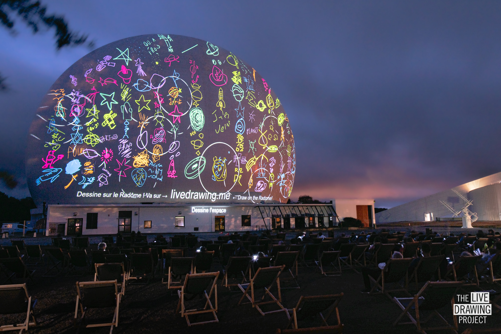

 
 
 

Nous avons célébré les 6O ans de la [Cité des Telecoms](https://www.cite-telecoms.com/en/) en projetant sur l'immense toile du Radôme avec un show interactif et sonore.
 Lors de l'événement, les petits et les grands pouvaient proposer des thématiques de dessin à la foule et contrôler les couleurs de la projection.
pendant que le musicien [Yomi](https://www.instagram.com/yomi.music/) composait un liveset immersif. 
Record battu pour le Live Drawing Project, avec un total de __6400 dessins réalisés par le public en 90 minutes de spectacle, soit plus d'un dessin par seconde !__

 
 
 

<ImageGrid props={props} />

## Partenaires
[Cité des Telecoms](https://www.cite-telecoms.com/en/)  
[Fondation Orange](https://www.fondationorange.com/en)  
[Yomi](https://www.instagram.com/yomi.music/)  