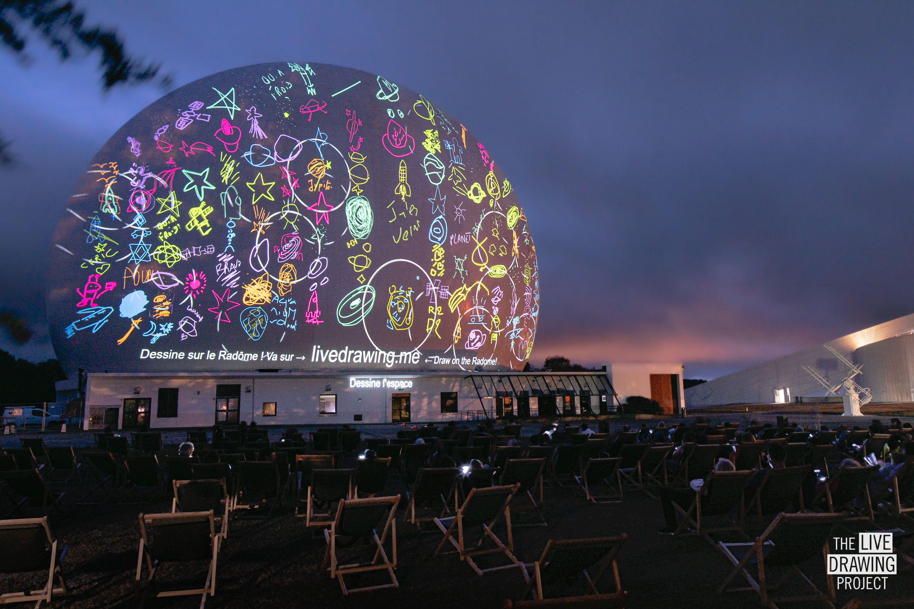

 
 
 

We celebrated the the [Cité des Telecoms](https://www.cite-telecoms.com/en/) 60th birthday by producing an interactive projection and musical show.
During the event, people of all ages were invited to choose drawing thematics and control the projection colours while musician [Yomi](https://www.instagram.com/yomi.music/) performed an immersive liveset.
Record breaking event for the Live Drawing Project with __6,400 drawings made by the audience in 90 minutes: more than one drawing per second!__

 
 
 

<ImageGrid props={props} />

## Partners
[Cité des Telecoms](https://www.cite-telecoms.com/en/)  
[Orange Foundation](https://www.fondationorange.com/en)  
[Yomi](https://www.instagram.com/yomi.music/)  