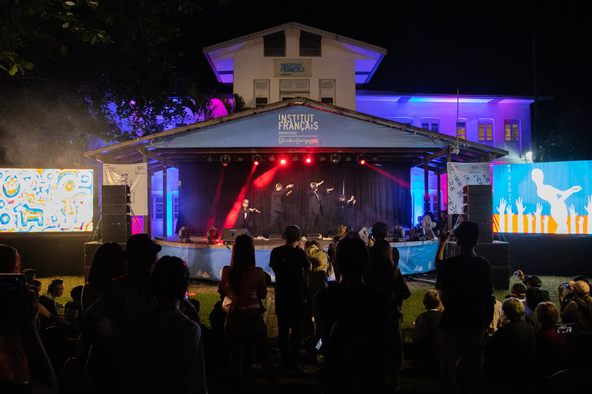

 
 
 

Nous avons été invités par [l'Institut Français de Birmanie](https://www.ifbirmanie.org/frn/) pour participer au Festival des Droits Humains. Nous avons organisé deux performances d'artistes locaux diffusés sur écrans LED géants.
L'événement a été organisé entièrement à distance.

 
 
 

<ImageGrid props={props} />
  

_Credits Photo : Institut Français de Birmanie_

## Artistes 

[Chuu Wai](https://www.instagram.com/chuu_wai/)
[Thoe Htein](https://www.instagram.com/thoe_htein/)

## Partenaires
[Institut Français de Birmanie](https://www.ifbirmanie.org/frn/)  