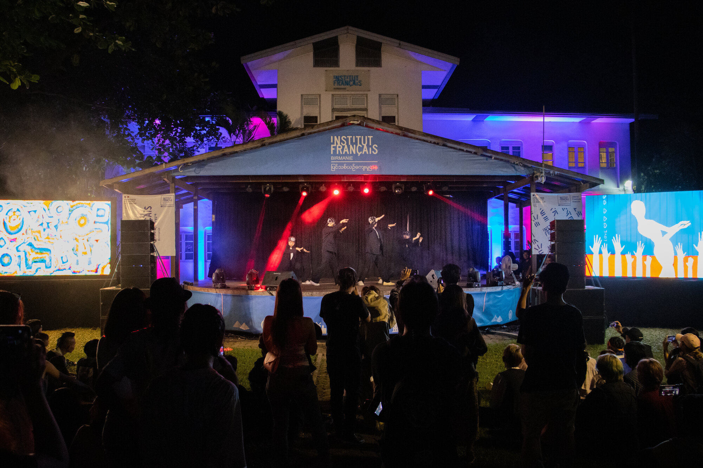

 
 
 

We've been invited by the [French Institute of Burma](https://www.ifbirmanie.org/frn/) to organise drawing performances with local artists during the Human Rights Festival. The event was organised remotely.

 
 
 

<ImageGrid props={props} />
  
   

_Photo credits: French Institute of Burma_  

## Performing artists

[Chuu Wai](https://www.instagram.com/chuu_wai/)
[Thoe Htein](https://www.instagram.com/thoe_htein/)

## Partners

[French Institute of Burma](https://www.ifbirmanie.org/frn/)  