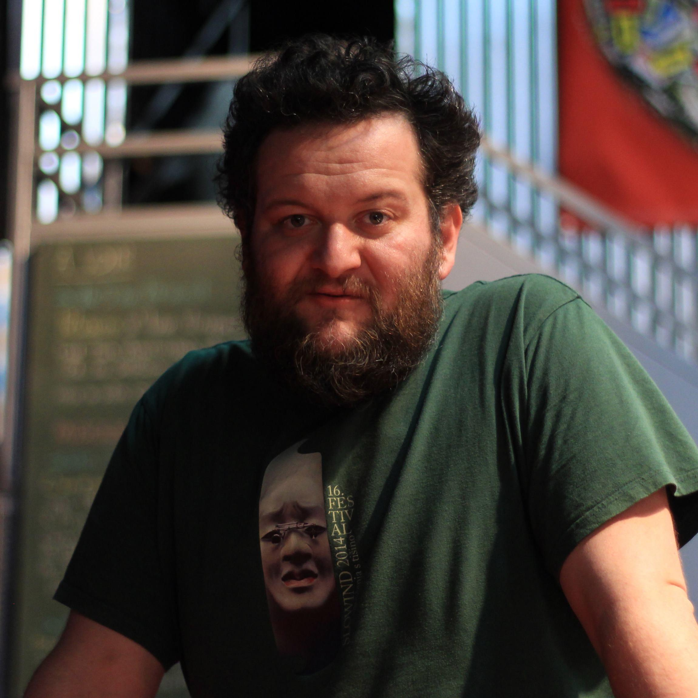
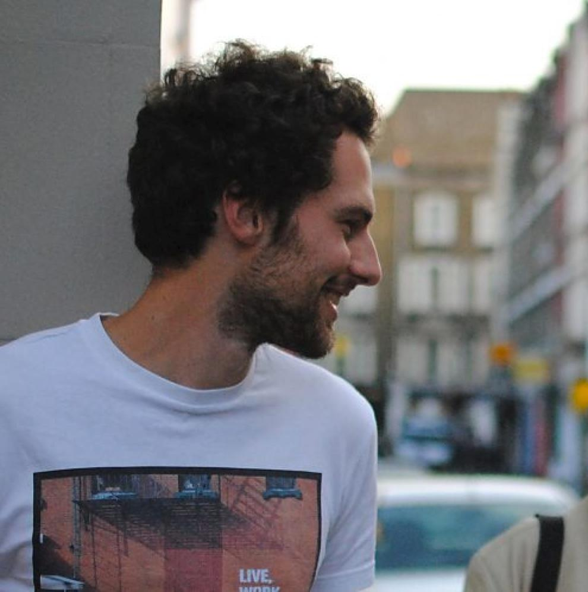
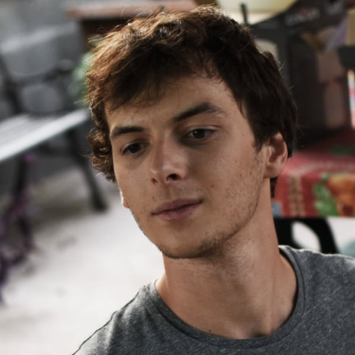

## Louis Clément

</img>

  
  
Depuis toujours adepte des arts, Louis Clément, après ses études d’architecture, se penche sur la scénographie, d’abord pour l’événementiel puis en tant qu’artiste. Il accompagnera des créations de musique contemporaine en vidéo-projection.

En 2017, il participe à un projet de parcours guidé par smartphone qui l’emmènera sur les chemins de la création participative.

## Maxime Hurdequint 

</img>

  
  
Maxime Hurdequint est architecte HMONP à Lyon, diplômé de l’INSA de Strasbourg. Après avoir complété sa formation par différentes pratiques au Danemark, au Mexique puis au Japon à l’agence de Sou Fujimoto, il a exercé comme architecte chef de projet pendant huit ans à Paris.
Parce que “les bâtiments prennent trop de temps pour être achevés”, Maxime Hurdequint est aussi illustrateur… “J’aime faire des dessins parce qu’il est beaucoup plus rapide d’en finir un ! J’aime faire dessiner les gens pour être surpris et partager un moment avec eux.”
  
  
## Maxime Touroute 

</img>

  
  
Maxime Touroute est un ingénieur passionné par les arts audiovisuels. Autodidacte, il travaille sur les plateaux de tournage en tant que réalisateur ou technicien, et s’investit en parallèle sur des projets visuels comme le projet Humanlapse, où il explore la création de timelapses de portrait.
L’art numérique est pour lui l’écrin idéal pour mêler ses compétences techniques et sa passion créative.