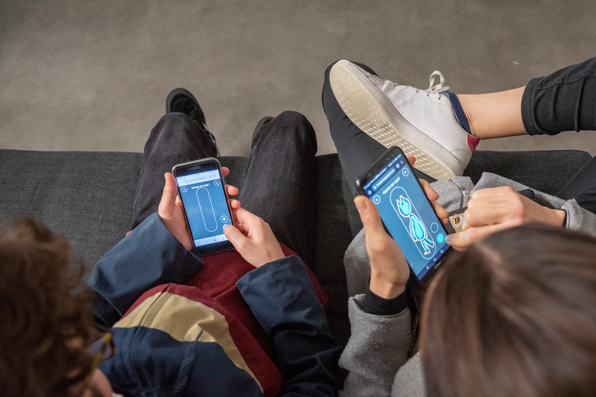

<!-- import a2 from './a2.jpg';
import { getImage, GatsbyImage } from 'gatsby-plugin-image'; -->

# My MDX

some content IN ENGLISH
<!-- 
<PhotoGridForMdx>

</PhotoGridForMdx>

{a2}
 -->

<!-- <Link to="/">This is a link to /</Link> -->

<!--  -->

<!-- <StaticImage src={a2} alt={''}/> -->

<!-- <GatsbyImage image={getImage(a2)} alt={''}/> -->

<!-- <PhotoGrid imageUrls={[a2]} useGatsbyThumbs={false}> -->
<!-- </PhotoGrid> -->