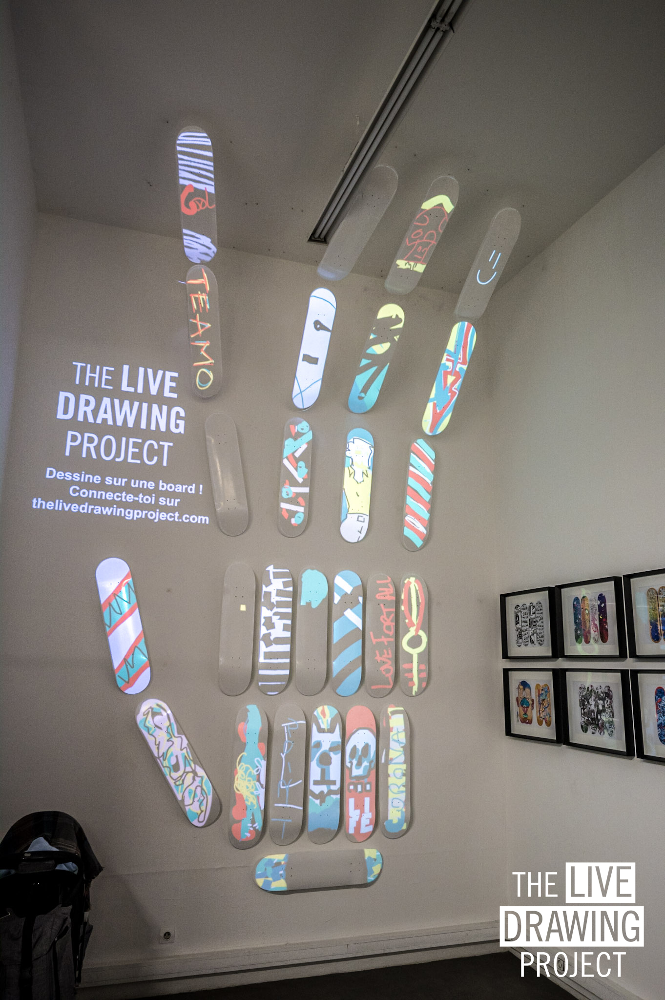
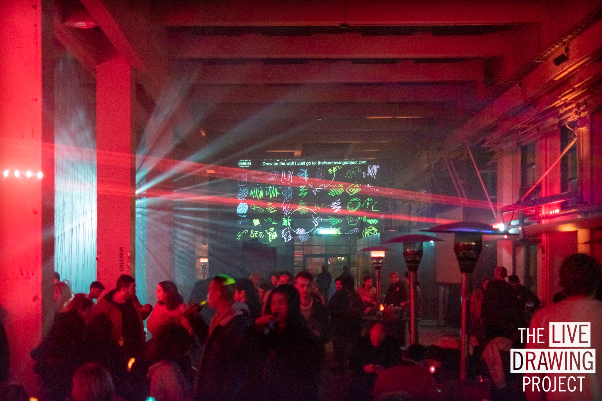
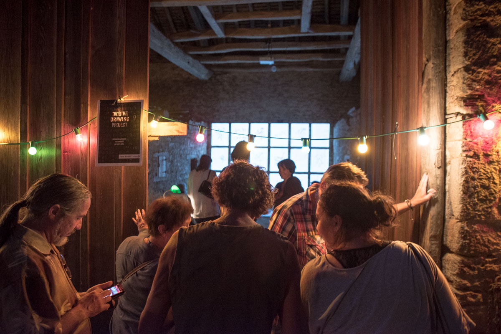
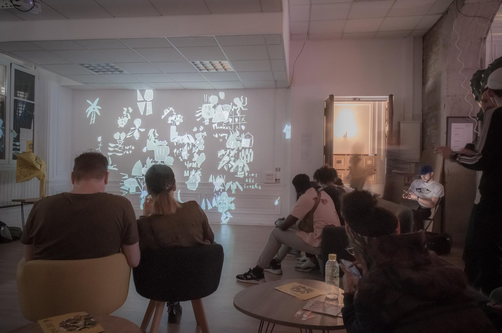
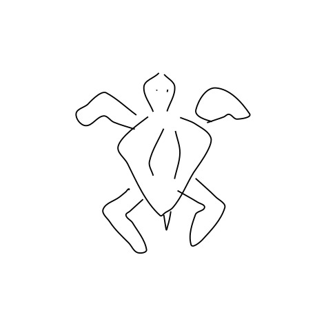

[Télécharger la brochure (Français)](./TheLiveDrawingProject_Brochure_FR.pdf)

[Page Facebook](//facebook.com/TheLiveDrawingProject)

[Page Instagram](//instagram.com/livedrawingproject)

## Dans les rues lyonnaises

The Live Drawing Project est un project 100% lyonnais. Notre ville est notre lieu d'experimentation privilégié pour tester de nouvelles façons d'inspirer le public.

<photo-grid>

</photo-grid>

## GLOW Winter Festival

Fête des Lumières de Calgary au Canada. Février 2020.

<photo-grid>

</photo-grid>

## Copenhagen Light Festival

Fête des lumières de Copenhague, Danemark. Février 2020.

<photo-grid>

</photo-grid>

## Festival Nouvelles Passions

Festival artistique multi-disciplinaire, Installation dans une grange. Chevagny, France, Août 2019.

<photo-grid>

</photo-grid>

## Festi Lumi

Le Fête des Lumières de Bonifacio en Corse. Juillet 2019.

<photo-grid>

</photo-grid>

## Festival Peinture Fraiche

Festival de Street Art international. Lyon, Mai 2019.

<iframe src="https://player.vimeo.com/video/344490536" frameborder="0" allowfullscreen width="1920" height="1080"></iframe>

[Lien Direct](//vimeo.com/344490536)

<photo-grid>

</photo-grid>

## Performance collaborative avec le Street Artiste Shab

A la Galerie d'Art Sitio par Superposition. Lyon, Avril 2019.

<iframe src="https://player.vimeo.com/video/335872657" frameborder="0" allowfullscreen width="1920" height="1080"></iframe>

[Lien Direct](//vimeo.com/335872657)

<photo-grid>

</photo-grid>

## Résidence Artistique 360°

Résidence au Lab Lab en partenariat avec l'AADN. Lyon, France, février 2019.

<photo-grid>

</photo-grid>

## Exposition pour la Fête des Lumières

Notre première exposition au bar _Le Malting Pot_ Lyon, France, 2018.

<iframe src="https://player.vimeo.com/video/311653956" frameborder="0" allowfullscreen width="1920" height="1080"></iframe>

[Lien Direct](https://vimeo.com/311653956)

<photo-grid>

</photo-grid>

## Quelques dessins du public

Pendant nos évenements, nous récupérons des milliers de dessins. Nous avons plus de 100 000 dessins dans notre base de données. Voici une selection de quelques dessins faits par des personnes du public entre 4 et 90 ans.

<photo-grid>

</photo-grid>
