[Télécharger la brochure (Français)](./TheLiveDrawingProject_Brochure_FR.pdf)  
 
[Télécharger la brochure (Anglais)](./TheLiveDrawingProject_Brochure_EN.pdf)  
  
[Accéder à notre page Facebook](//facebook.com/TheLiveDrawingProject)  
   
[Accéder à notre page Instagram](//instagram.com/livedrawingproject) 

# Dans les rues lyonnaises
Lyon, France, 2019  
The Live Drawing Project est un project 100% lyonnais. Notre ville est notre lieu d'experimentation privilégié pour tester de nouvelles façons d'inspirer le public.

<photo-grid>

</photo-grid>

# Festival Nouvelles Passions
Chevagny, France, August 2019  
Festival artistique  
Installation dans une grange  

<photo-grid>
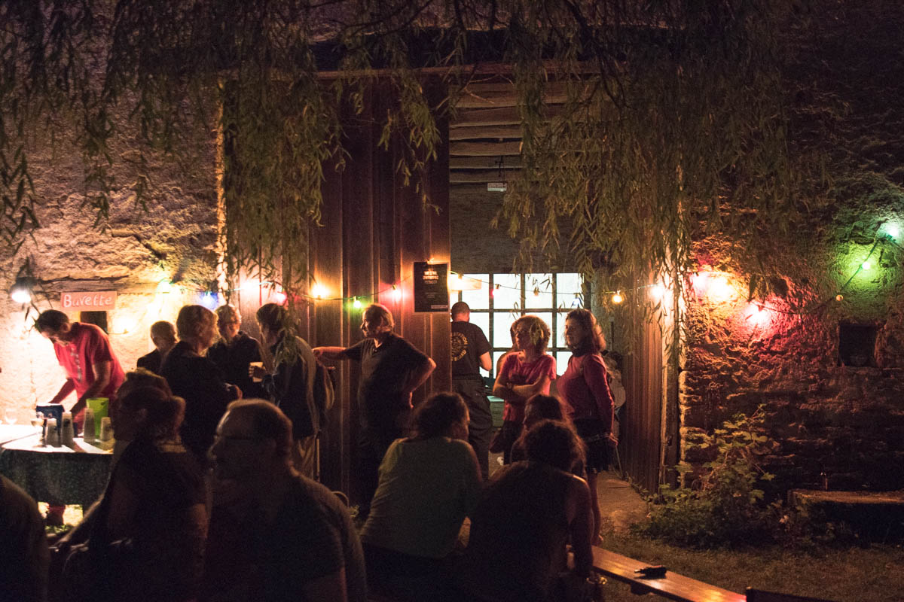

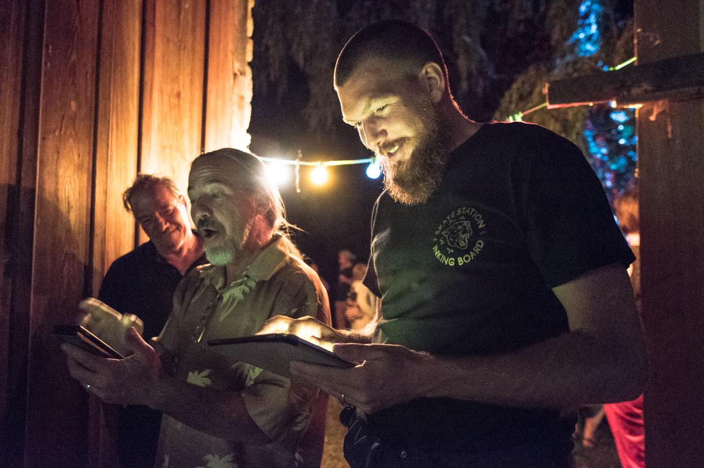

</photo-grid>

# Festi Lumi
Corse, Juillet 2019  
Fête des Lumières  

<photo-grid>

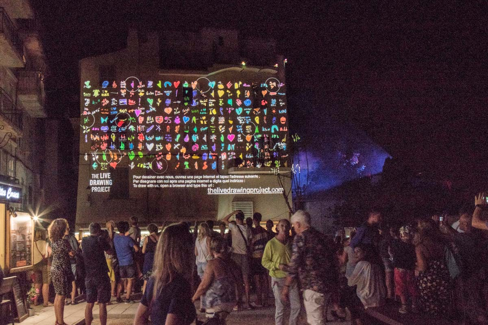

</photo-grid>

# Installation au festival Peinture Fraiche
Festival de Street Art  
Mai 2019, Lyon  

<iframe src="https://player.vimeo.com/video/344490536" frameborder="0" allowfullscreen width="1920" height="1080"></iframe>

[Lien Direct](//vimeo.com/344490536)

<photo-grid>

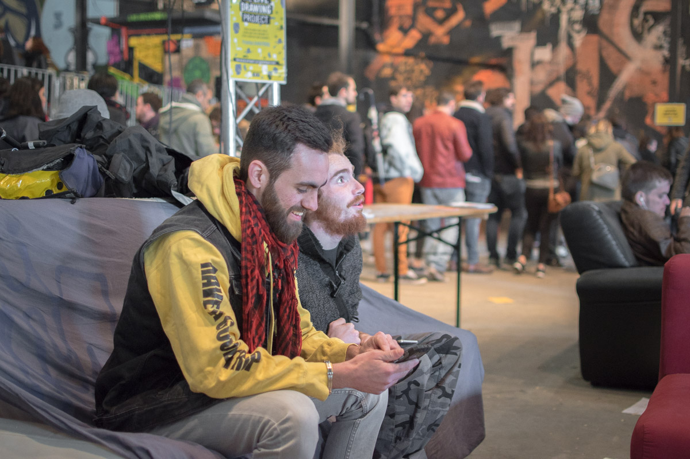

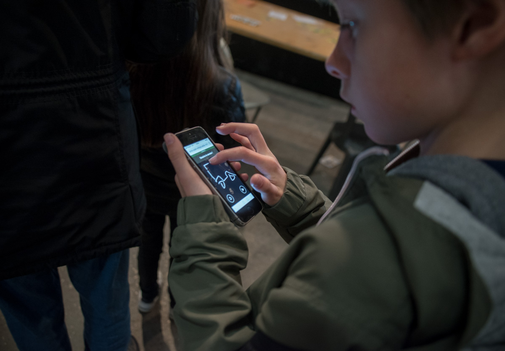
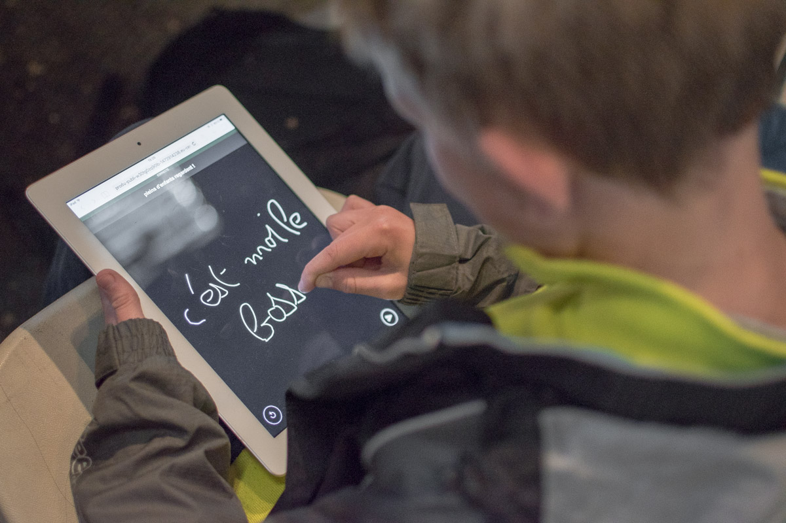

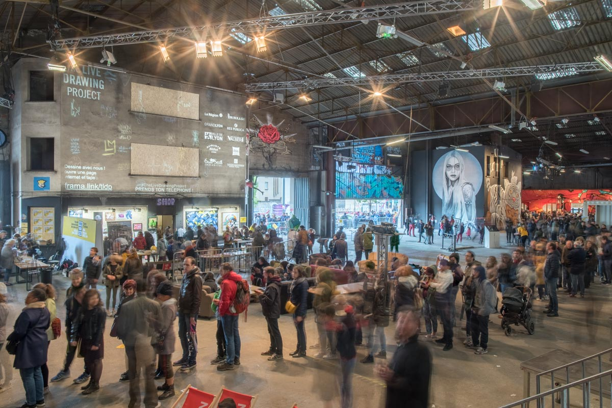
</photo-grid>

# Performance collaborative avec le Street Artiste Shab
Galerie d'art  
Avril 2019, Lyon  

<iframe src="https://player.vimeo.com/video/335872657" frameborder="0" allowfullscreen width="1920" height="1080"></iframe>

[Lien Direct](//vimeo.com/335872657)

<photo-grid>

</photo-grid>

# Résidence Artistique au LabLab
Lyon, France, février 2019  

<photo-grid>

</photo-grid>

# Exposition pour la Fête des Lumières
Lyon, France, 2018  
Au bar _Le Malting Pot_  

<iframe src="https://player.vimeo.com/video/311653956" frameborder="0" allowfullscreen width="1920" height="1080"></iframe>

[Lien Direct](https://vimeo.com/311653956)

<photo-grid>

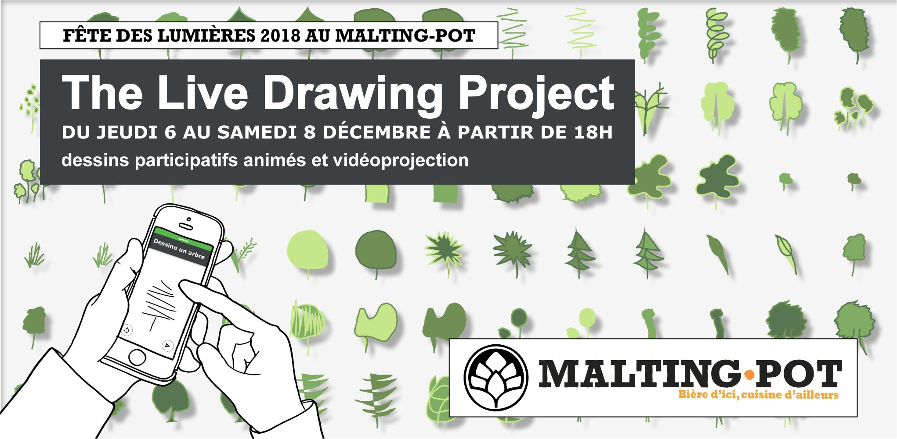
</photo-grid>
  
   
  
  
# Quelques dessins du public

Pendant nos évenements, nous récupérons des milliers de dessins. Nous nous approchons de 100 000 dessins dans notre base de données. Voici une selection de quelques dessins faits par des personnes du public entre 4 et 90 ans.

<photo-grid>

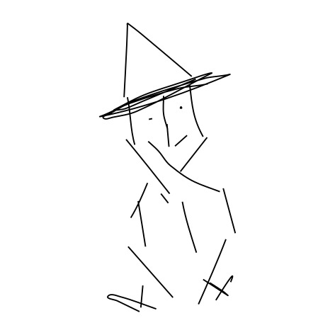
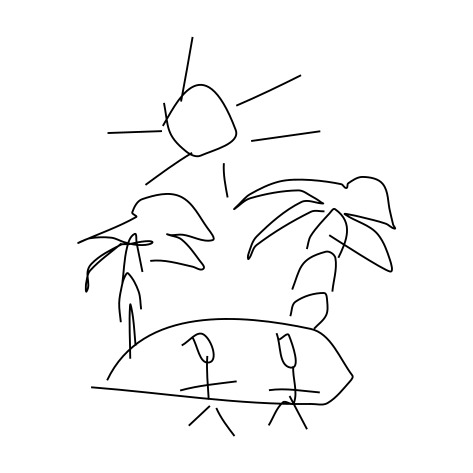
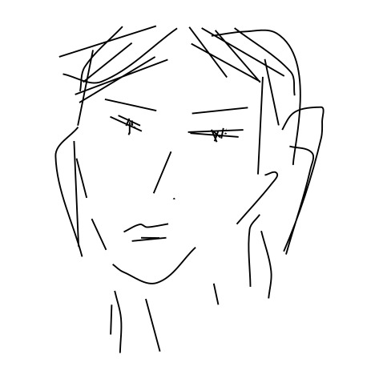
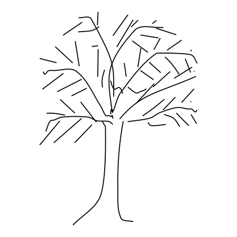

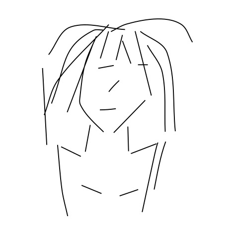
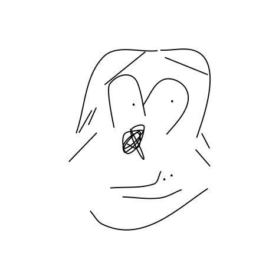

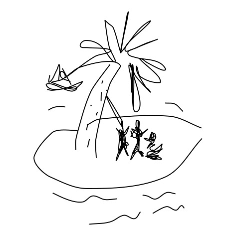

</photo-grid>

