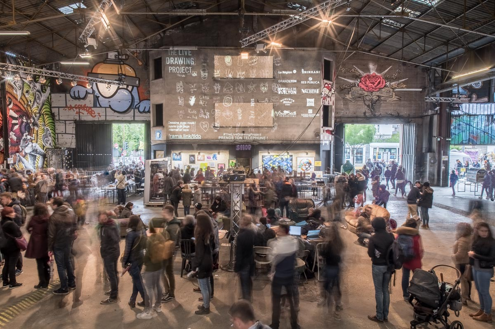
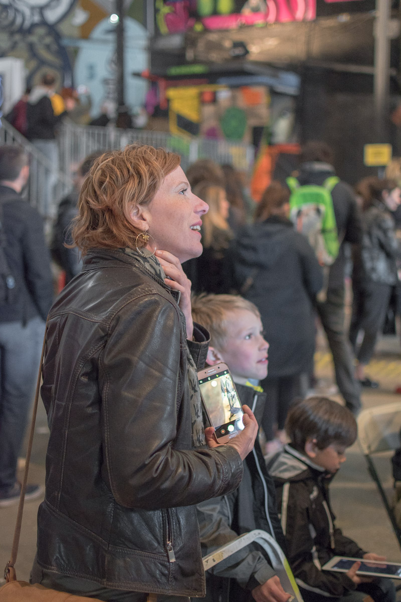
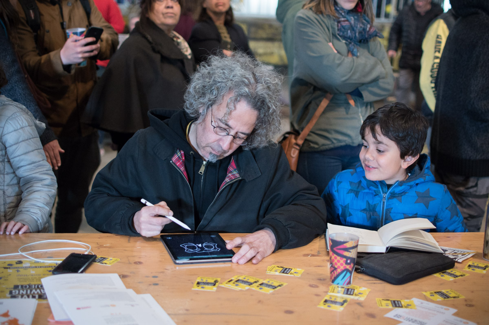
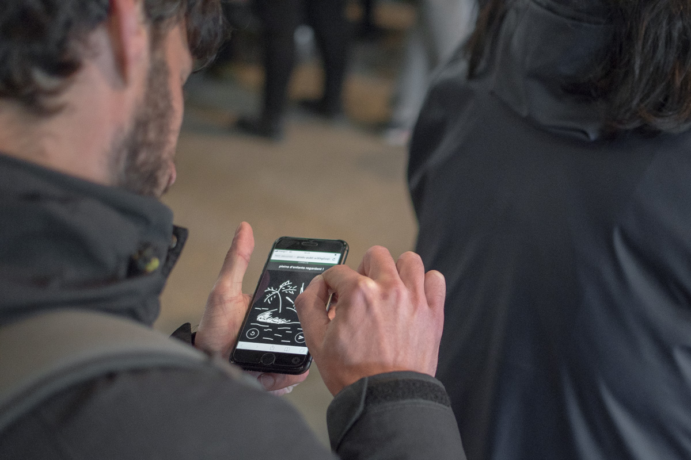
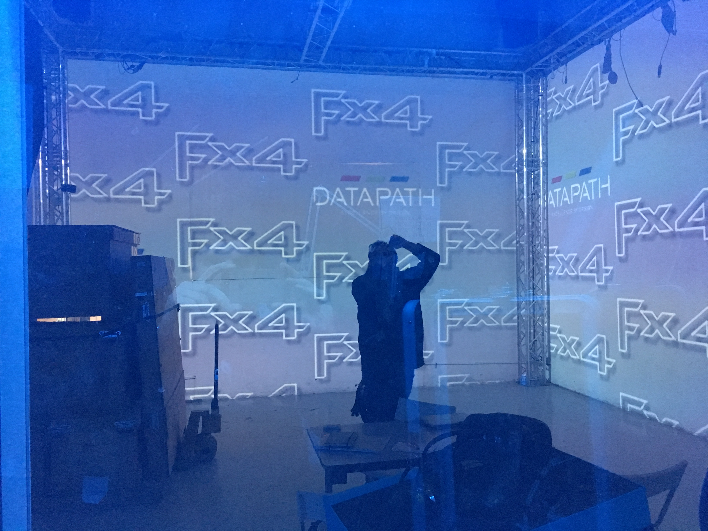
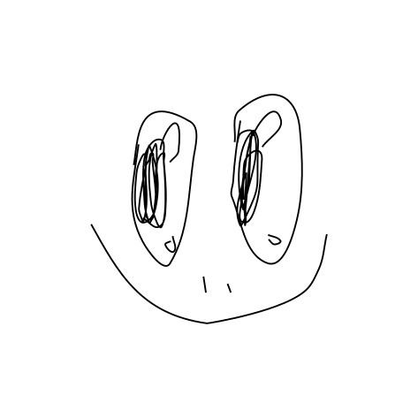

[Download brochure (English)](./TheLiveDrawingProject_Brochure_EN.pdf)  

[Download brochure (French)](./TheLiveDrawingProject_Brochure_FR.pdf)  
   
[Access our Facebook Page](//facebook.com/TheLiveDrawingProject)   
  
[Access our Instagram Page](//instagram.com/livedrawingproject)

# Nouvelles Passions Festival
Art Festival  
Scenography in a barn  
Chevagny, France, August 2019  

<photo-grid>

</photo-grid>

# Installation for Festi Lumi
Lights Festival  
Corsica, July 2019  

<photo-grid>

</photo-grid>

# Installation at the Peinture Fraiche Festival
Street Art Festival  
Lyon, France, May 2019  

<iframe src="https://player.vimeo.com/video/344490536" frameborder="0" allowfullscreen width="1920" height="1080"></iframe>

[Direct Link](//vimeo.com/344490536)

<photo-grid>

</photo-grid>

# Collaborative Performance with the Street Artist Shab
Lyon, France, April 2019  
Art gallery  

<iframe src="https://player.vimeo.com/video/335872657" frameborder="0" allowfullscreen width="1920" height="1080"></iframe>

[Direct Link](//vimeo.com/335872657)

<photo-grid>

</photo-grid>

# Art residency at the LabLab
Lyon, France, February 2019  

<photo-grid>

</photo-grid>

# Exhibition for la Fête des Lumières
Lyon, France, 2018  
At the Malting Pot pub  

<iframe src="https://player.vimeo.com/video/311653956" frameborder="0" allowfullscreen width="1920" height="1080"></iframe>

[Direct Link](https://vimeo.com/311653956)

<photo-grid>

</photo-grid>

  
  
  
# Some drawings from the audience

During our events, we gather thousands of drawings. We're closely reaching 100,000 drawings in our database. Here's a selection of a few drawings made by people between 4 and 90 years old.

<photo-grid>

</photo-grid>

