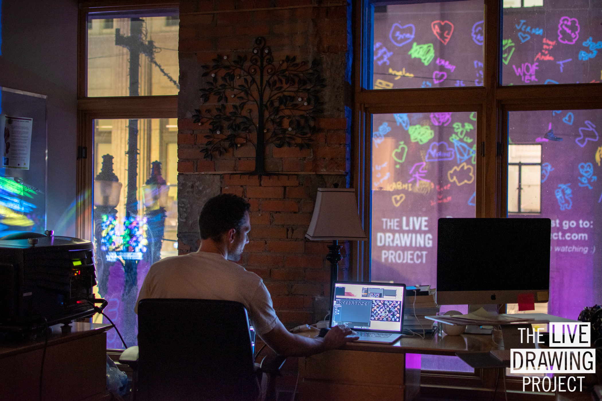
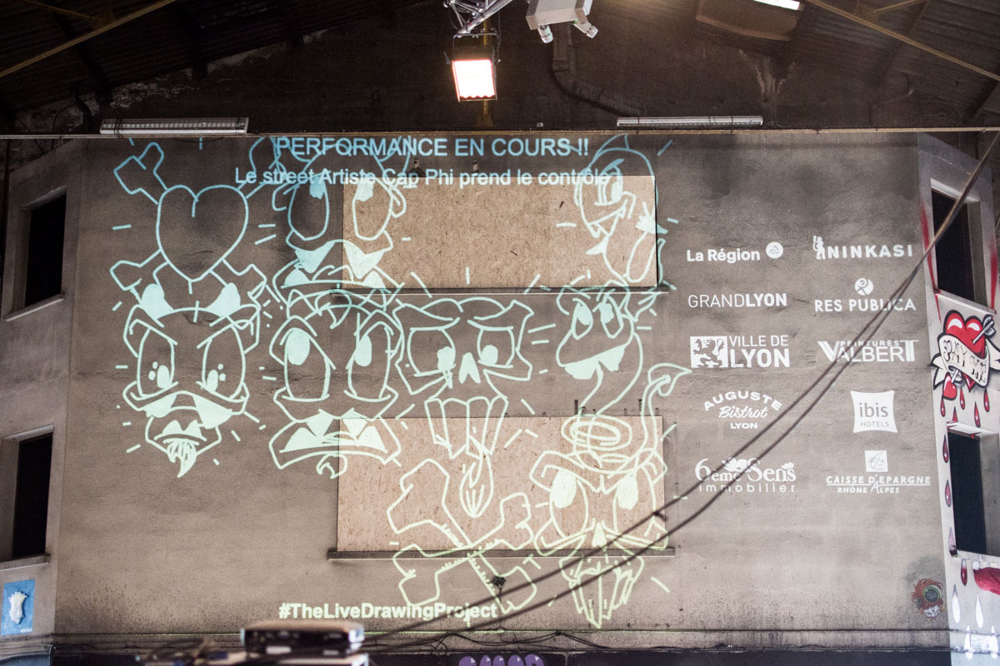

[Download brochure (French)](./TheLiveDrawingProject_Brochure_FR.pdf)

[Facebook Page](//facebook.com/TheLiveDrawingProject)

[Instagram Page](//instagram.com/livedrawingproject)

## In the Streets of Lyon

Our hometown is our place of experimentation where we test new ways to inspire people.

<photo-grid>

</photo-grid>

## GLOW Winter Festival

Winter Festival of Calgary, Canada. February 2020.

<photo-grid>

</photo-grid>

## Copenhagen Light Festival

Light Festival of Copenhagen, Denmark. February 2020.

<photo-grid>

</photo-grid>

## Nouvelles Passions Festival

International Art Festival, scenography in a barn. Chevagny, France, August 2019

<photo-grid>

</photo-grid>

## Festi Lumi

The Lights Festival of Bonifacio in Corsica. July 2019.

<photo-grid>

</photo-grid>

## Peinture Fraiche Festival

International Street Art Festival. Lyon, France, May 2019

<iframe src="https://player.vimeo.com/video/344490536" frameborder="0" allowfullscreen width="1920" height="1080"></iframe>

[Direct Link](//vimeo.com/344490536)

<photo-grid>

</photo-grid>

## Collaborative Performance with the Street Artist Shab

At the Sitio by Superposition Art Gallery. Lyon, France, April 2019.

<iframe src="https://player.vimeo.com/video/335872657" frameborder="0" allowfullscreen width="1920" height="1080"></iframe>

[Direct Link](//vimeo.com/335872657)

<photo-grid>

</photo-grid>

## Art residency at the LabLab

Lyon, France, February 2019

<photo-grid>

</photo-grid>

## Exhibition for la Fête des Lumières

Our first exhibition at the _Malting Pot_ pub. Lyon, France, 2018

<iframe src="https://player.vimeo.com/video/311653956" frameborder="0" allowfullscreen width="1920" height="1080"></iframe>

[Direct Link](https://vimeo.com/311653956)

<photo-grid>

</photo-grid>

## Some drawings from the audience

During our events, we gather thousands of drawings. We're closely reaching 100,000 drawings in our database. Here's a selection of a few drawings made by people between 4 and 90 years old.

<photo-grid>

</photo-grid>
