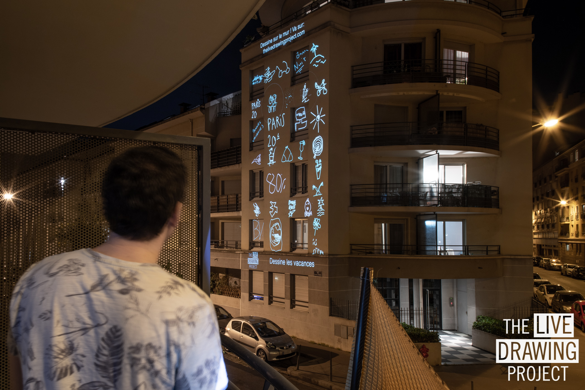
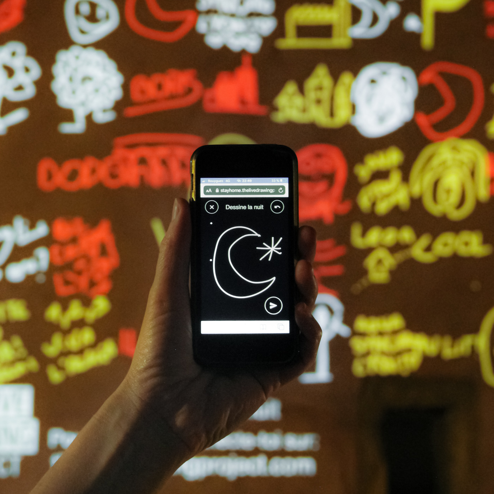

<h1 style="text-align:center">
Open your virtual doors
</h1>

Our interactive instalaltion works through internet. It allows you to **engage remotely with your audience** in a collective creation process.

_Videoprojection during the French lockdown - Lyon - May 2020.  
More infos about this event: [Our solidary initiative during lockdown](/stayhome)_
 
 

#### Gather your audience

Create **online gatherings** by exhibiting _The Live Drawing Project_ on the wall of your choice and by broadcasting the performance live on social medias:

- We prepare the online event together
- During the event, participants are invited to draw remotely on their phones
- Their drawings appear videoprojected on a wall of your choice
- Participants see their drawings from the video live on social medias (Facebook Live, Youtube Live...)

The installation allows you to communicate and share with your audience through drawings. During the event you can set-up personnalized drawing thematics that appears on drawer's phones. After the event you can retreive all the drawings made by the audience.

In many cases, **we can setup the installation remotely**.

_The drawing interface and videoprojection in the background_

#### Connect multiple locations

With our realtime technology we can videoproject in multiple locations simultaneously. Drawings travel between locations connecting people and creating discussions across the locations.

_During France lockdown we exhibited on 30 locations simultaneously.  
[More informations about our lockdown solidary initiative](/stayhome)_

 

#### Our mission

In this context, we want to give to online cultural events the warmth of the crowd they miss. We believe exhibiting massively interactive installations can make us reach that goal.

That's why we offer this online format for _The Live Drawing Project_. We also work on new massively interactive installations adapted to the current context where the public can express themselves collectively.  
Event catalog on demand by email.

Let's create something together!

### [Contact us](/contact)

[The Live Drawing Project Brochure](../gallery/TheLiveDrawingProject_Brochure_EN.pdf)

[Photo gallery](/gallery)

